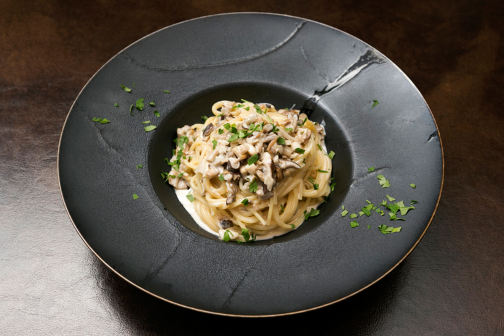

# 3種のきのこのクリームパスタ〜トリュフ風味〜＆鶏もも肉のロートロ ローズマリー風味 じゃが芋のロースト添え

# **45min**

**Cooking description**

**- 料理説明 -**

鉄板のきのこのクリームパスタをトリュフソースでリッチな仕上がりに。きのこは手でほぐしてしっかりと焼き色をつけ、刻んでソースにします。トリュフの香りも相性抜群。ちょっとした手間でワンランク上の仕上がりに変わります。鶏肉はロール状に巻き、見た目もおしゃれに。チーズやお野菜、好きなハーブや香辛料を巻いて自分なりのアレンジも楽しめます。今回はローズマリーとじゃが芋のローストと一緒に。どちらの料理も白ワインにぴったりです。

Produced by ―  このレシピの考案者のご紹介

#### 平井 正人

DAL-MATTO(ダル・マット) / イタリアンシェフ

\

人気イタリアン『ダル・マット』オーナーシェフ。 大学在学中からイタリアンレストランに勤務。卒業とほぼ同時に渡伊し、リグーリア州、トスカーナ州のレストランで修行を積む。帰国後は「ラ・ベットラ・ダ・オチアイ」「グットドール・クラッティーニ」など名店で研鑽を重ね、2004年11月に独立。西麻布、恵比寿、六本木などに店舗を展開。

Ingredients ―  お送りする食材リスト

\

**きのこのクリームパスタ〜トリュフ風味〜**

スパゲッティーニ200g

オリーブオイル大さじ2

ひら茸50g程度

舞茸50g程度

たもぎ茸40g程度

塩ひとつまみ

生クリーム1本（200ml）

塩小さじ1/2

パルメザンチーズ2袋（14g）

トリュフソース10g

イタリアンパセリ1g程度

スパゲッティーニを茹でるお湯適量

スパゲッティーニを茹でる用の塩  水に対し1%

**鶏モモ肉のロートロ ローズマリー風味 じゃが芋のロースト添え**

鶏もも肉1枚

塩小さじ1

胡椒適量

オリーブオイル大さじ1

じゃがいも（メークイン）2個

塩小さじ1/2

ローズマリー2g程度

にんにく3片（15g程度）

オリーブオイル大さじ1

タコ糸1m

イタリアンパセリ1g程度

黒胡椒適量

### **調理方法**

##### じゃがいもの下準備

じゃがいもの皮をむき一口大に切る。

\

じゃがいもを水から茹でて、沸騰してから3分ほど中火で茹でる。お湯から上げて塩（小さじ1/2）を振り、10分ほどマリネしておく。

\

・ローズマリーの葉を枝から外す。

\

・イタリアンパセリをみじん切りにする。（主菜副菜共通）

\

主菜と副菜まとめてお送りしています。

##### ～鶏肉を成形して、焼きます～

オーブンを180℃に予熱する。

\

鶏もも肉を叩いて平らにし、両面に塩（小さじ1/2）、胡椒（適量）を振る。

\

身側にローズマリーの葉（半量）をちらし、皮目を外側にしてロール状にタコ糸でしばる。

\

**POINT**

何箇所かを縛り、肉が丸くまとまれば大丈夫です。

**POINT**

アレンジでチーズや野菜を中に入れてもおいしいです。

フライパンにオリーブオイル（大さじ1）を入れ、中火にし鶏もも肉を入れ転がしながら色付くまで焼く。

\

**POINT**

あとでオーブンに入れるので、ここでは表面に焼き色がつく程度で大丈夫です。

じゃがいもにオリーブオイル（大さじ1）と皮付きのにんにく、ローズマリー（残りの半量）を和え、耐熱皿にじゃがいもと鶏もも肉、皮付きにんにくをのせ、温めておいたオーブンで15分ほど焼く。

\

**POINT**

オーブンがない場合は、フライパンで弱中火で10分程度、蓋をしながら鶏肉の中心に火が入るまで焼きます。

糸をはずし、鶏もも肉を4等分に切り分ける。

\

皿にじゃがいもと鶏もも肉を盛りつけ、刻んだイタリアンパセリ（1/3程度）と黒胡椒をかけて完成。

\

##### ～パスタを作ります～

きのこ（ひら茸、舞茸、たもぎ茸）をそれぞれ手で小房に分ける。

\

スパゲッティーニを茹でるために、鍋にお湯を沸かし、塩を入れる。

\

**POINT**

塩の目安はお湯の1％（お湯3Lに対して、塩大さじ2）

フライパンにオリーブオイル（大さじ2）を入れ強火できのこを炒め、焼き色がついたら塩（ひとつまみ）で下味をつける。

\

**POINT**

なるべくきのこを動かさず焼き色をつけてください。

きのこを取り出し、粗く刻む。

\

**POINT**

刻んで炒めると水分が出すぎて風味が出にくいので、あとから刻みます。

フライパンに生クリーム（1本）と刻んだきのこを入れ、一煮立ちさせ、塩（小さじ1/2）を加え、ソースを作る。

\

沸かしたお湯でスパゲッティーニを4分茹でる。

\

スパゲッティーニが茹で上がったら、ソースに加え、軽く煮詰め、塩（適量）で味を調える。

\

**POINT**

煮詰め過ぎたり、塩を入れすぎたときは、パスタの茹で汁を使ってソースを伸ばしてください。

火を消し、パルメザンチーズ（2袋）を加え混ぜる。

\

トリュフソース（10g）を加えてサッ中火で和えて、皿に盛り、刻んだイタリアンパセリ（2/3程度）をかけて完成。

\

**POINT**

トリュフソースは火にかけすぎると香りが飛ぶので、最後に加え、軽く和えたら火を止めてください。

料理をお召し上がりになった後、今回のメニューのご感想を是非お聞かせください。
