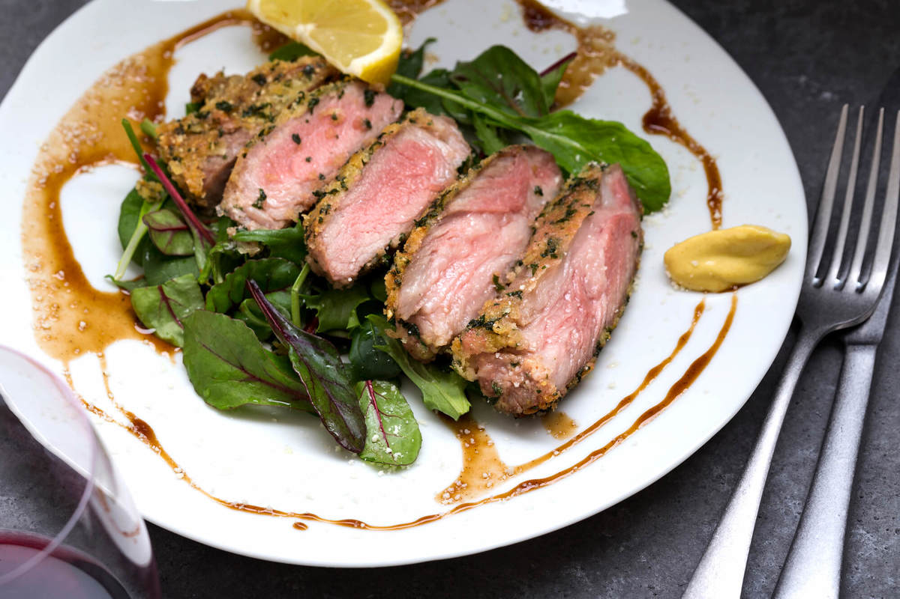
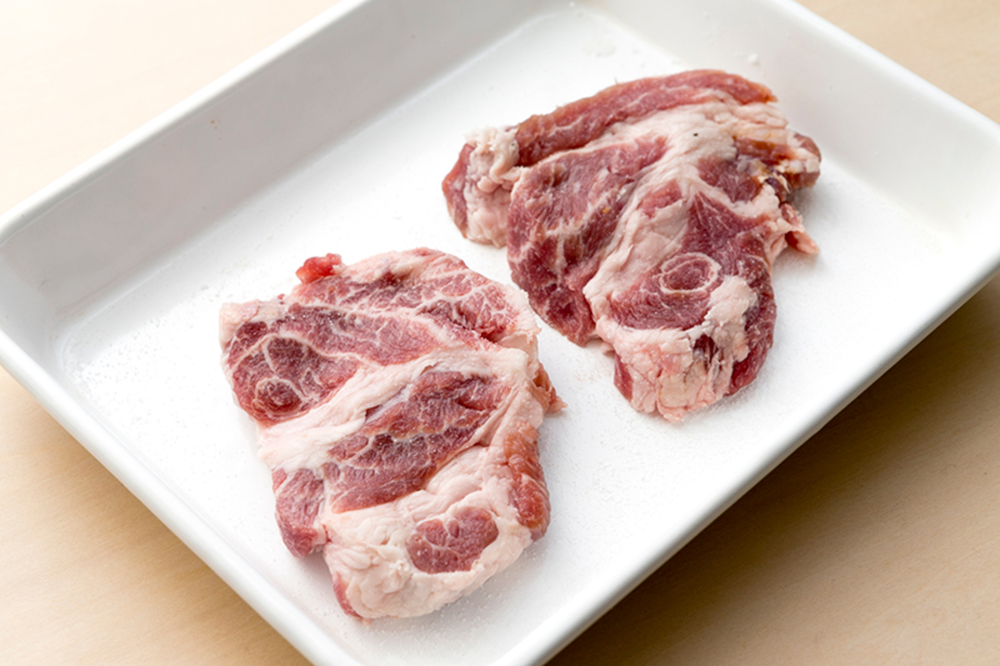
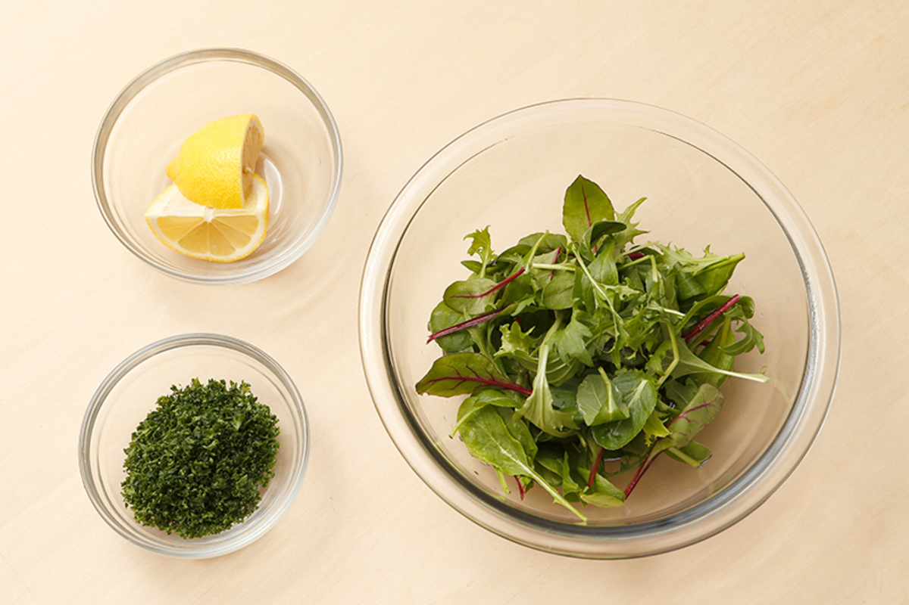
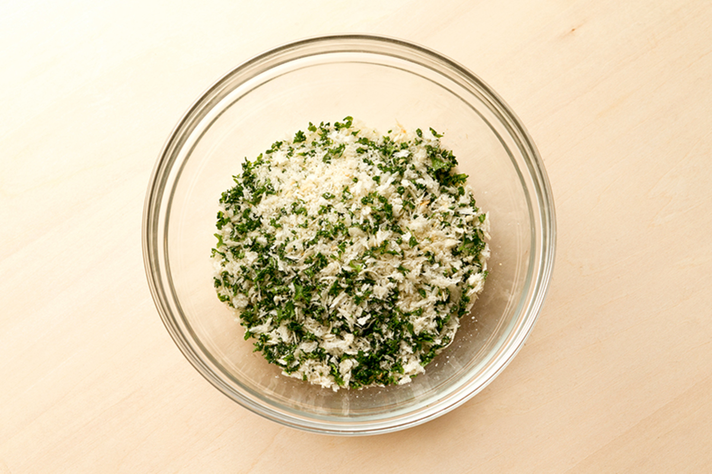
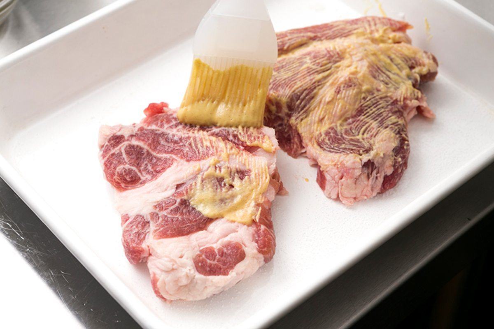
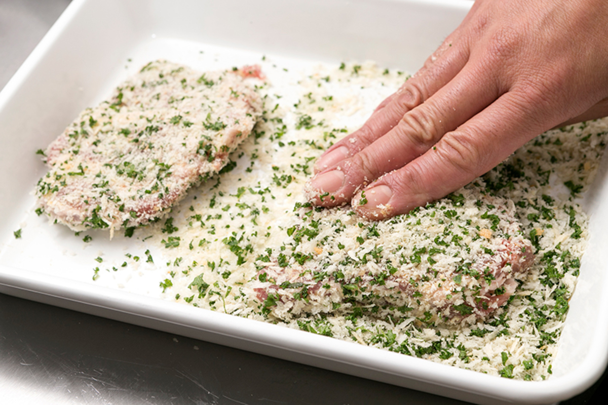
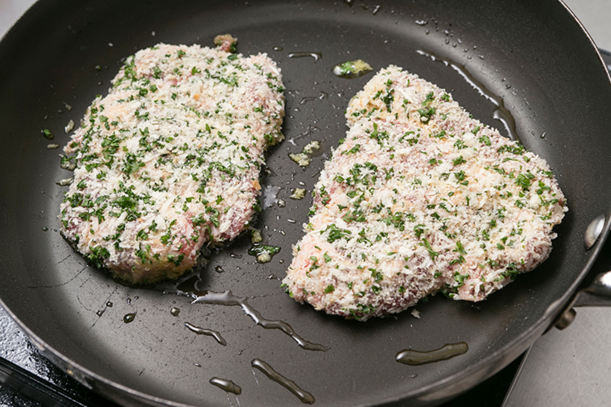
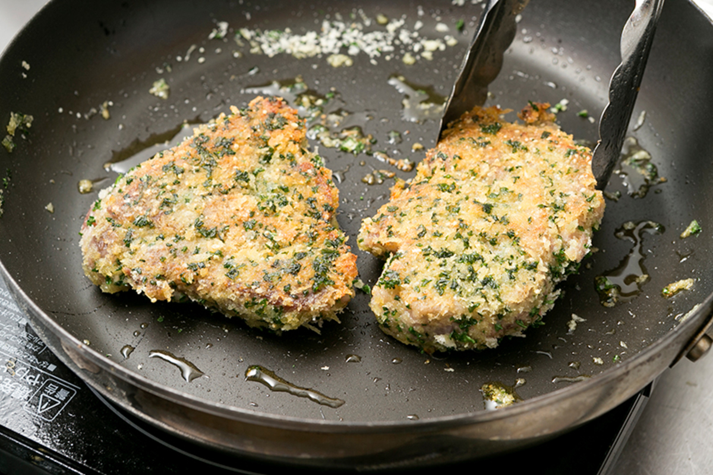
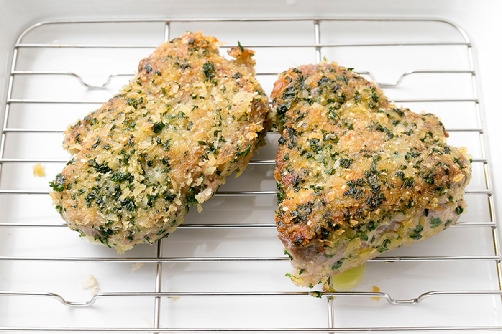
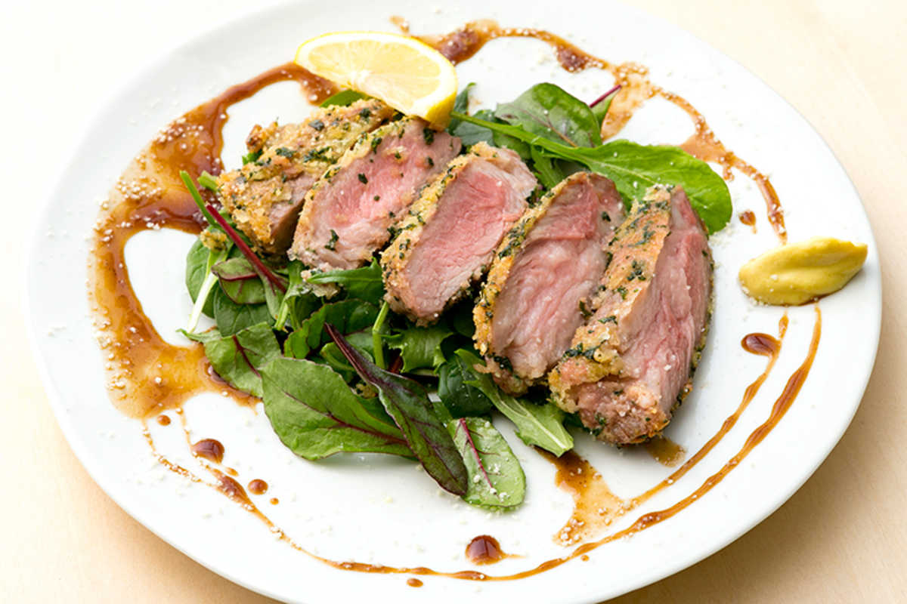

# イベリコ豚の香草カツレツ

\

\

イベリコ豚肩ロース 120g×2切れ

\

塩 各小さじ1/3

\

ディジョンマスタード 20g

\

オリーブオイル 大さじ2

\

＜香草パン粉＞ -

\

パン粉 30g

\

パセリ 5g 程度

\

パルメザンチーズ 1袋（7g）

\

＜付け合せ＞ -

\

ベビーリーフ 20g

\

塩 ひとつまみ

\

黒胡椒 適量

\

オリーブオイル 適量

\

レモン 1/4個

\

とんかつソース 2袋（20g）

\

##### **〜カツレツの準備をします〜**

イベリコ豚の水分をペーパーで拭き取り、脂身と赤身の境にある筋を数ヶ所、包丁で刺すようにして切れ込みを入れて筋切りする。

\

イベリコ豚の両面に塩（各小さじ1/3）して常温に戻しておく。

\

**POINT**

肉の中心に綺麗に火が入るように常温に戻します。夏場は30分、冬場は1時間程度が目安です。

ベビーリーフを冷水にさらし、ざるで水をしっかり切っておく。

\

パセリをみじん切りにする。

\

レモン（1/4個）を半分にカットする。

\

パン粉（30g）とパルメザンチーズ（1袋）、みじん切りしたパセリを合わせて香草パン粉を作っておく。

\

\

\

\

##### **〜カツレツを作ります〜**

イベリコ豚にディジョンマスタード（10g：送付量の半分）を刷毛などを使って全体に塗り、香草パン粉を付ける。

\

**POINT**

マスタードがパン粉を付ける糊になるので、全体的に薄く塗ってください。

フライパンにオリーブオイル（大さじ2）を入れ中火にかけ、パン粉付けしたイベリコ豚を入れて4分ほど色づくまで焼く。

\

ひっくり返して2分ほど焼き、網を敷いたバットに移して温かい場所で休ませる。

\

**POINT**

パン粉がカリッとするまでしっかり焼きます。

皿にベビーリーフをちらし、塩（ひとつまみ）と黒胡椒（適量）、オリーブオイル（適量）を回しかける。カツレツを食べやすい大きさにカットして盛る。とんかつソース（2袋）を回しかけ、レモンとマスタード（10g：残りの半量）を添えて完成。

\

\
