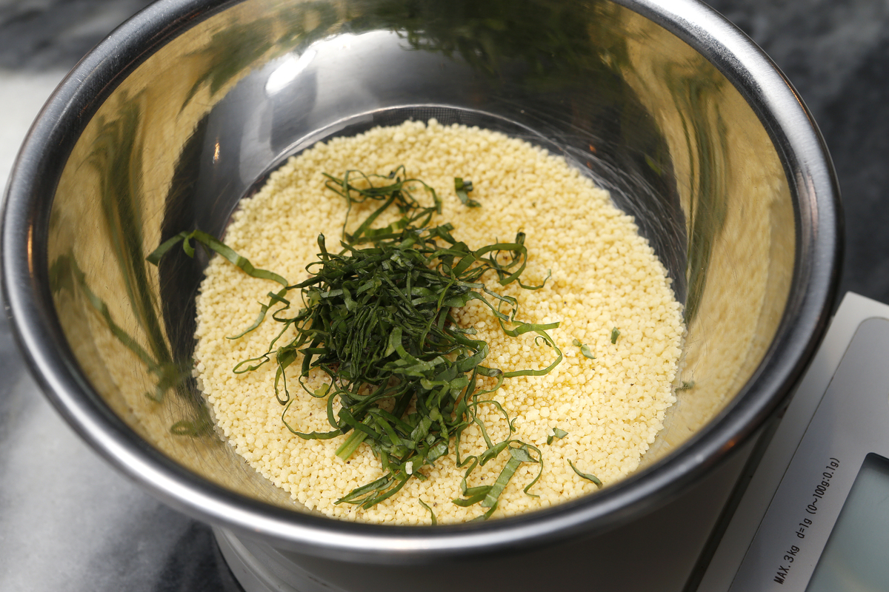
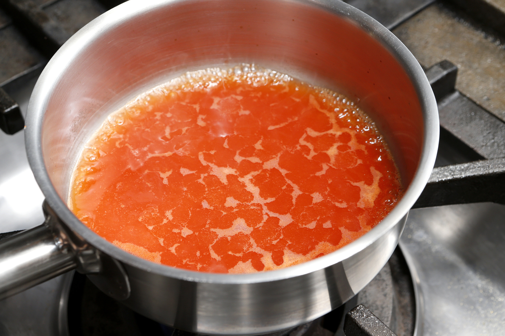
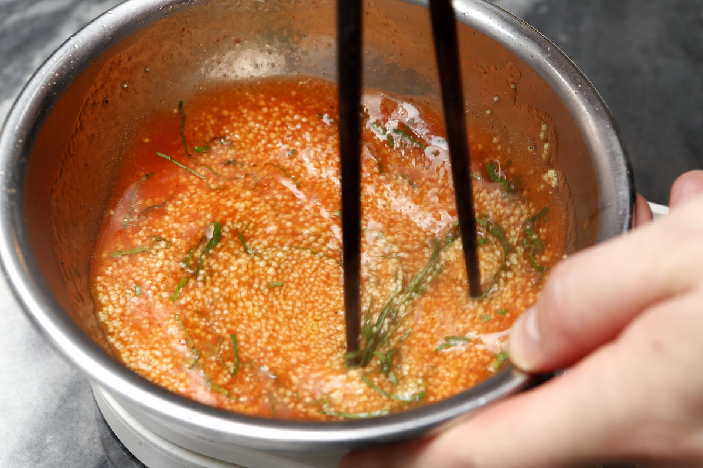
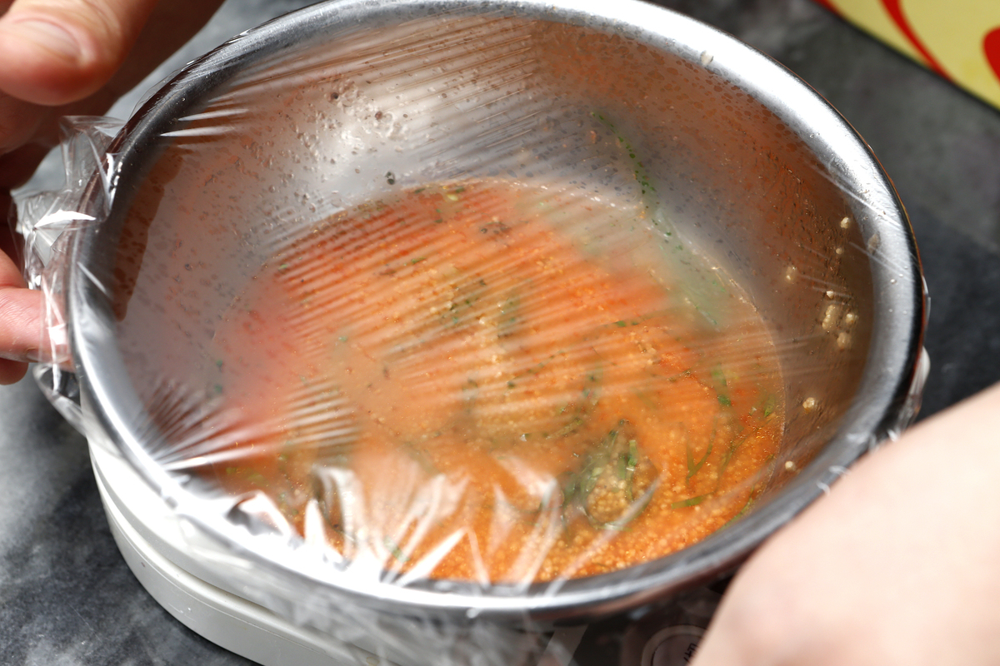
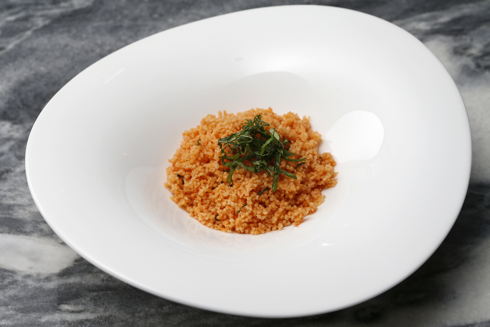

# トマト風味のクスクス

\

トマト風味のクスクス

クスクス
60g

トマトジュース
30ml

水
60ml

バジル
2g

塩
1g

胡椒
0.2g

オリーブオイル
小さじ2

\

##### サイド‐1. トマト風味のクスクスの下準備をします。

バジルを千切りにしておく。

##### サイド‐2. トマト風味のクスクスを作ります。

ボウルにクスクスとオリーブオイル(小さじ2)、塩(1g)、胡椒(0.2g)、バジル(半量)を入れ、混ぜ合わせておく。

鍋に水(60ml)とトマトジュース(30ml)を沸かし、ボウルに入れ軽くかき混ぜ蓋をして5分程置いておく。

##### サイド‐3. トマト風味のクスクスを仕上げます。

皿に盛り残りのバジルを飾って完成。

\

\

\
