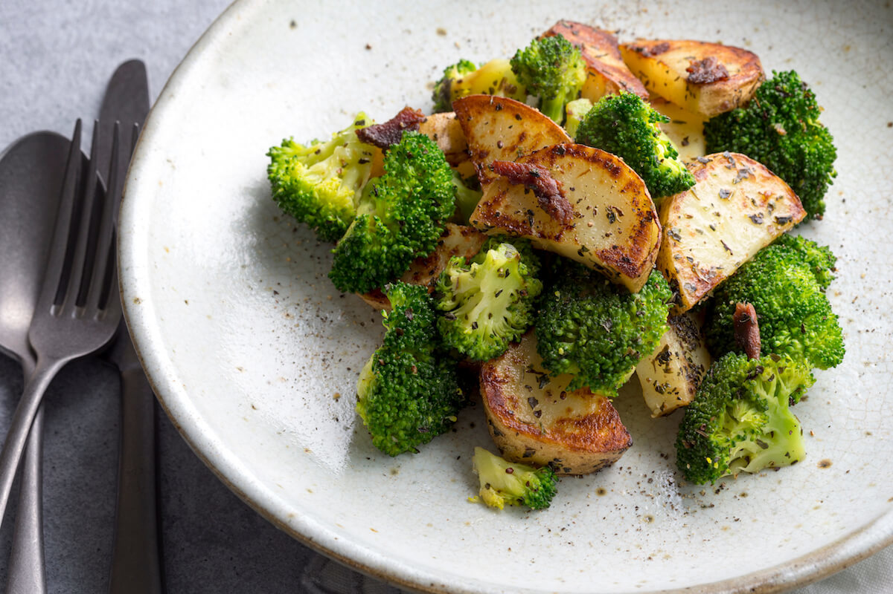
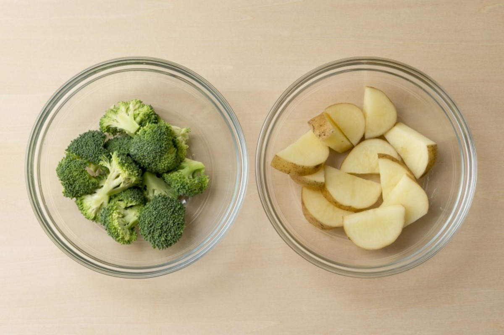
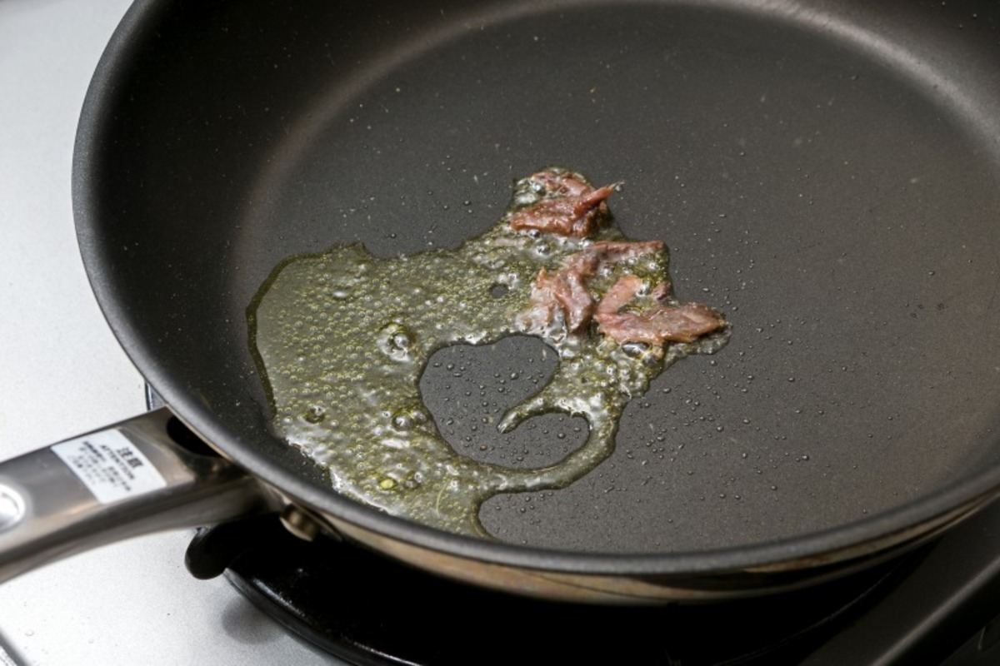
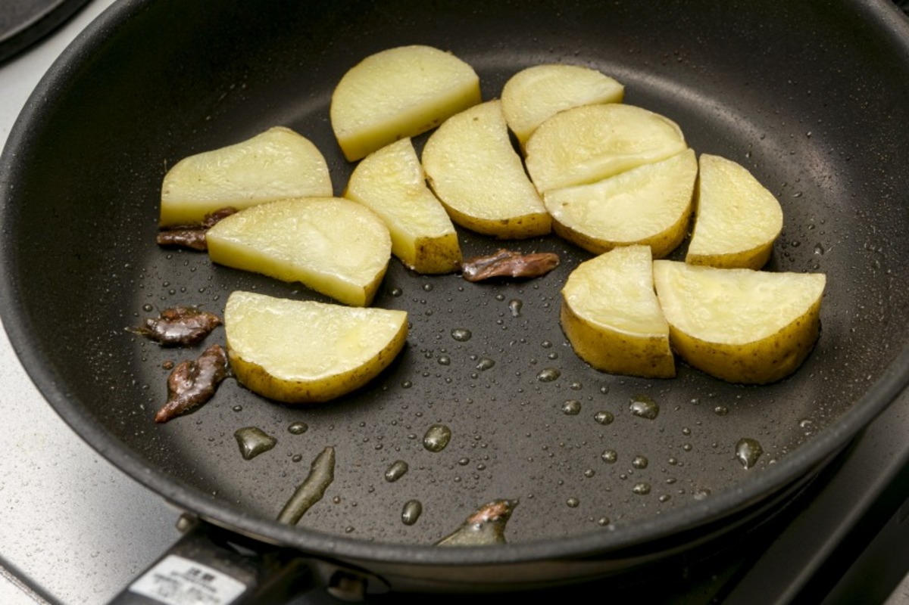
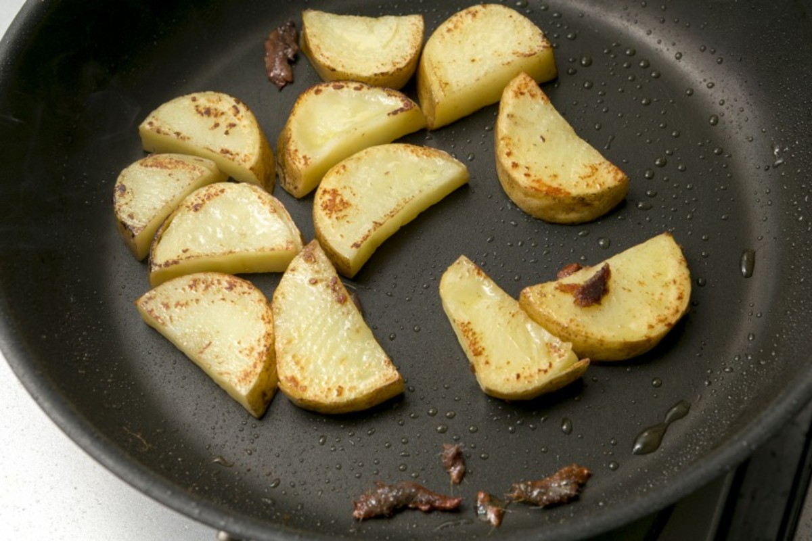
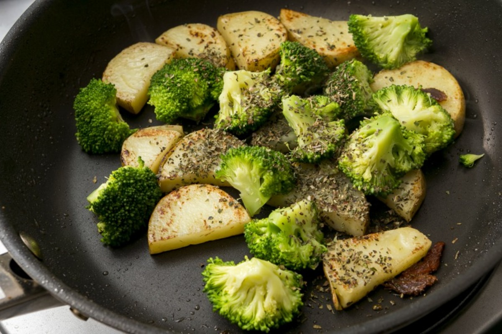
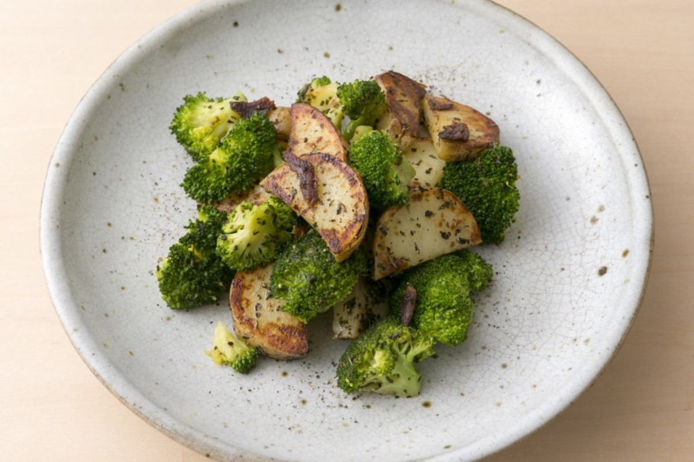

# ブロッコリーとポテトのアンチョビバジルソテー

\

じゃがいも（メークイン）
150g

ブロッコリー
100g

アンチョビ
5g

オリーブオイル
大さじ1

ドライバジル
小さじ1

塩
小さじ1/3

バター
1個（8g）

黒胡椒
適量

##### 〜アンチョビソテーの準備をします〜

じゃがいもをよく洗い、1cm幅にスライスして、半月の一口大にカットする。

ブロッコリーも一口大にカットする。

野菜を軽く濡らした状態でラップをして、500Wの電子レンジでじゃがいもを4分、ブロッコリーを1分加熱する。

##### 〜アンチョビソテーを作ります〜

フライパンにオリーブオイル（大さじ1）とアンチョビを入れ中火にかけて、軽く潰しながら炒める。

アンチョビの香りが立ったら、じゃがいもを加えて色づくまで炒めて、ブロッコリーとドライバジル（小さじ1）、塩（小さじ1/3）、バター（1個）を加えて和える。

皿に盛り、黒胡椒（適量）をして完成。

\

\
