# 丸ごとトマトとバジルバターのスープ

\

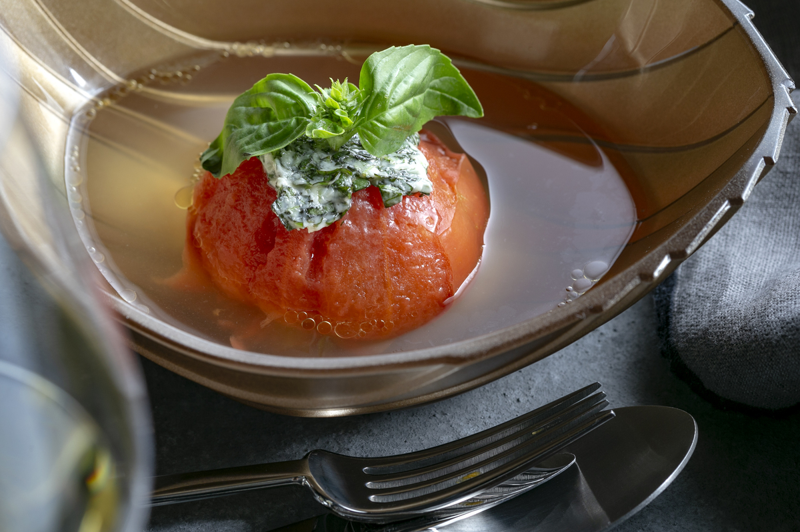

トマト
2個

バジル（飾り用含む）
1枝程度

バター
1個（8g）

チキンブイヨン
1本（6g）

水
400m

##### 〜スープの準備をします〜

トマトを洗いヘタを取る。

POINT

ヘタをくり抜くように取ると、あとの皮を剥く作業が楽になります。

バジルを飾り用に数枚（半分程度）残し、残りをみじん切りにする。

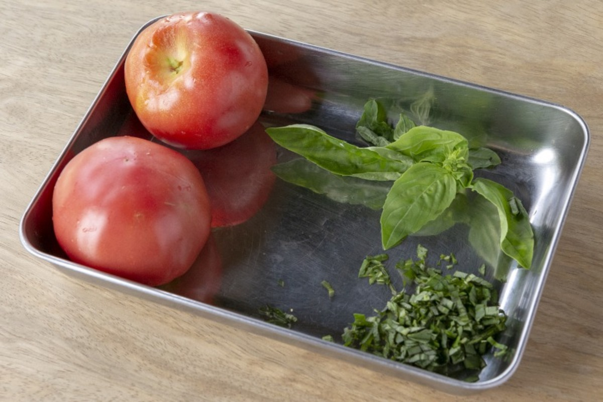

バター（1個）をラップで包んで室温に戻し、指で潰す。バジルのみじん切りを加えてよく混ぜ合わせ、バジルバターを作る。平らに伸ばして冷蔵庫に入れる。

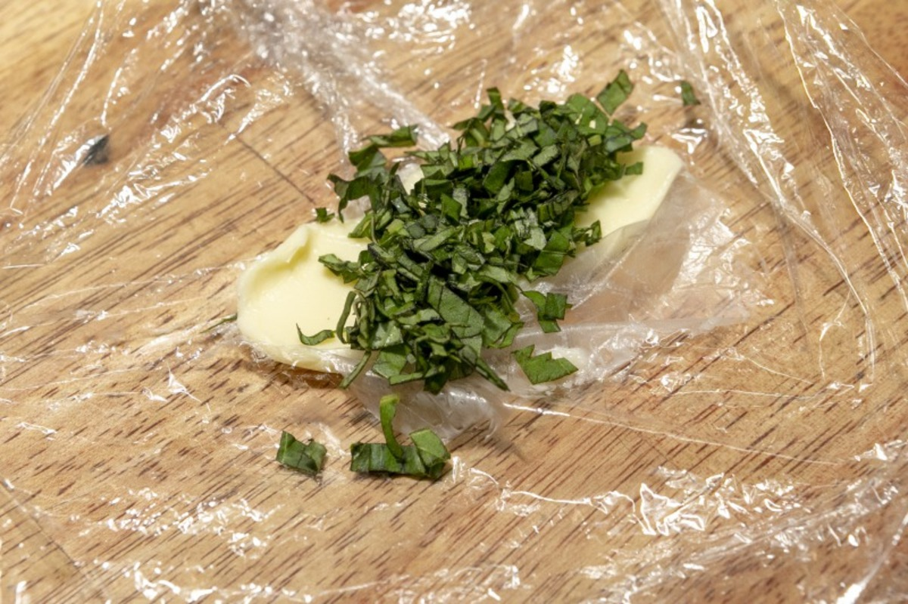
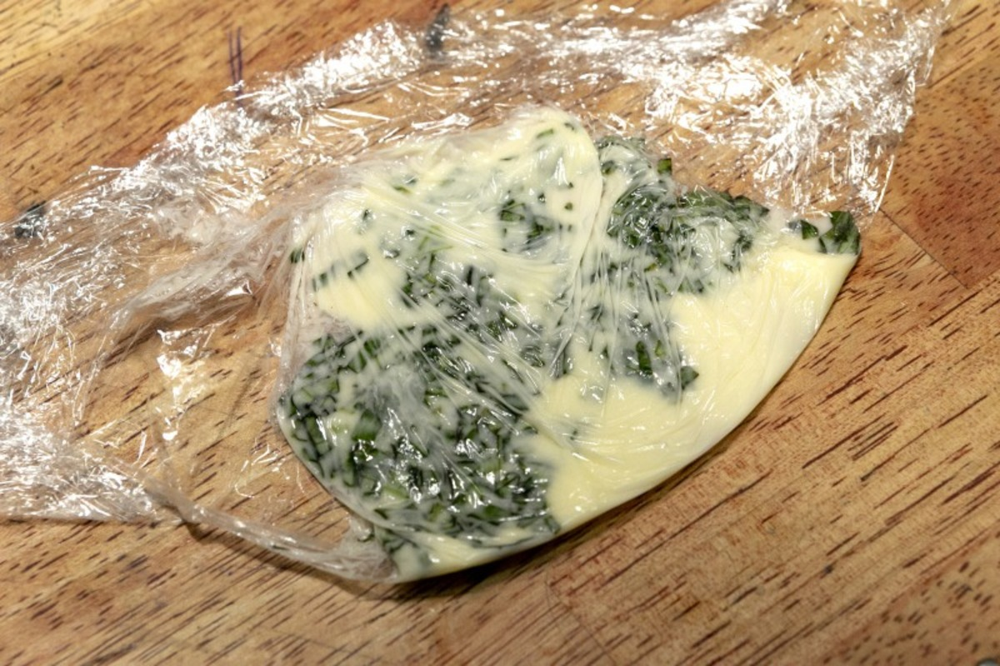

\

##### 〜鴨のローストを焼きます〜

温めたフライパンに油をひかずに鴨の皮目を下にして入れ、すぐに蓋をして中弱火で3分ほど火を入れる。弱火に落とし、さらに3分焼く。

POINT

蓋を使うことで、オーブンを使わずにローストができます。

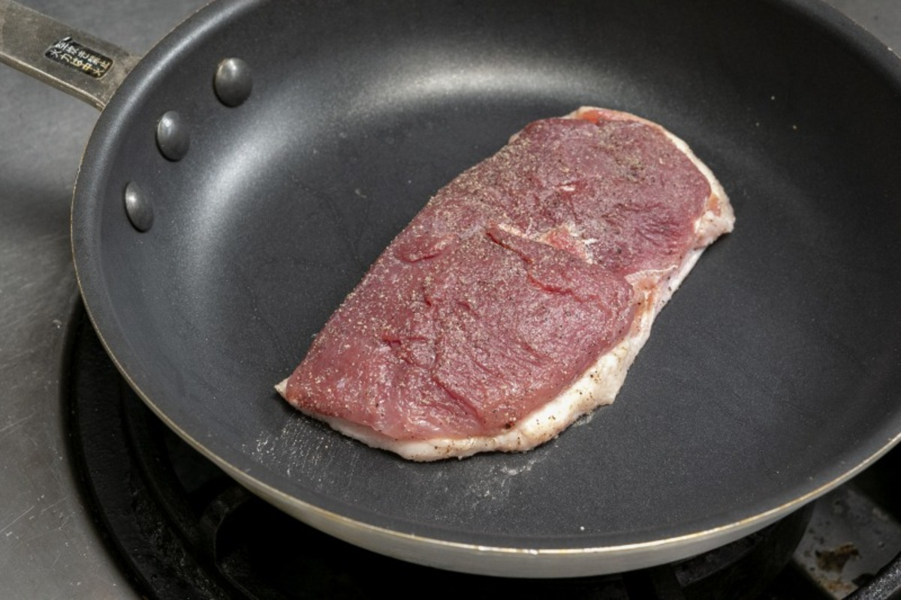
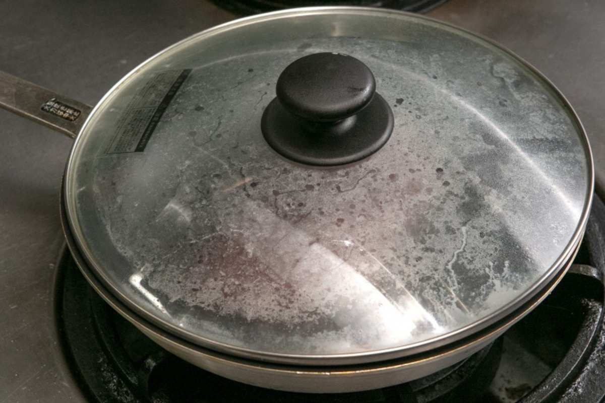

蓋を外して、出てきた油をペーパーで拭き取り、中火でさらに焼く。皮目がこんがりときれいなきつね色になったらひっくり返し、身側も少しだけ色づく程度に焼く。（目安：30秒〜1分程度）

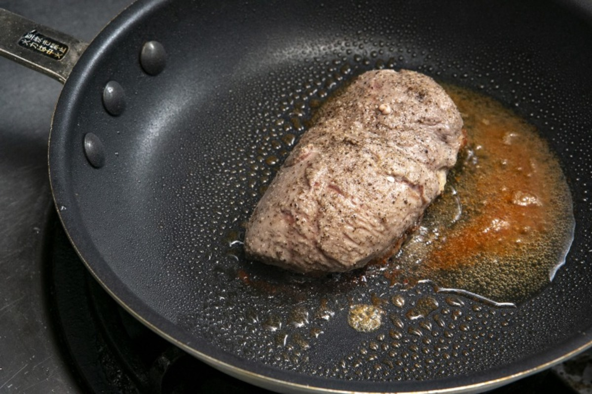
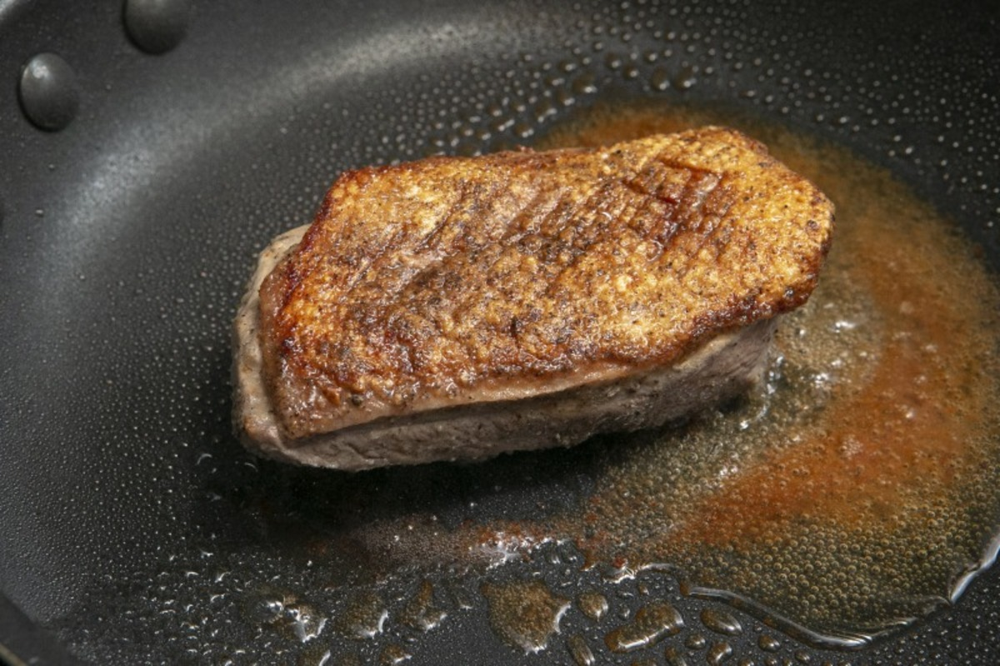

皮目を上にしてバットにのせ、アルミホイルをかぶせて温かい場所で7分休ませる。

POINT

余熱でゆっくり火を入れることで、きれいなロゼ色に仕上げます。

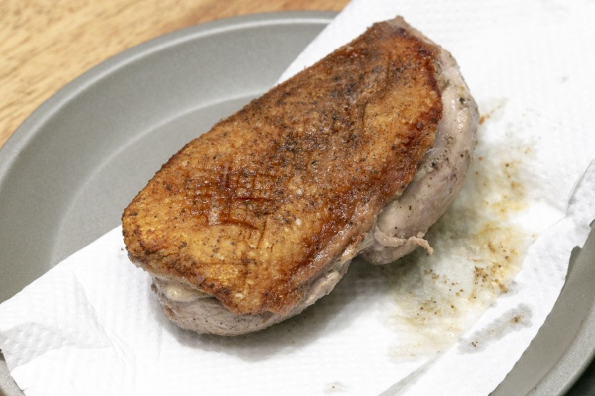
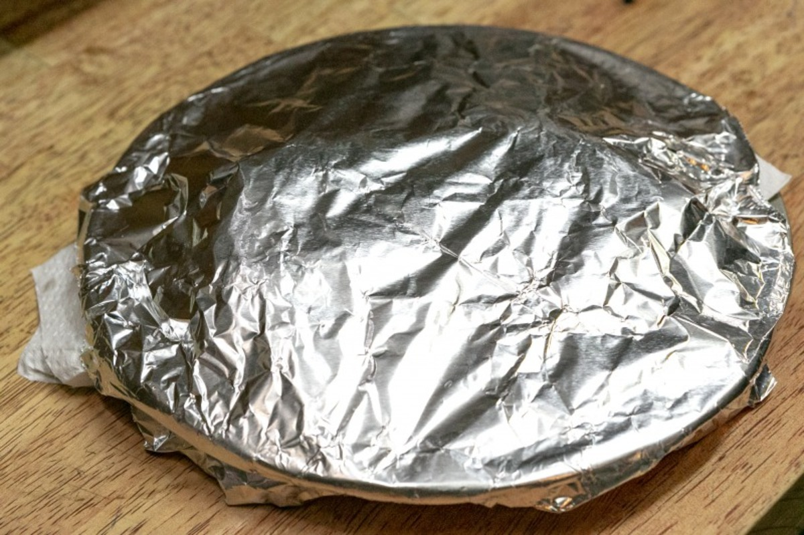

##### 〜鴨を焼いている間にスープを作ります〜

鍋に水（400ml）、チキンブイヨン（1本）を入れ沸騰させ、トマトを加えてから、弱火にして蓋をして10分煮る。

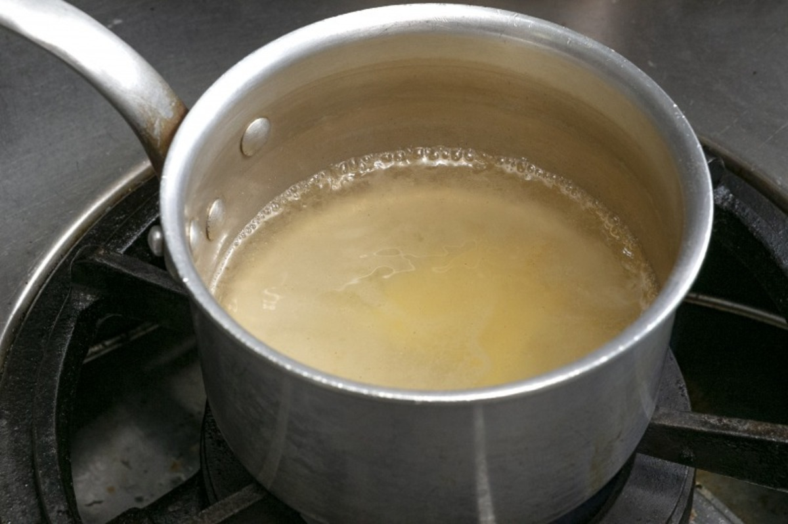
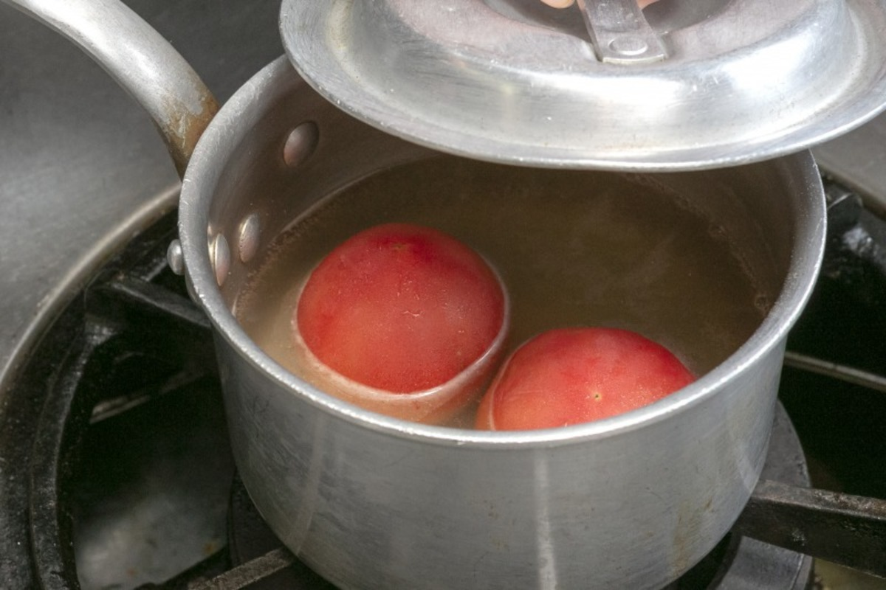

##### 〜スープを完成させます〜

トマトの皮が半分くらい剥けている状態になるので、その皮をピンセットや菜箸などで全部取り除く。

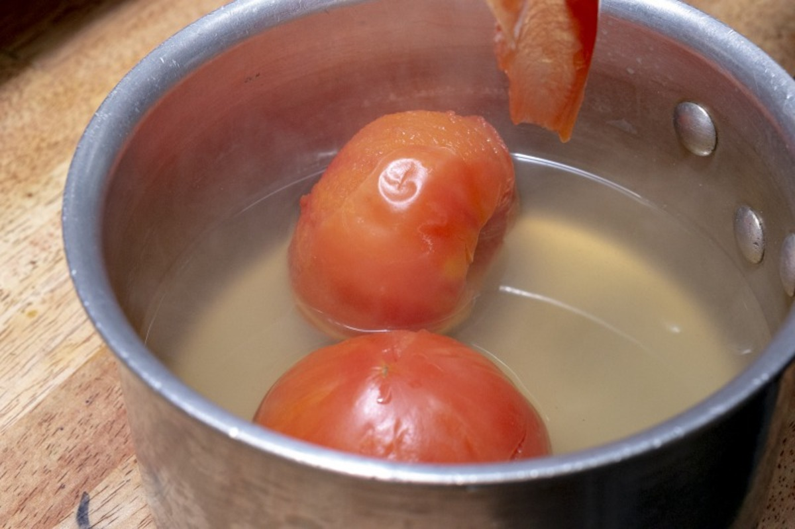
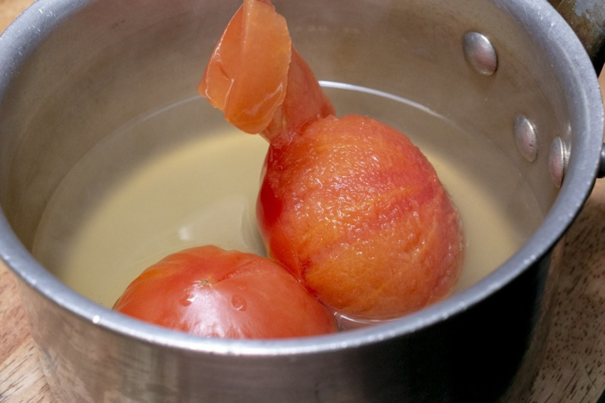

POINT

トマトは、皮と身の間に旨味が多いので、スープに入れたまま皮を剥きます。

皿にトマトを盛り、スープを注ぐ。

トマトの上に、バジルバター、飾り用のバジルをのせて完成。

POINT

トマトを潰しながらお召し上がりください。

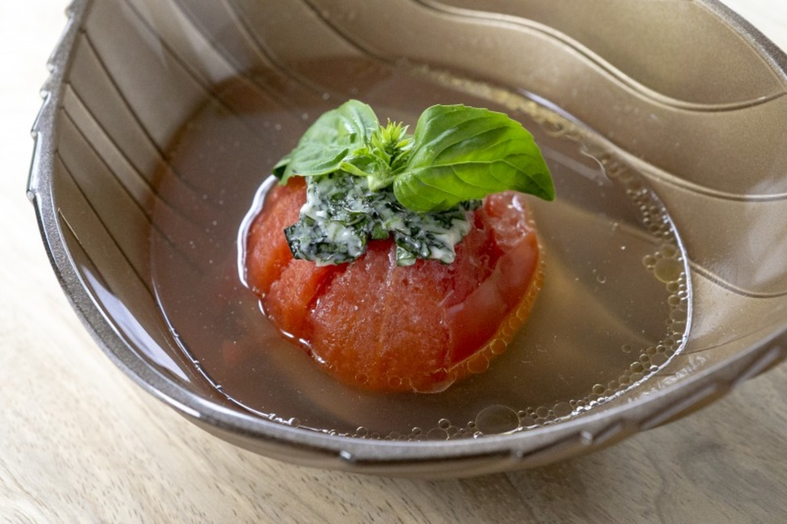

\
