# 仔羊のロースト バスク風 春野菜のエチュベ

\

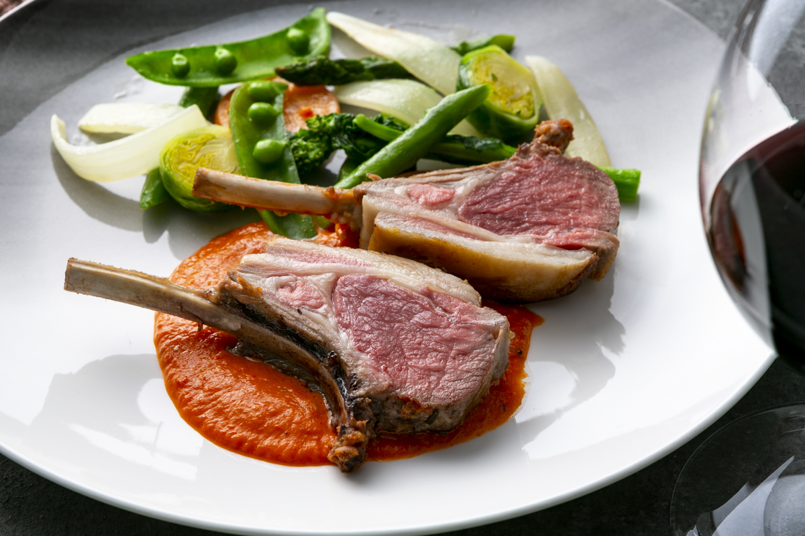

\

仔羊肉 4本

\

オリーブオイル 小さじ1

\

フェンネルシード 小さじ1/2

\

唐辛子 1本

\

オリーブオイル 大さじ1

\

赤パプリカ 1/2個

\

塩 1g

\

トマト缶(ダイス) 80g

\

アスパラ 2本

\

芽キャベツ 2個

\

スナップエンドウ 2本

\

新玉ねぎ 1/4個

\

菜の花 30g程度

\

人参 30g程度

\

バター 2個(16g)

\

塩 3g

\

チキンブイヨン 1本(6g)

\

(水：300ml+チキンブイヨン：1本) -

\

##### **メイン‐1. 仔羊のローストバスク風 春野菜のエチュベの下準備をします。**

野菜を下茹でするためのお湯を沸かしておく。

\

チキンブイヨンを水で溶かしておく。

\

（水：300ml+チキンブイヨン：1本）

\

仔羊肉を常温に戻す。（目安：1時間）

\

赤パプリカを極細切りにカットする。

\

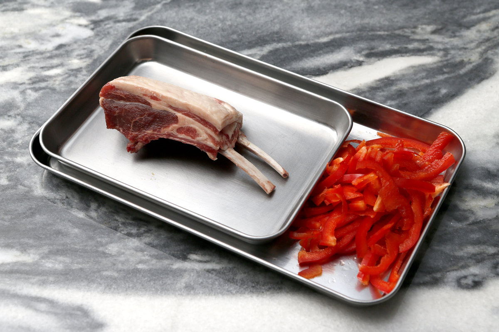

アスパラは下1/3程度の皮を剥き、斜めに3等分にカットする。

\

芽キャベツは下の硬い部分を落とし、半分にカットする。

\

人参は5㎜幅程度の薄切りにする。

\

新玉ねぎはくし切りにする。

\

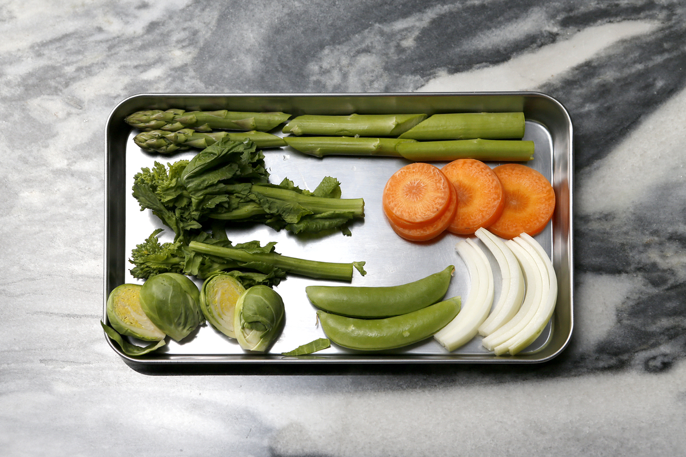

\

\

##### **メイン‐2. 仔羊のローストバスク風 春野菜のエチュベを作ります。**

フライパンにオリーブオイル(小さじ1)をしき、羊肉を脂の面から中火で、全面じっくり焼く。【焼き上がり目安：4分程度】

\

**POINT**

2分程度焼いたら、羊肉から脂が出てくるのでスプーンなどで焼き脂を骨にかけつつ焼きます。

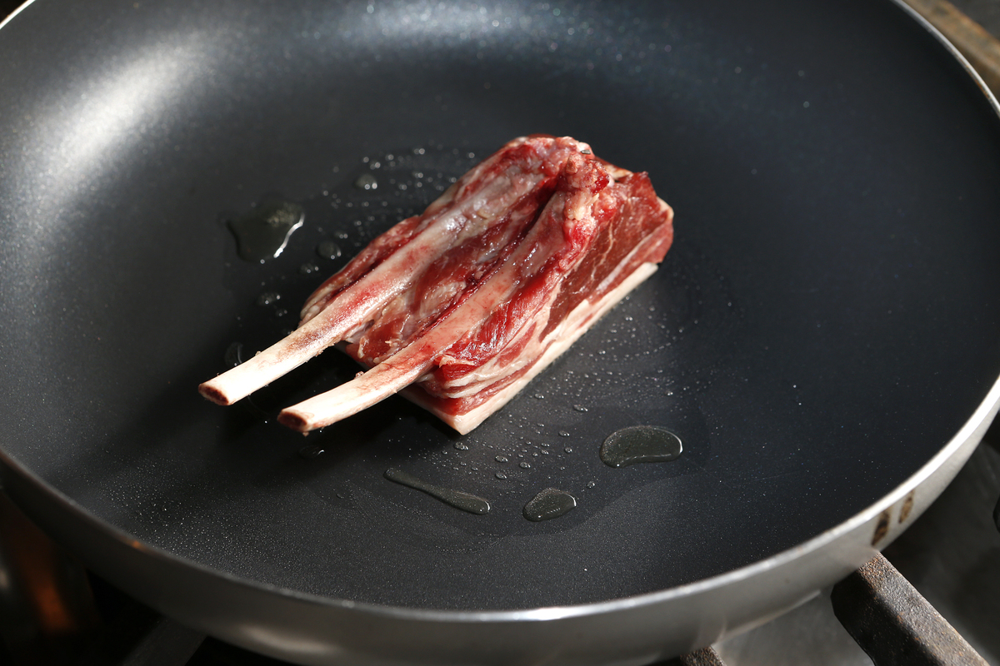
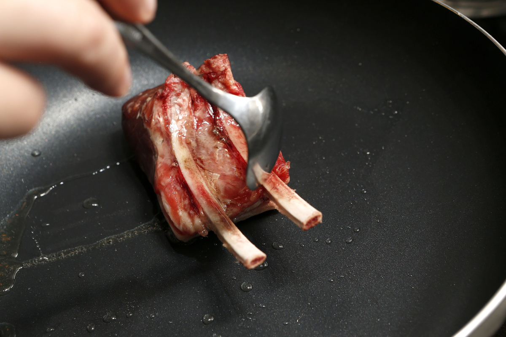
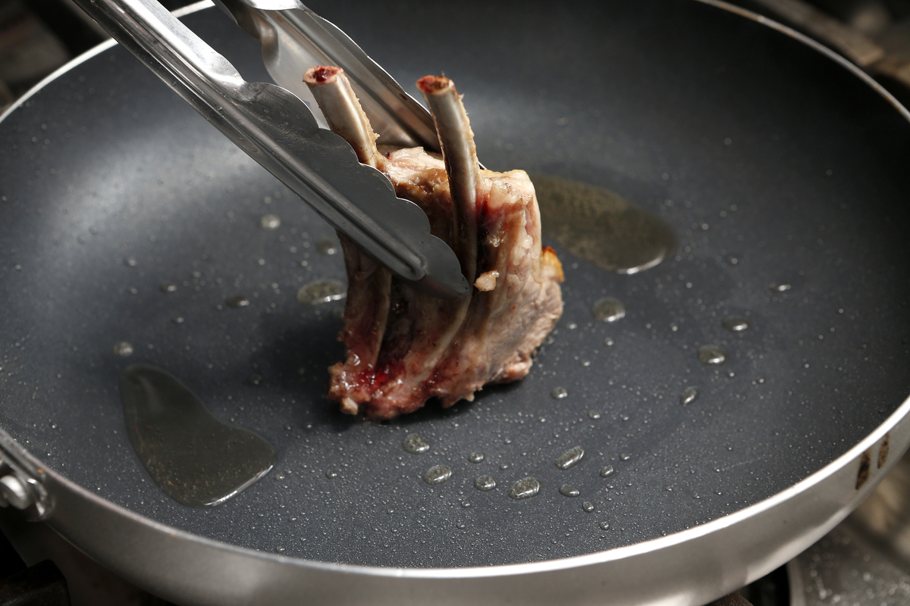

鍋にオリーブオイル(大さじ1)とフェンネルシード(小さじ1/2)、唐辛子(1本)を入れ弱火で火にかける。

\

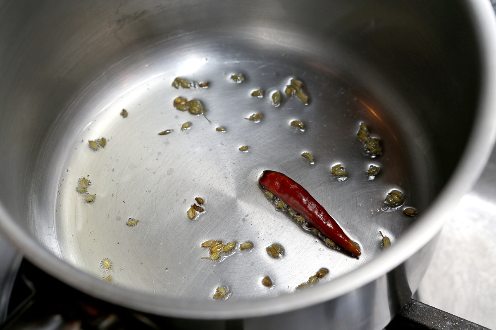

ふつふつしてきたら、パプリカと塩(1g)を加え、弱火で蓋をしてしんなりするまで炒める。

\

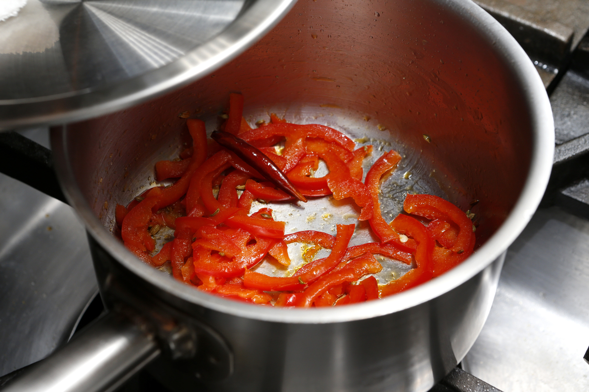

トマト缶(80g)を入れ、肉を入れ蓋をして、極弱火で5分ほど火にかける。

\

**POINT**

骨を下(脂面を上)にして入れ、鍋肌に肉が直接付かないようにしてください。

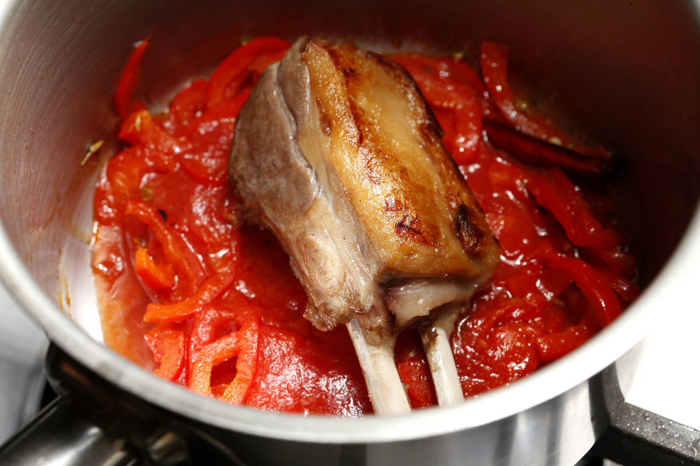

肉を鍋から取り出しアルミホイルで包み温かい場所に置いておく。

\

.

\

エチュベの野菜を下茹でする。

\

**POINT**

【茹で時間目安】：人参(2分)、スナップエンドウ(1分)、芽キャベツ(40秒)、アスパラ・玉ねぎ(15～20秒)、菜の花(茎だけ10秒茹で、全体を鍋に落として10秒)

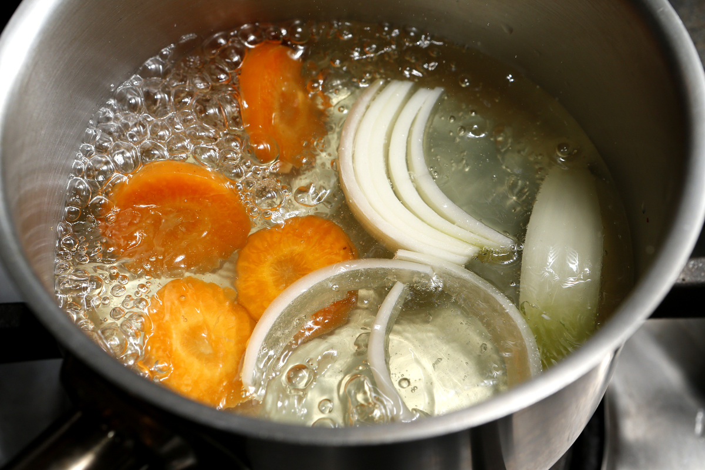

鍋にバター(3個)と塩(3g)、チキンブイヨン(50ml)を入れ、弱中火にかける。

\

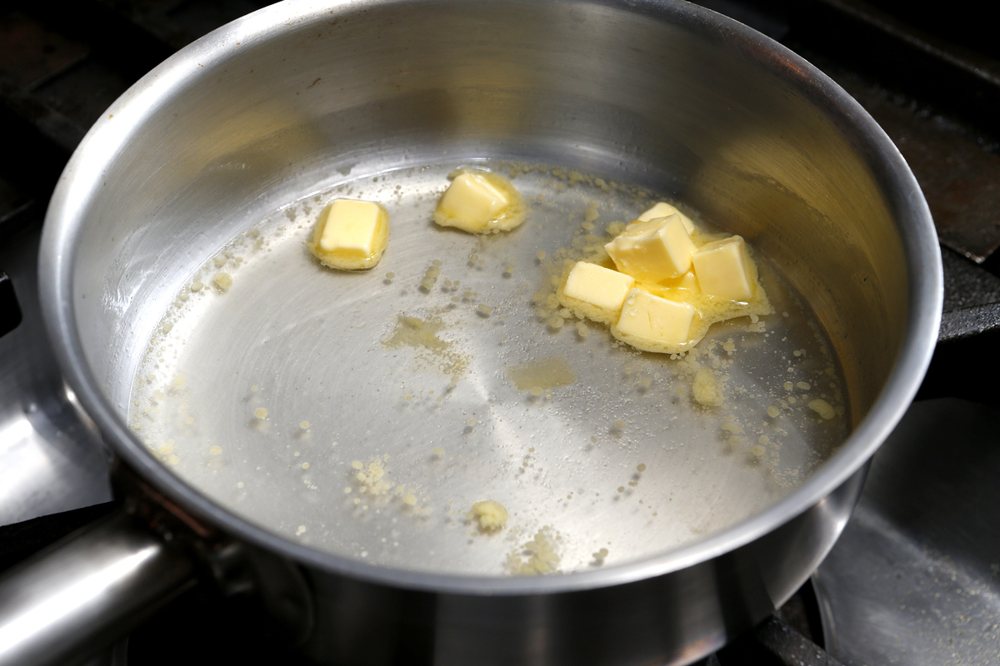

バターが溶けたら野菜を全て加え、蓋をして火にかける。

\

**POINT**

野菜がお好みの柔らかさになるまで、火にかけて下さい。

**POINT**

焦げないように時々様子を見てください。

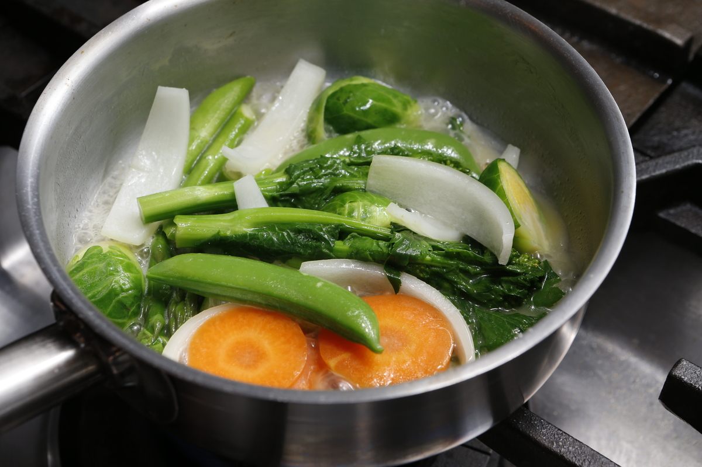

野菜を少し硬めに召し上がる方は煮汁が水っぽくなりますので、野菜を取り出し写真のようにトロっとするまで煮詰めてください。

\

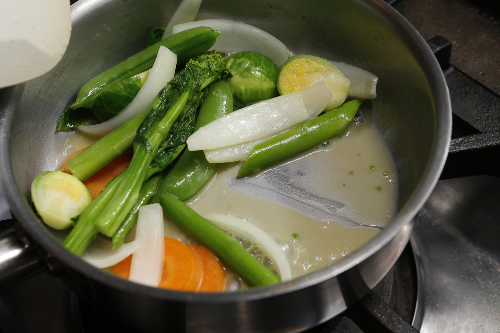

パプリカのソースは水分が半量くらいになるまで煮詰め、唐辛子を取り出しハンドブレンダーやミキサーでしっかり撹拌する。

\

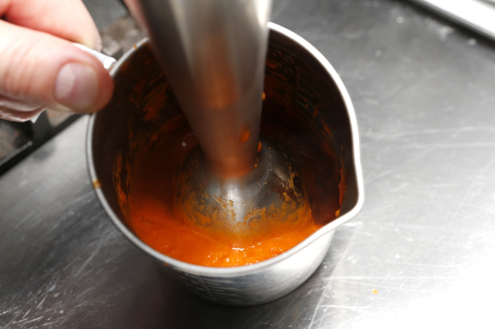

**POINT**

ざるなどで漉すと、よりなめらかなソースになります。

##### **仔羊のローストバスク風 春野菜のエチュベを仕上げます。**

仔羊肉を切り分け、野菜を盛りつけ、ソースをしいてその上に肉を盛り付けて完成。

\

**POINT**

仔羊の関節を手前に置いて（骨が出ている方を奥）切ると、綺麗に切り分けることができます。

**POINT**

突き出た骨を手前側にしてカットすると、関節に包丁が上手く入らず綺麗に切り分けられないことがあるので、関節を手前に置いて切り分けることを推奨しています。

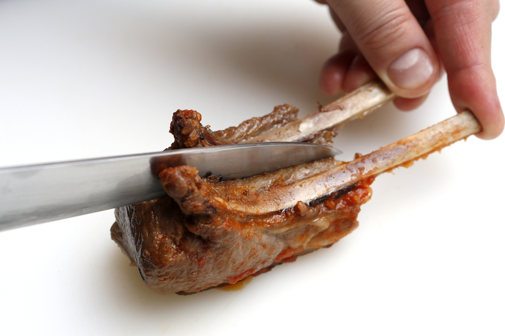
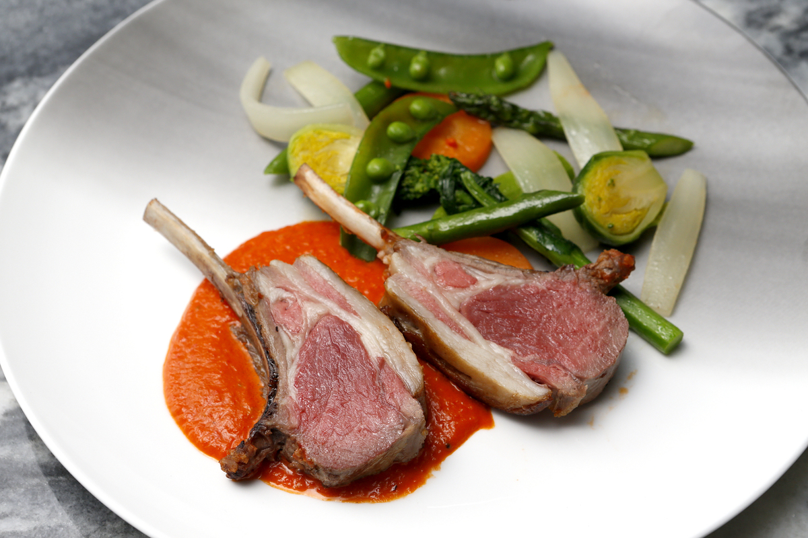

\
