# 仔羊背肉ロースト ペルシヤード

\

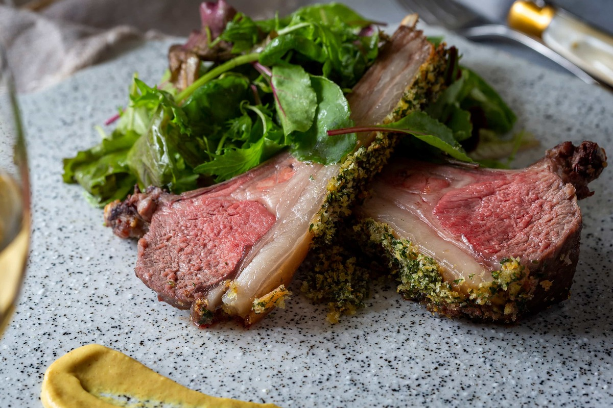

骨付き仔羊肉
4本分

塩
小さじ2/3

サラダ油
大さじ1

ディジョンマスタード
15g

※送付量の3/4程度
-

■ペルシヤード
-

おろしにんにく
2袋(6g)

ドライパセリ
1.5g

ドライパン粉
6g

オリーブオイル
小さじ1

■付け合わせ
-

ベビーリーフ
20g

塩
ひとつまみ

胡椒
適量

オリーブオイル
大さじ1/2

ディジョンマスタード(飾り用)
5g

※送付量の1/4程度
-

##### メイン-1. 仔羊背肉ロースト ペルシヤードの下準備をします。

仔羊肉に塩(小さじ2/3)を振り、常温に20分ほど置いておく。

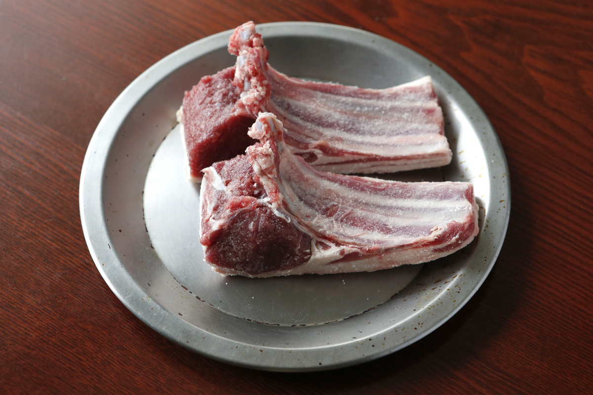

POINT

常温に戻しておくことで、焼いたときに肉の外側と中心の温度差が小さくなり、きれいなロゼ色に焼き上がります。

POINT

羊のにおいが苦手な方は、脂をそぐと羊臭さが軽減され、さっぱり召しあがっていただけます。

オーブンを200℃に予熱しておく。

ベビーリーフを水洗いして、ざるに上げておく。

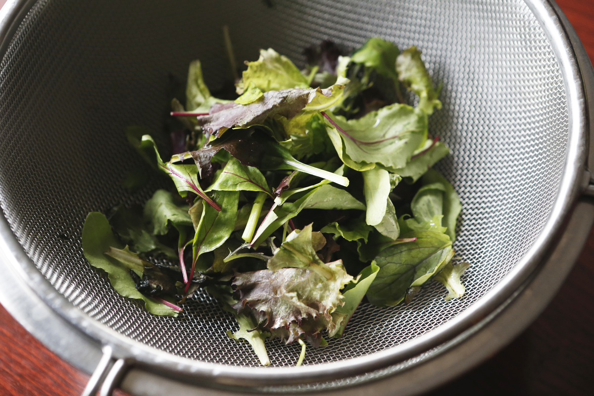

\

##### メイン-2. 仔羊背肉ロースト ペルシヤードを作ります。

ドライパセリ（1.5g）、ドライパン粉（6g）、おろしにんにく（2袋）、オリーブオイル（小さじ1）をボウルで合わせてよく混ぜて、ペルシヤードを作っておく。

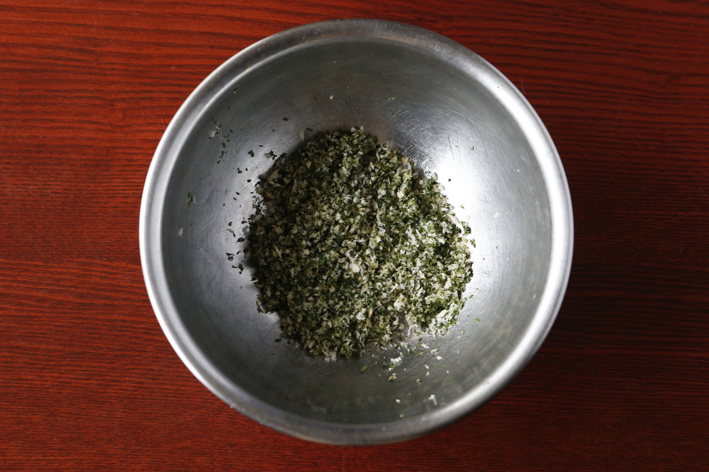

フライパンにサラダ油（大さじ1）をひき、常温に戻した仔羊肉の全面を、カリッとするまで弱火で焼き色を付ける。

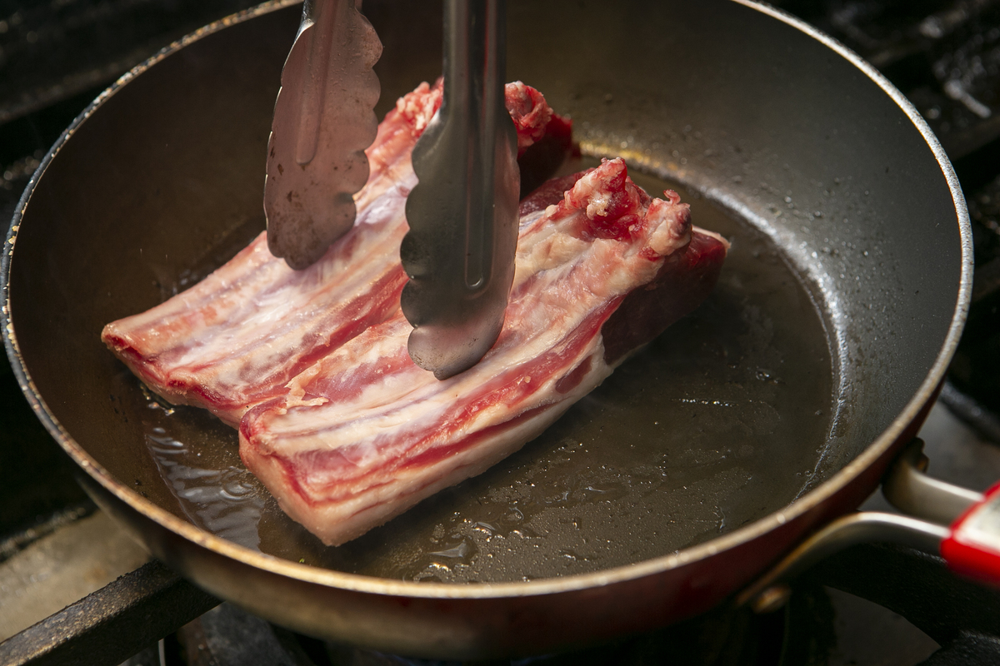
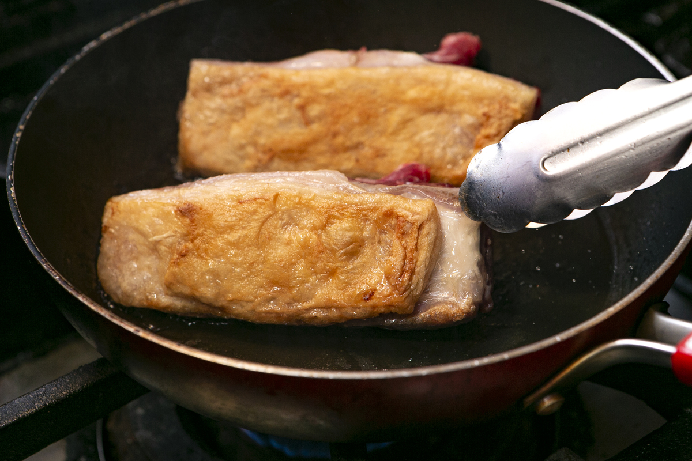
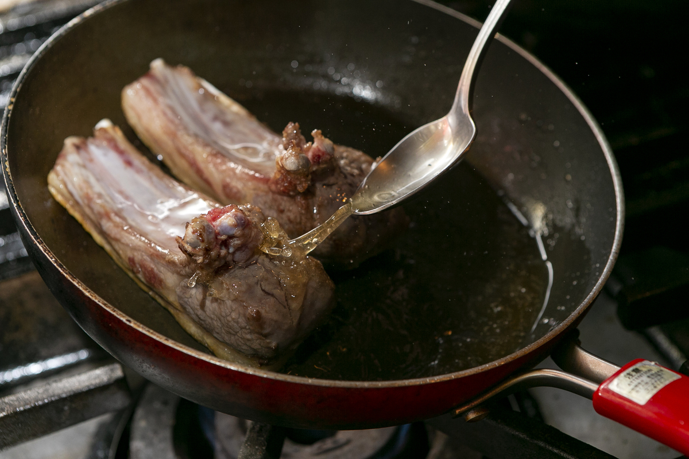

POINT

脂面は押し付けるようにして、脂をしっかりと出すように焼きます。

POINT

骨がある部分は火が入りにくいので、スプーンなどでフライパンにある油をかけながら焼きます。

仔羊肉の脂の方にマスタード（送付量の3/4程度）を塗り、ボウルで混ぜ合わせたペルシヤードをまぶしてつける。

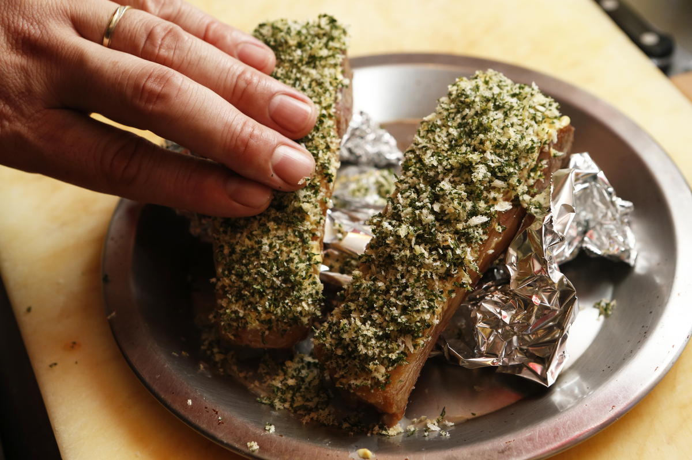

POINT

マスタードはゴムベラやスプーンの腹で塗ると塗りやすいです。

POINT

アルミホイルで土台を作り、仔羊肉を固定して、ペルシヤードを押し付けるようにしっかりつけます。

200℃のオーブンで仔羊肉を12分焼き、4～5分アルミホイルなどで包まず、暖かい場所で休ませる。

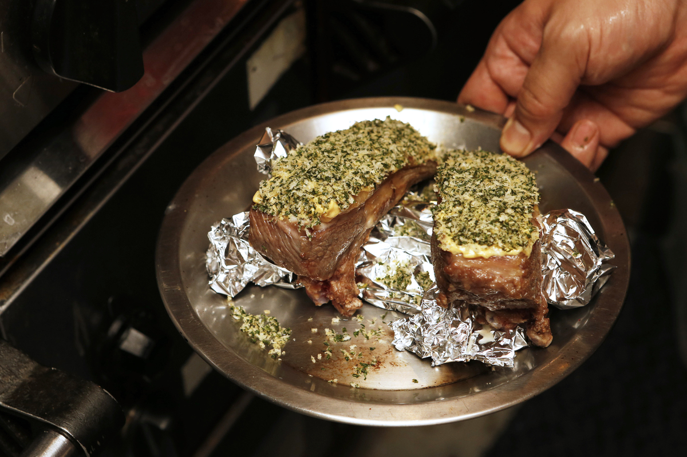

POINT

オーブンがない場合：焼く前に骨を1本ずつに切り分け、全面にパン粉を付けて、弱中火くらいで周りのパン粉が香ばしくなるまで焼いてください。焦げやすいので注意してください。

POINT

休ませると肉汁が落ち着き、カットしたときに肉汁の流失を防げます。

\

##### メイン-3.仔羊ロースト ペルシヤードを仕上げます。

ベビーリーフをボウルに入れ、塩（ひとつまみ）、胡椒（適量）、オリーブオイル（大さじ1/2）を混ぜ合わせ味見をして、塩胡椒でお好みの味に調整する。

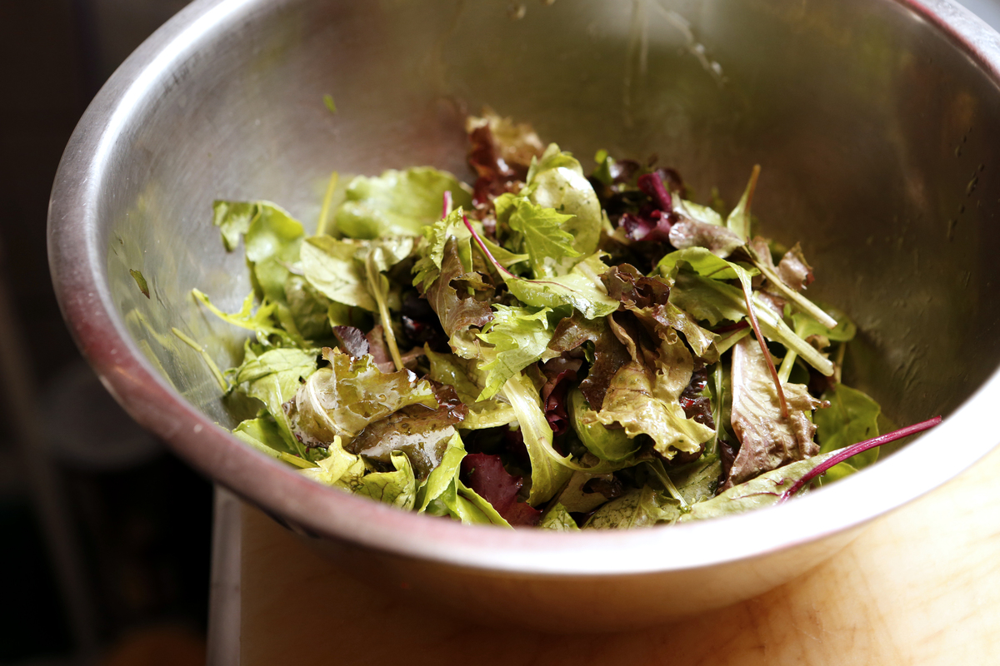

骨と骨の間に包丁を入れ、半分にカットする。

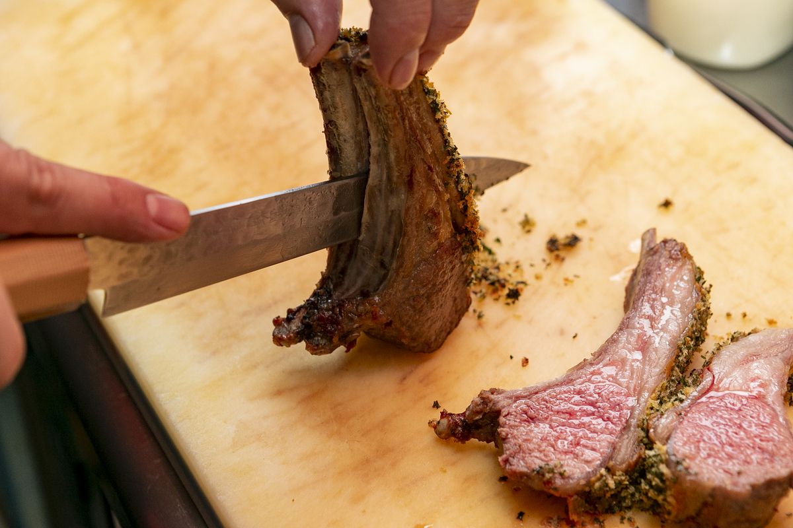

仔羊肉を盛り付け、ベビーリーフとマスタード(送付量の1/4程度)を飾る。

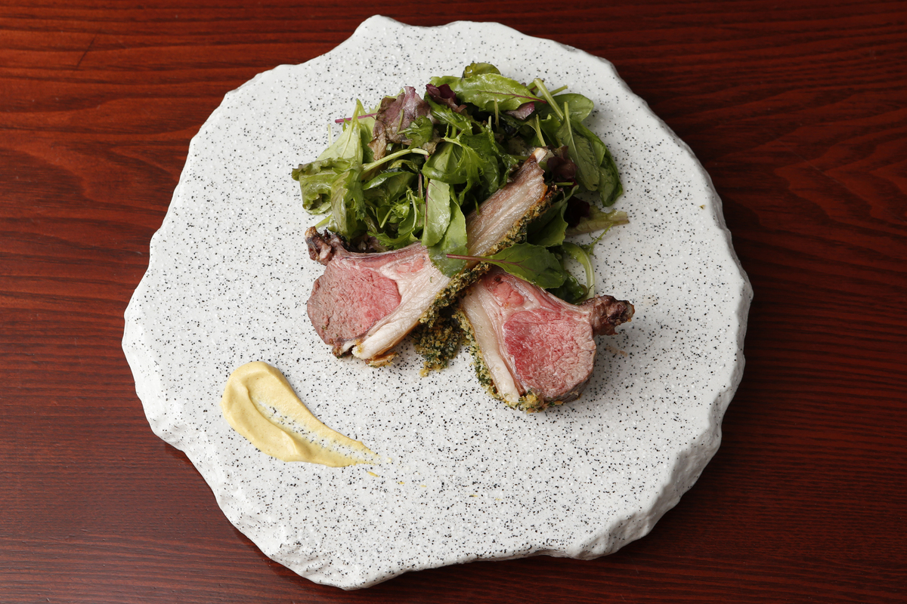

\

\

\
