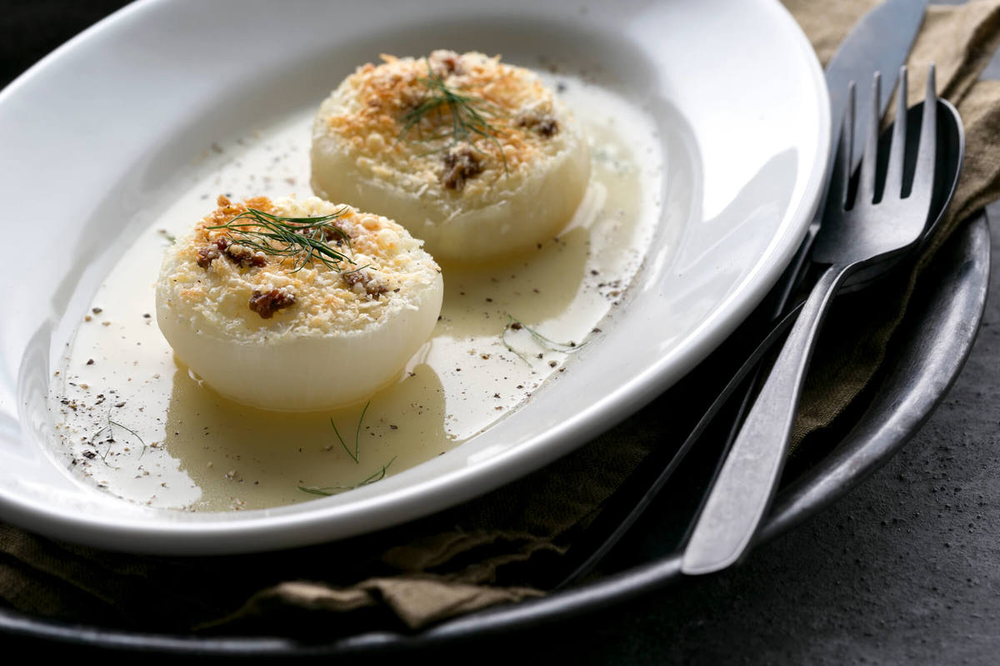
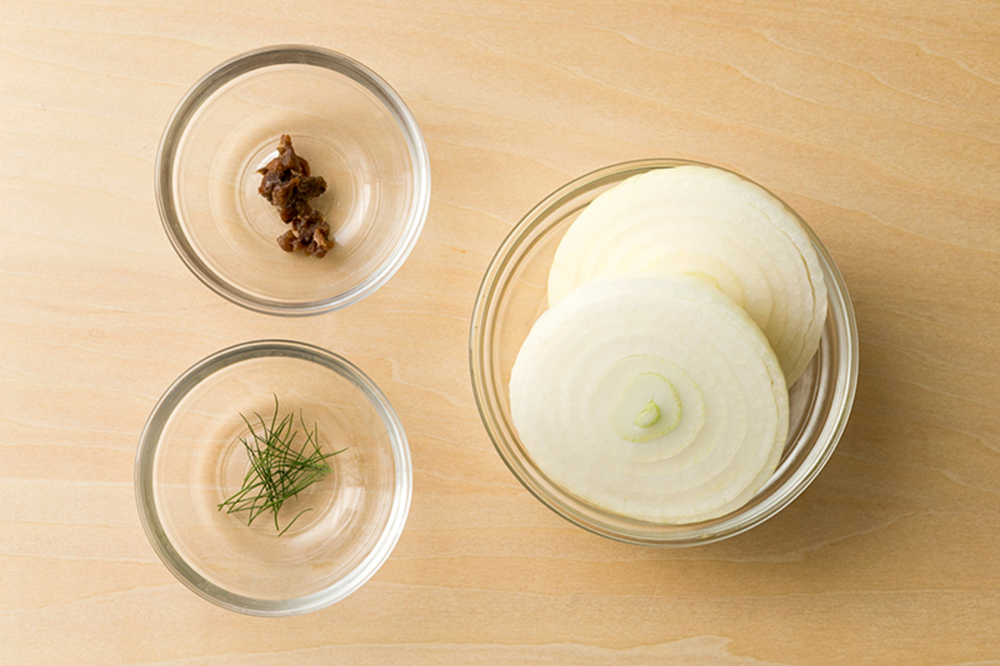
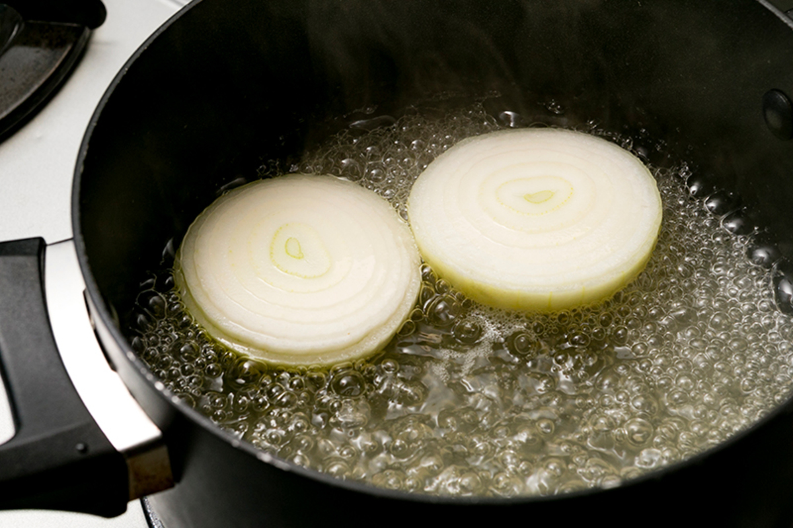
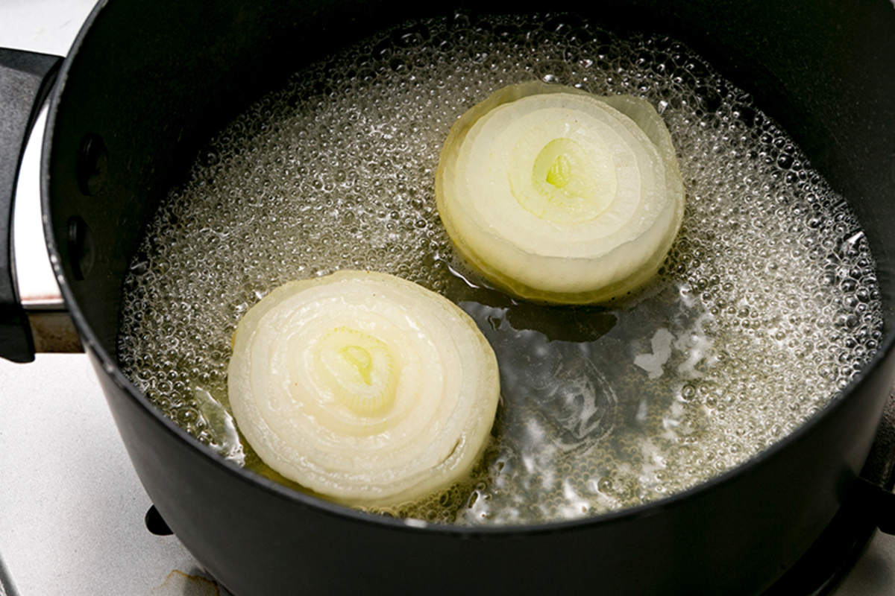
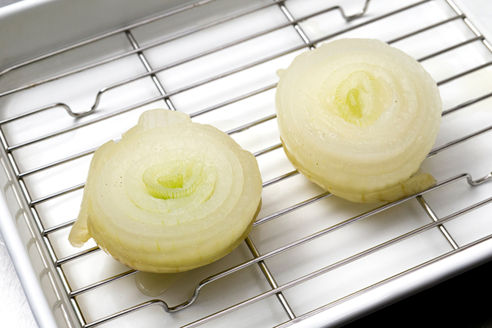
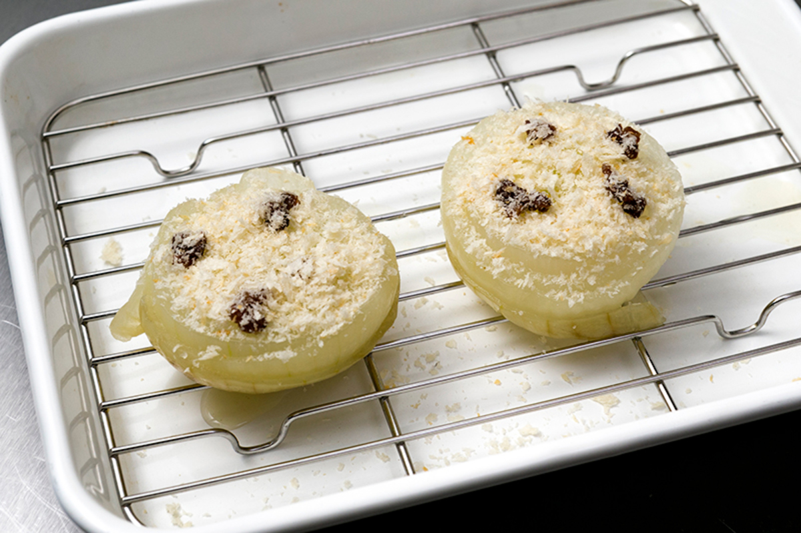
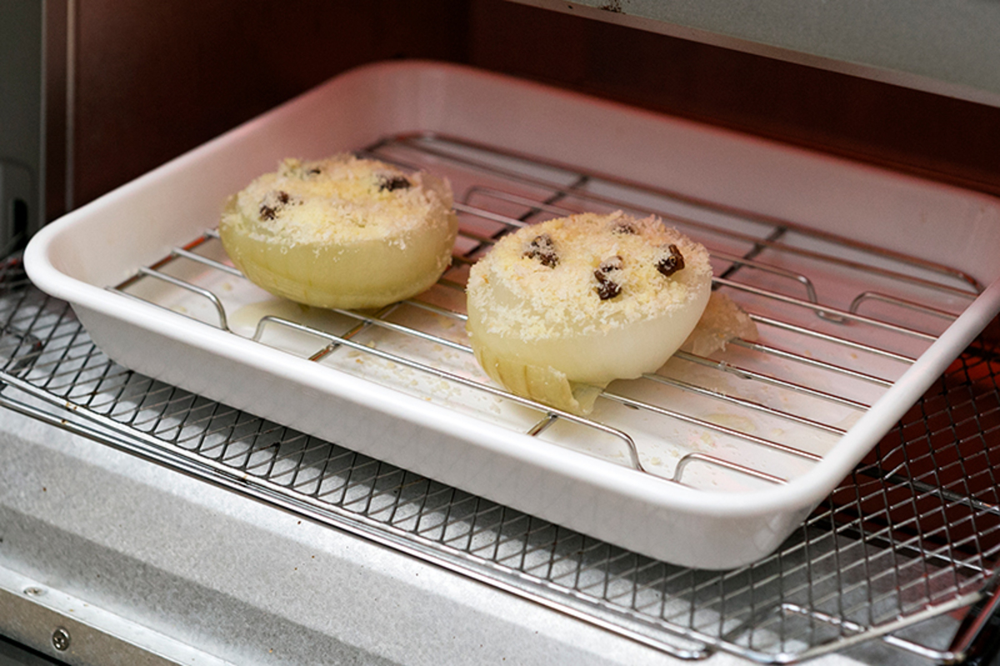
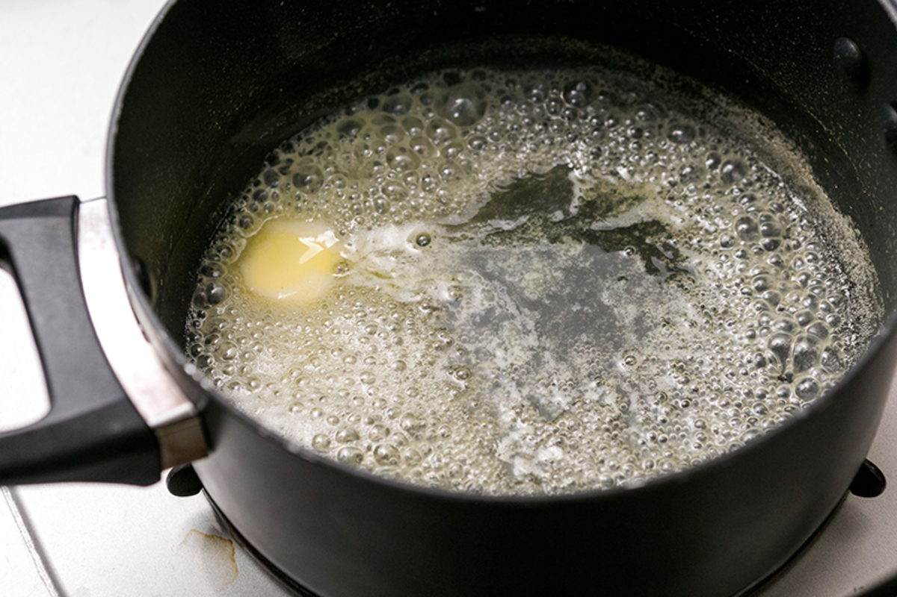
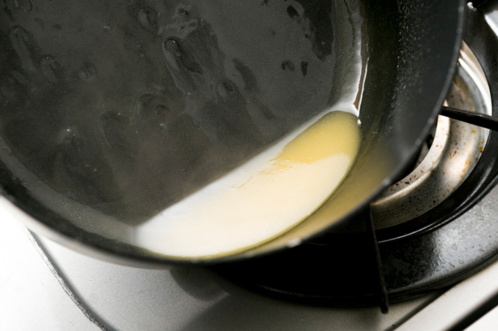
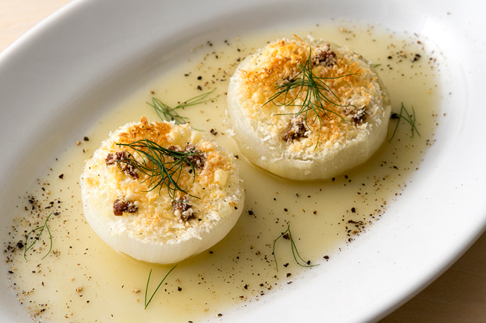

# 新玉ねぎのグラチネ

\

新玉ねぎ
2個

チキンブイヨン
300ml （水300ml＋顆粒1本）

アンチョビ
3g 程度

パルメザンチーズ
2袋（14g）

パン粉
5g程度

バター
1個（8g）

ディル
1g程度

##### 〜グラチネの準備をします〜

新玉ねぎの皮を剥き、横半分にカットする。

アンチョビを粗みじん切りにする。

##### 〜グラチネを煮込みます〜

鍋にチキンブイヨン（水300ml＋顆粒1本）と新玉ねぎを入れ、強火にかけ一煮立ちさせる。

沸いたら中火に落とし、蓋をして13分ほど煮込み（途中で一度ひっくり返す）、バットに新玉ねぎを取る。

新玉ねぎの断面を上にし、アンチョビ（3g）、パン粉（5g）、パルメザンチーズ（2袋）を振り、200℃のトースターで4分ほど焼き色が付くまで焼く。

新玉ねぎの煮汁にバター（1個）を加え、とろみがでるまで煮詰めてソースにする。

POINT

煮汁に残った新玉ねぎの旨味を、煮詰めてソースにします。

皿にソースをしき、新玉ねぎを乗せ、ディルを散らして完成。

\

\
