# 穴子と彩り野菜のミルフィーユ仕立て〜プロバンス風〜＆ヴィシソワーズ 〜コンソメジュレ添え〜

**75min※**

※冷製スープのヴィシソワーズは先に作って冷やすのがおすすめです。

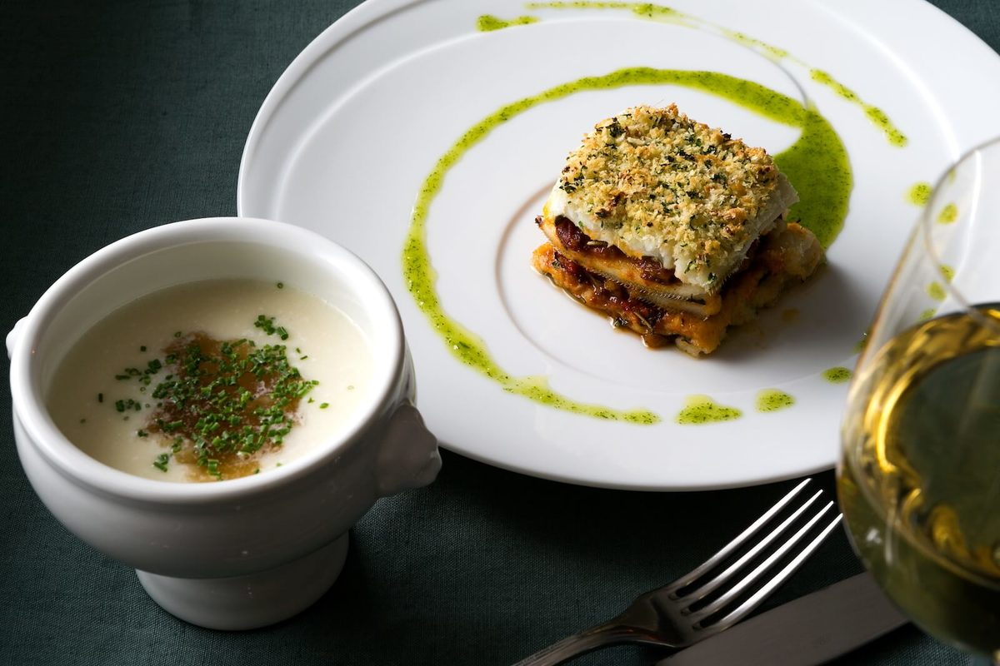

**Cooking description**

**- 料理説明 -**

夏に脂の乗る穴子を彩り豊かな野菜を合わせたプロバンス風の一皿。キリッとしたプロバンスのロゼワインとも相性ピッタリです。夏の火照った身体に染み渡るじゃがいもの冷製ヴィシソワーズは体力が落ちている時には最高です。ミュスカデなどの辛口白ワインを合わせるのもオススメです。

#### 土切 祥正

コントワール　ミサゴ / フレンチシェフ

\

「コントワール　ミサゴ」オーナーシェフ。1976年静岡県生まれ。高校卒業後「下高井戸旭鮨総本店」に入社。その後、西麻布「レリノス｣等を経て、北海道のオーベルジュ「ヘイゼルグラウスマナー」で働いた後、「ブラッスリーマノワ」に立ち上げから携わり、4年間勤務。2010年8月に東京・西麻布にて「コントワール　ミサゴ」をオープン。料理の修業は鮨屋から始まり、カリフォルニア料理やフランス料理等で幅広く研鑽を積み、コントワールミサゴでは、日本全国からシェフの厳選した食材をベースにした本格的な料理を提供しています。

Ingredients ―  お送りする食材リスト

\

**穴子とラタトゥイユのミルフィーユ～ハーブのビネグレット～**

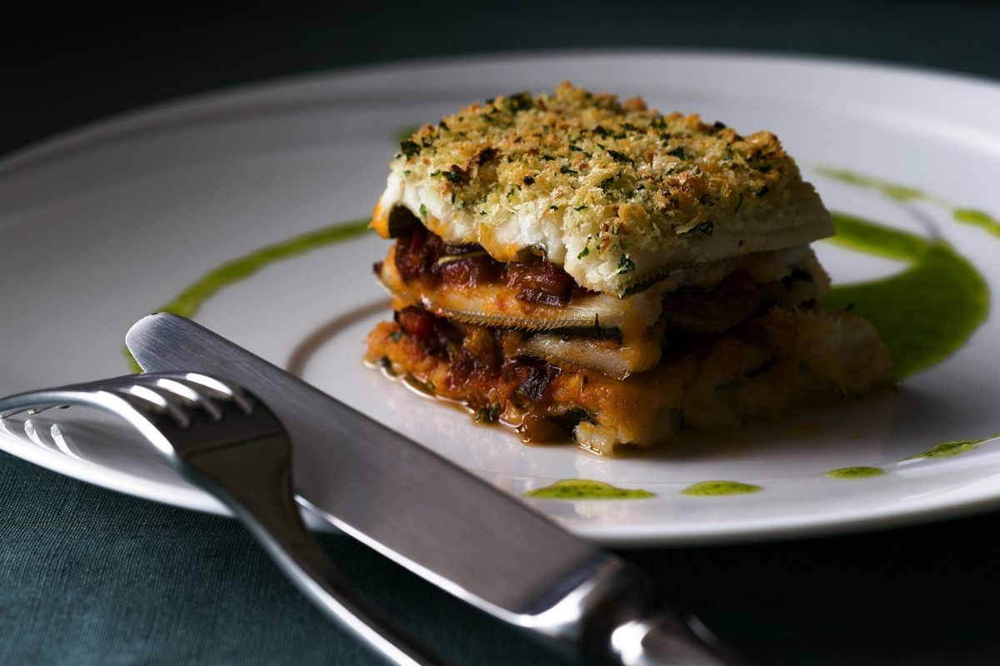

穴子2尾

チキンブイヨン1本

水800ml

塩適量

オリーブオイル適量

【ラタトゥイユ】

トマト1個

にんにく1/2片(2.5g程度)

玉ねぎ15g程度

ドライタイム0.5g

ローリエ1枚

赤パプリカ1/4個

黄パプリカ1/4個

塩ひとつまみ

オリーブオイル大さじ1

【ペルシヤード】

パン粉10g

パセリ2g

すりおろしにんにく1袋

オリーブオイル大さじ1/2

【ハーブビネグレット】

ディル、セルフィーユ、シブレット各2g

オリーブオイル大さじ4

玉ねぎ10g程度

ディジョンマスタード4g

白ワインビネガー15ml

塩小さじ1/3

\

**ヴィシソワーズ コンソメジュレ添え**

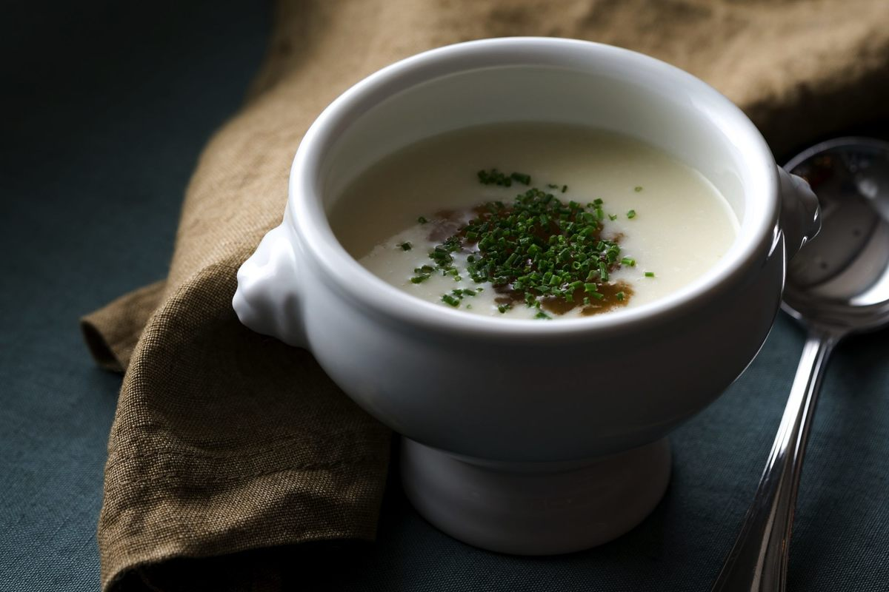

長ねぎ60g程度

じゃがいも(メークイン)2個

オリーブオイル大さじ1

チキンブイヨン1本(6g)

水600ml

牛乳125ml

塩水15ml(塩：小さじ1/2＋水：大さじ1)

【コンソメジュレ】

コンソメ1/2本(3g)

水100ml

ゼラチン1.5g

シブレット適量

\

### **調理方法**

##### ヴィシソワーズの下準備をします。

じゃがいもは皮をむき、 1cmの輪切りにして水にさらす。

\

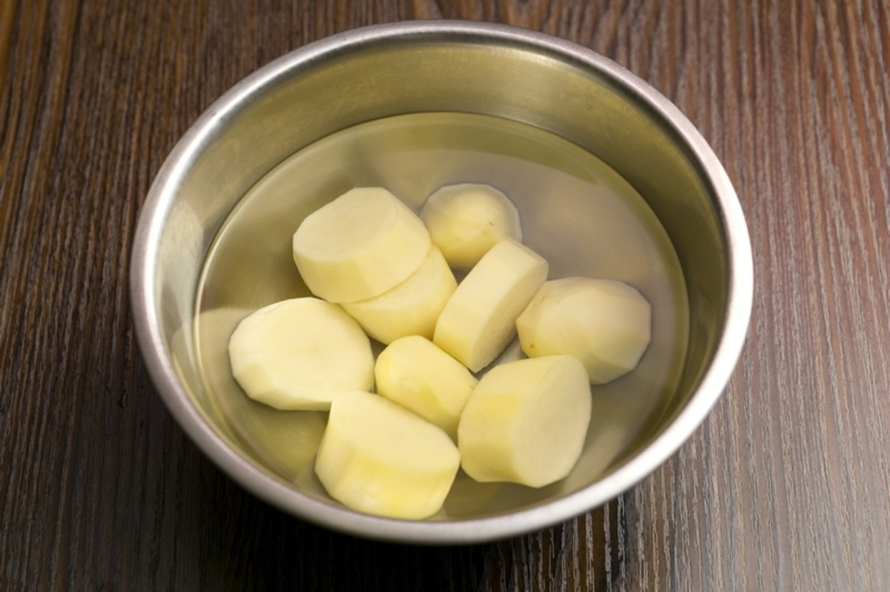

長ねぎを斜めに切る。

\

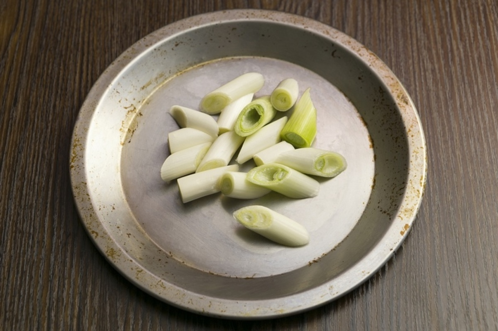

##### ミルフィーユの下準備をします

・トマトの皮を湯剥きして、中の種取り、1cm角の大きさに刻む。

\

湯むきについて詳しく確認したい方は下記をご覧ください。

\

<https://tastytable.jp/magazines/29>

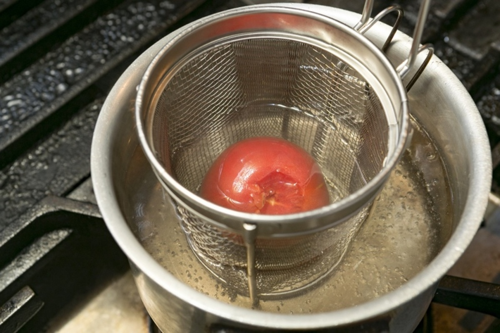
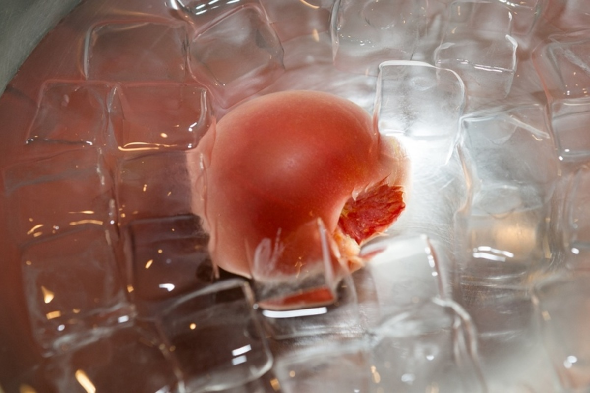
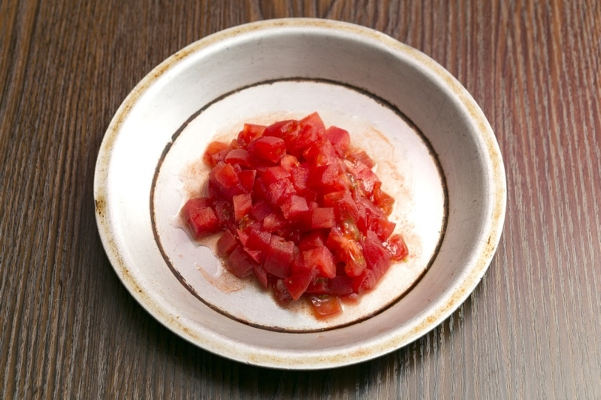

・オーブンを200度にセットしておく。

\

・パプリカ(赤・黄)を１cm程度の角切りにする。

\

・にんにく(1/2片)、玉ねぎ(送付量の1/2)をみじん切りにする。

\

・パセリをみじん切りにする。

\

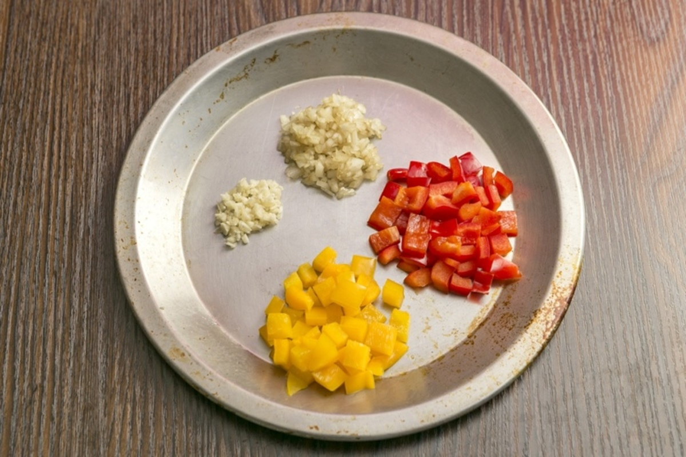

##### コンソメジュレを作ります。

鍋にコンソメ1/2本(3g)、水(100ml)を入れて温め、中火でゼラチン(1.5g)を溶かす。

\

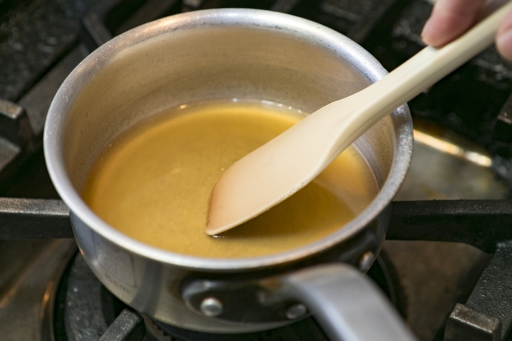

ジュレを別の容器に移し、冷蔵庫で固まるまで冷やしておく。

\

**POINT**

時間が無い場合は、氷水で冷やすと早く固まります。

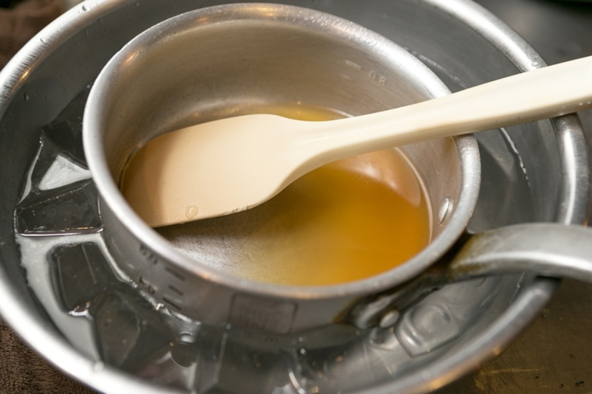

##### ヴィシソワーズを作ります。

鍋にオリーブオイル(大さじ1)をひき、長ねぎを弱火で10分ほどしんなりするまで弱火で炒める 。

\

**POINT**

なるべく色づけ無いようにしてください。

鍋に水(600ml)、チキンブイヨン(1本) 、じゃがいもを鍋に入れ、中火で20分ほど煮る。

\

**POINT**

20分ほど煮たら、粗熱をとって冷まします。

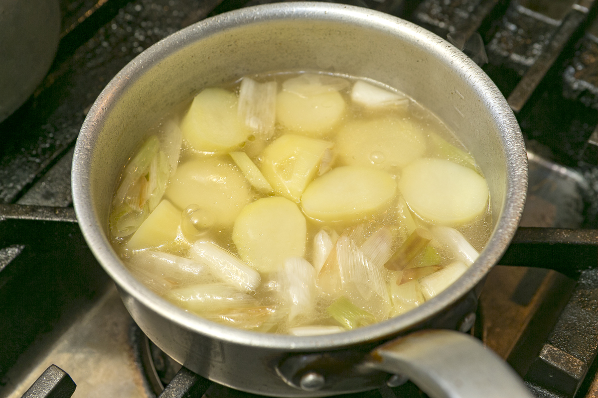

粗熱が取れたらミキサーにかけ、氷水か冷蔵庫でスープを冷やす。

\

**POINT**

ミキサーがない場合は、じゃがいもが柔らかくなったらザルなどで裏ごししてください。

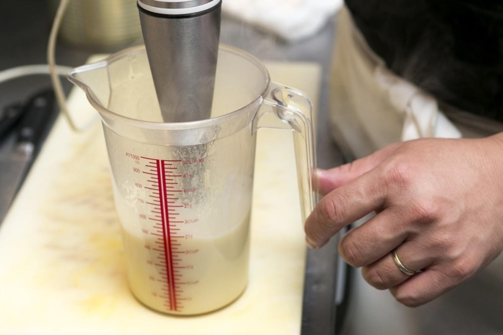

##### 香草パン粉、ヴィネグレットを作ります。

フードプロセッサーに下記食材を入れて回し、香草パン粉を作る。

\

パセリ

パン粉10g

すりおろしにんにく1袋

オリーブオイル大さじ1

**POINT**

フードプロセッサーがない場合は、細かく刻んだパセリとその他の食材をよく混ぜてください。

ミキサーに下記食材を入れ、撹拌してソースを作る。

\

ディル

セルフィーユ

シブレット

オリーブオイル大さじ4

玉ねぎ10g程度

ディジョンマスタード小さじ1

白ワインビネガー15ml

塩小さじ1/3

**POINT**

ビシソワーズ用に、シブレット（細長い葱のようなもの）のみじん切りをふたつまみとっておく。

##### 〜穴子を煮ます〜

水(800ml)、チキンブイヨン(1本)を鍋に入れ、沸騰させる。

\

穴子を軽く水洗いして、沸騰したスープに穴子を表面の色が変わる程度にさっと湯通しする。

\

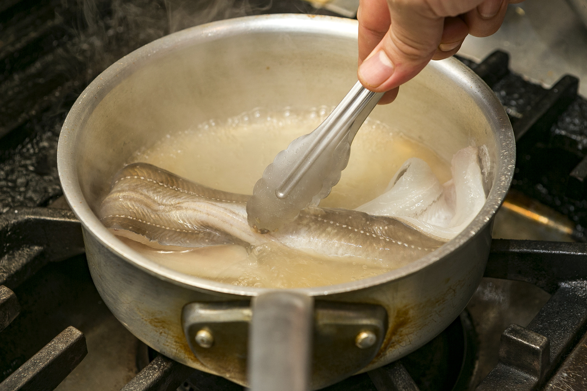

穴子を取り出し、皮目をメインに包丁の裏などで白いぬめりをとる。

\

**POINT**

ぬめりをとることで、魚の臭みをなくすことができます。

穴子を鍋に戻し、クッキングペーパーなどで落し蓋をして、沸騰してから中火で10分ほど煮る。

\

**POINT**

穴子の煮汁は後でオーブンで焼くときに使うので、取っておきます。

煮終わったら粗熱を取り、少し押さえるようにして、まっすぐ伸ばして冷ます。

\

**POINT**

ミルフィーユ状に重ねるので、伸ばしておきます。

##### ラタトゥイユを作ります。

フライパンオリーブオイル(大さじ1)をひき、パプリカを強火で炒める。

\

パプリカに軽く焼き色が付いたら、下記食材を加えしんなりするまで中火で炒める。

\

にんにく1/2片

玉ねぎ送付量の1/2

ドライタイム0.5g

ローリエ1枚

\

しんなりしたらトマトを加え、中火で2～3分ほど中火で煮詰め、最後に塩(ひとつまみ)を加える。

\

##### 穴子のミルフィーユを作ります。

冷ました穴子の尻尾の部分をカットし、同じ大きさくらいになるよう4等分にする。

\

穴子に塩(分量外)を振り、下味をつける。

\

耐熱の皿にオーブンシートを乗せ、穴子とラタトゥイユを交互に乗せる。

\

1番上にオリーブオイル(適量)を塗り、パセリパン粉を付ける。

\

穴子の煮汁(50ml)を穴子の周りに流し、200度のオーブンで10分蒸し焼きにする。

\

##### ヴィシソワーズを仕上げます。

スープが冷えたら牛乳(125ml)を加え、ミキサーで回して滑らかなスープに仕上げる。

\

味をみてお好みで塩水(15ml)を加え、お好みの味に整えて完成。

\

**POINT**

冷たいスープだと塩が溶けないので、塩水を使って味を調整します。

お皿にスープを注ぎ、コンソメジュレを上にのせて刻んだシブレットをふりかけて完成。

\

##### 穴子を盛り付けます。

**POINT**

焼き色がついたらお皿に取り出し、ハーブのビネグレットソースを周りに回しかけて完成。

料理をお召し上がりになった後、今回のメニューのご感想を是非お聞かせください
