# 豚ロースのハーブマリネ～和風シャリアピンソース～

\

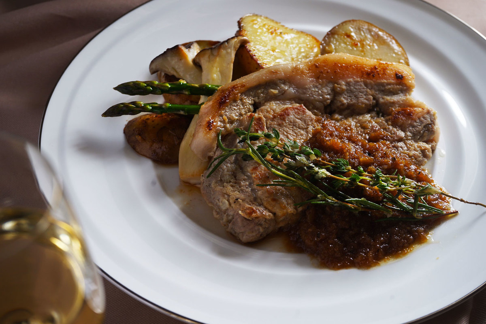

豚ロース肉
150g×2枚

オリーブオイル
大さじ1

じゃがいも
2個

ミニエリンギ
60g程度

アスパラ
2本

塩
適量

胡椒
適量

■マリネ液
-

玉ねぎ
1/2個

にんにく
1片（5g程度）

塩
小さじ1/3

黒胡椒
小さじ1/3

オリーブオイル
大さじ2

ローズマリー
2g程度

タイム
2g程度

■ソース
-

醤油
大さじ2

酢
大さじ1

はちみつ
1袋（15g）

##### 〜豚肉をマリネします〜

玉ねぎ（1/2個）はすりおろす。

POINT

フードプロセッサーでペーストにしても問題ありません。

にんにくはみじん切りにする。

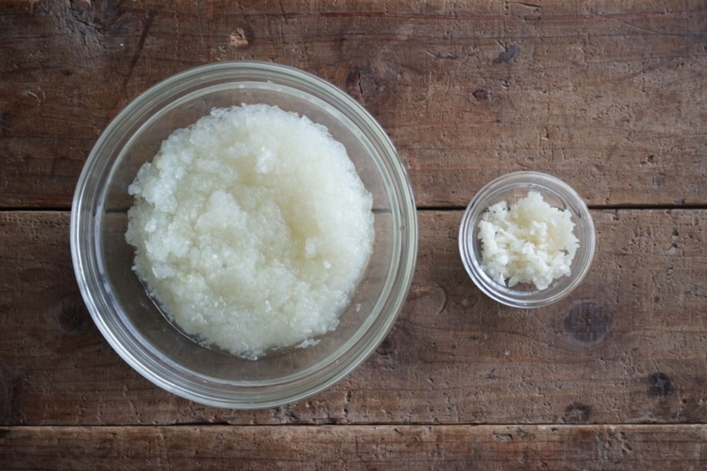

豚肉は脂身と赤身の間に数回切り込みを入れる。

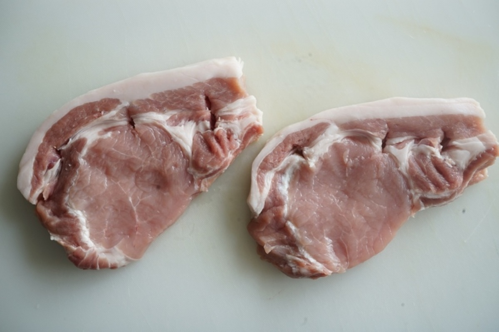

マリネ液を混ぜ合わせ、袋に入れる。

玉ねぎ
1/2個

にんにく
1片

ローズマリー
2g程度

タイム
2g程度

塩
小さじ1/3

黒胡椒
小さじ1/3

オリーブオイル
大さじ2

豚肉をマリネ液に入れて軽くもみ込み、全体に密着するようにして20分常温で置いて、マリネする。

POINT

玉ねぎはタンパク質を分解する酵素が入っています。玉ねぎをすりおろした水分もよく働いてくれるので、しっかり混ぜ込んでください。

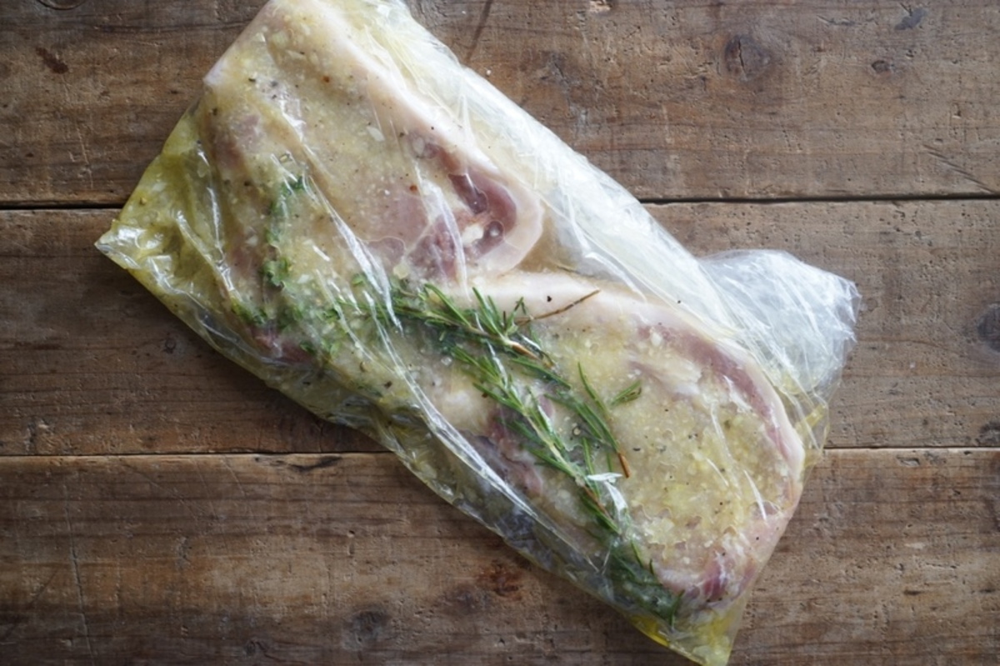

##### 〜豚肉をソテーして仕上げます〜

ジャガイモを2cm程度のスライスにし、電子レンジ600wで2分加熱する。

ミニエリンギは縦に半分に切り、アスパラは硬い部分の軸を落とす。

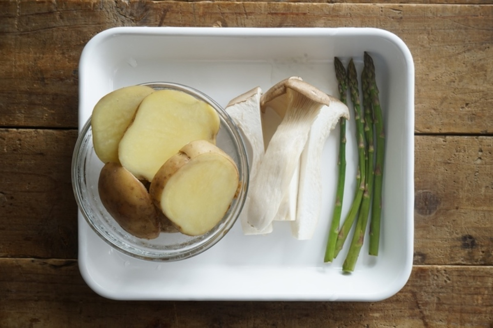

豚肉をマリネ液から取り出し、玉ねぎが付いていたら取り除く。

POINT

玉ねぎが付着していると焦げやすくなるので、できる限り取り除いてください。 袋に残ったマリネ液は、後でソースとして使います。

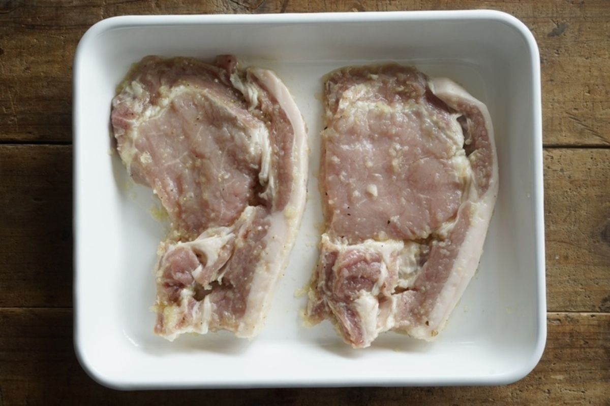

フライパンにオリーブオイル（大さじ2）をひいて温め、肉を入れて中火で焼く。片面3分程度焼き、裏返して更に2分程度焼く。焼きあがったら取り出し、アルミホイルに包み余熱で火を入れる。

POINT

今回は中火で焼いて、焼き目を付けすぎず、余熱でじんわり火入れをして柔らかく仕上げましょう。

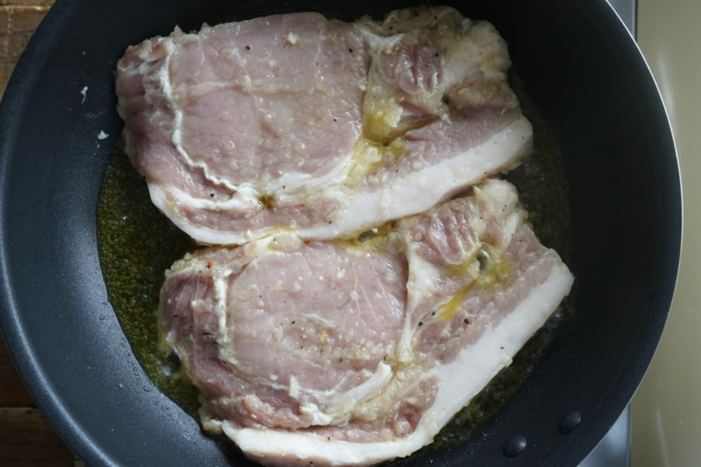
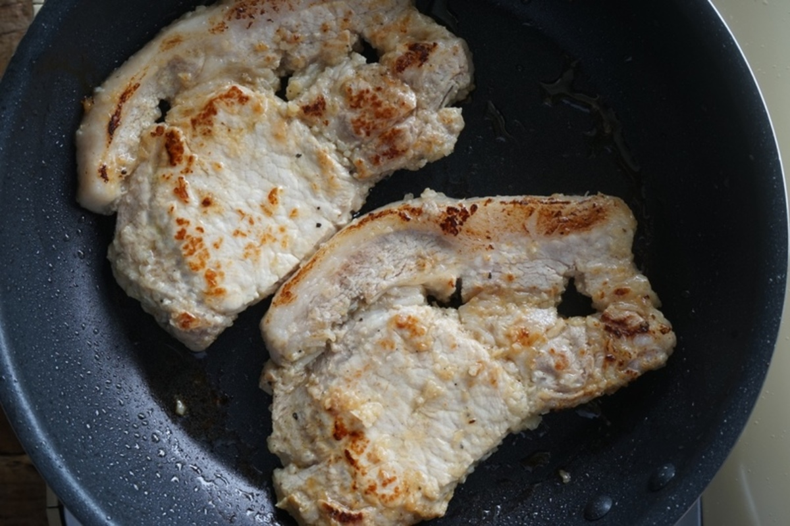
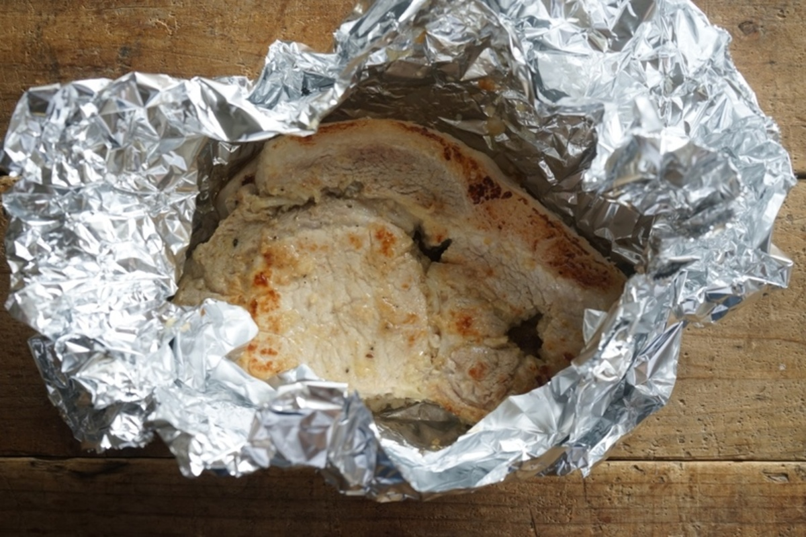

同じフライパンを軽く拭いて、ジャガイモ・ミニエリンギ・アスパラを入れ、軽く塩・胡椒（適量）を振り、火が通るまで焼いたら取り出す。

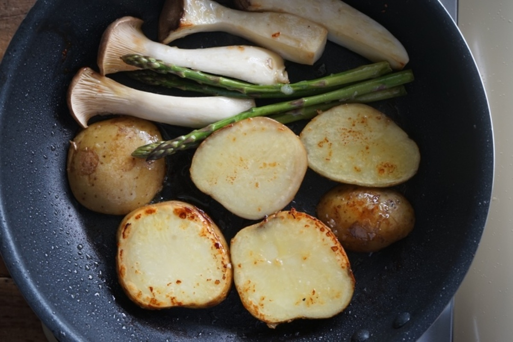

マリネ液をフライパンに入れ、玉ねぎが色づくまで5分ほど炒める。途中2分ほど炒めたら、ハーブを取り出して除けておいておく。

POINT

玉ねぎは焦げやすいので、火加減を調整して飴色になるまで炒めてください。

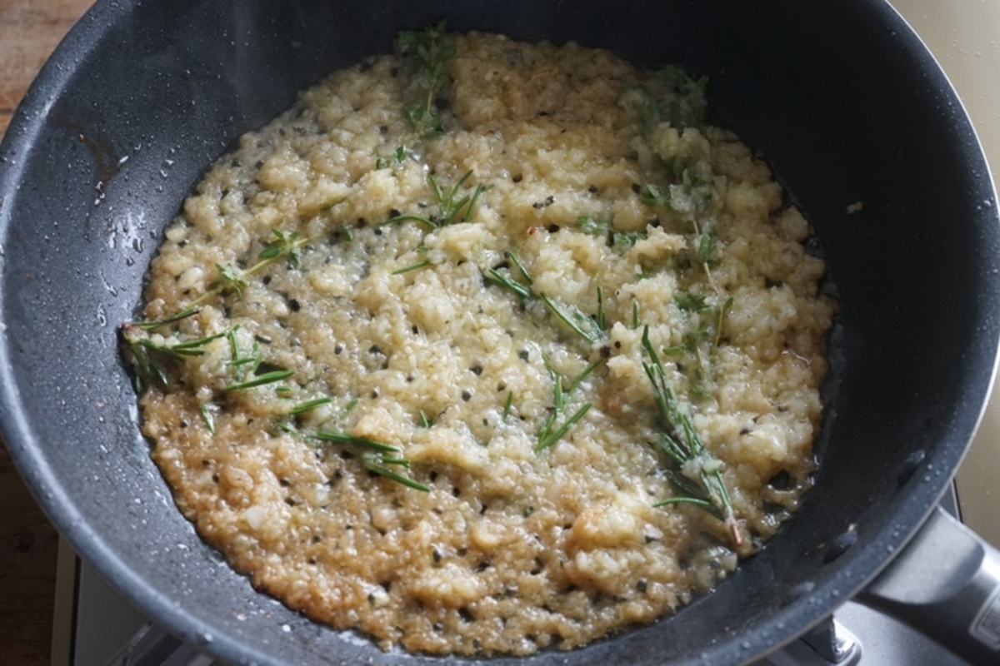

ソースの材料を加えて、軽く沸かしてなじませる。アルミホイルに出た肉汁も加えて混ぜる。

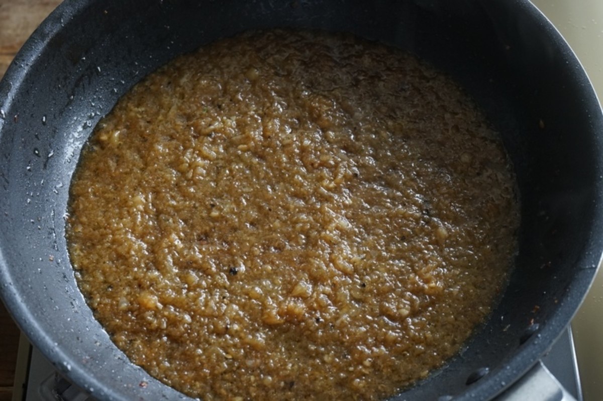

はちみつ
1袋

酢
大さじ1

醤油
大さじ2

お皿に野菜を盛り付け、豚肉をのせたらソースをかけ、ソースから取り出しておいたハーブを添える。

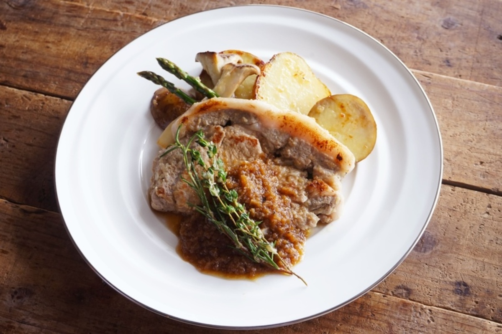

\
