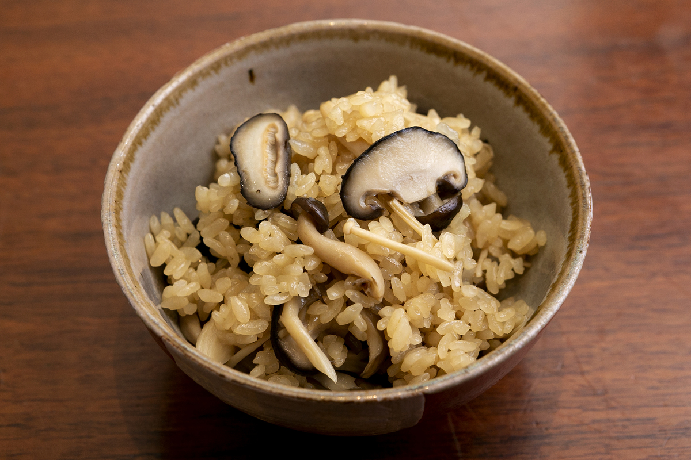

# 鴨と牛蒡とネギのロースト 赤味噌ソース＆きのこの炊き込みご飯

**65min**

**Cooking description**

**- 料理説明 -**

鴨と相性の良い牛蒡とネギを鴨の旨味が溶け出たフライパンで一緒にロースト。

バルサミコ酢の甘酸っぱさと、赤味噌の甘味とコクを含んだソースを合わせ、赤ワインに合う和食に仕上げました。

ふんだんに使ったきのこの旨味と出汁の香りが相性抜群の炊き込みご飯です。

ホッとする優しい味をお楽しみ下さい。

#### 中山 幸三

幸せ三昧 / 日本料理シェフ

\

広尾「幸せ三昧」オーナーシェフ。27才のときに笠原将弘（現「賛否両論」店主）と出会い、グラフィックデザイナーから料理人へと転身。笠原将弘の一番弟子として5年間修行を積み、2009年に独立後、「幸せ三昧」をオープン。店のコンセプトは「大人の居酒屋」で、正統派の和食フルコースを居酒屋感覚で楽しめる。

Ingredients ―  お送りする食材リスト

\

**鴨と牛蒡とネギのロースト 赤味噌ソース**

鴨肉1枚

塩小さじ1

長ねぎ1/2本

ごぼう40g

塩小さじ1/2

～赤味噌ソース～

赤味噌27g

バルサミコ酢23ml

砂糖大さじ1と1/2

酒大さじ1と1/2

みりん大さじ1と1/2

\

**きのこの炊き込みご飯**

生米2合

しいたけ2個

しめじ50g程度

舞茸50g程度

えのき50g程度

酒大さじ2

醤油大さじ2

出汁パック(鰹のだしパック)1パック

水500ml

\

### **調理方法**

##### きのこの炊き込みご飯の下準備をします。

・しいたけは厚さ1cmにスライスしておく。

\

・しめじ、舞茸は石づきを取ってほぐす。

\

・えのきは石づきを取って、長さ3cm程度に切っておく。

\

・米を研いでおく。

\

##### 鴨と牛蒡ネギのロースト 赤味噌ソースの下準備をします。

・牛蒡は長さ4㎝程度の4等分にする。さらに縦1/4にカットし、四つ割にする。

\

・ネギを4㎝程度に切っておく。

\

・鴨肉の皮目に写真のような切り込みを入れる。

\

・鴨肉の両面に塩(小さじ1)を振る。

\

##### きのこの炊き込みご飯を作ります。

鍋に水(500ml)を入れ、出汁パックを加えて5分程度煮だす。

\

**POINT**

軽く沸騰した状態を保つように、煮だしてください。

引いた出汁に醤油(大さじ2)、酒(大さじ2)、きのこを加え、ひと煮立ちさせ、氷水に当てて冷たくなるまで冷ます。

\

冷やした出汁と具材を炊飯器に入れ、炊く。

\

**POINT**

出汁を入れて目盛りが足りなかった場合は、水を入れ調節してください。

##### 鴨と牛蒡ネギのロースト 赤味噌ソースを作ります。

鴨肉を皮目から弱火で2~3分程度焼く。

\

**POINT**

皮目を焼く際、出てくる脂をペーパーなどでこまめに拭き取りながら焼いてください。

鴨肉をひっくり返して身を中火で4~5分ほど焼く。

\

同じフライパンに下記食材を入れ、中火でじっくり火を通す。

\

牛蒡

-

ネギ

-

塩

小さじ1/2

-

\

鴨肉をアルミホイルで包み、そのまま同じフライパンで弱火にして7~9分ほど焼く。

\

**POINT**

焼きあがった鴨肉を真ん中で半分にカットし、火通りが足りなかった場合は再度アルミホイルに包み、弱火で更に3分程度焼いてください。

**POINT**

火通しについて、詳しくはこちらをご覧ください。

<https://tastytable.jp/magazines/52>

鍋に下記調味料を入れ、ひと煮立ちさせてアルコールを飛ばす。

\

バルサミコ酢

23ml

酒

大さじ1と1/2

みりん

大さじ1と1/2

-

\

ひと煮立ちさせアルコールを飛ばしたら、下記調味料を加え、中火で混ぜながらとろみが出るまで煮詰める。

\

赤味噌

27g

砂糖

大さじ1と1/2

**POINT**

味噌を入れる前に、しっかりと沸かしてアルコールを完全に飛ばしてください。

##### 鴨と牛蒡ネギのロースト 赤味噌ソースを完成させます。

鴨肉を一口大(厚さ1㎝程度)に切り、鴨肉、野菜の順で皿に盛り、ソースをかけて完成。

\

##### きのこの炊き込みご飯を完成させます。

炊きあがったら、ざっくり混ぜてお茶碗に盛り、完成。

\

\
