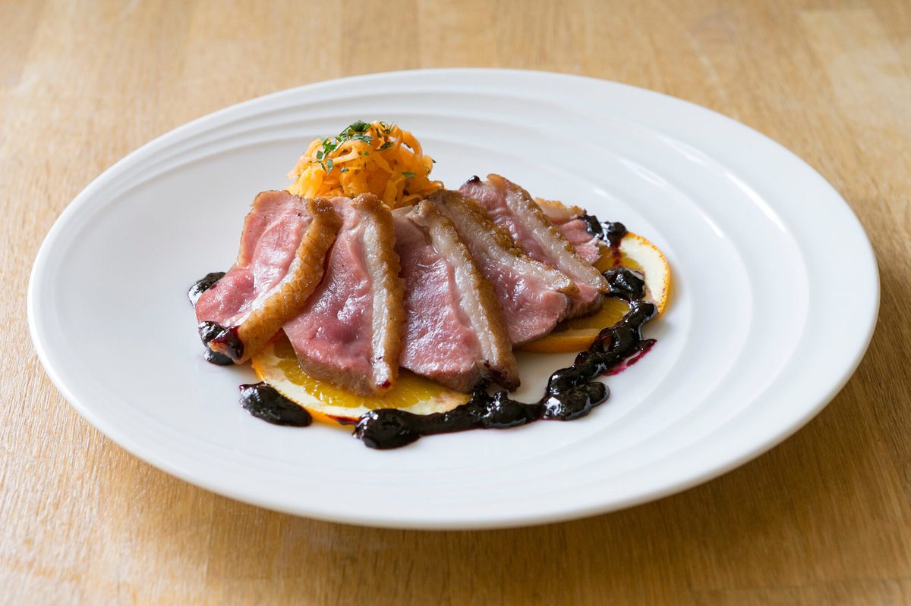

# 鴨のロースト ブルーベリーソース〜人参のマリナータ添え〜＆じゃがいもの自家製ニョッキ サルビア風

# 

**80min**

**\**

**Cooking description**

**- 料理説明 -**

メインの鴨のローストは時間をかけ、皮目はパリッと、中は柔らかく仕上げています。

相性の良いブルーベリーと赤ワインで本格的な味のソースを合わせ、付け合わせにはクミンが香る人参のマリナータを添えました。赤ワインと一緒に合わせたら、さらに本格的に味わっていただけます。

もう一皿にはピエモンテなどでよく見られる、じゃがいものニョッキに、セージとバターのソースを合わせました。

シンプルに素材の味を、最大限に引きし楽しんでいただける一皿になっています。

#### 泥谷 俊介

Ristorantino Lubero(リストランティーノ ルベロ) / イタリアンシェフ

\

1984年生まれ 岐阜県出身。高校卒業後、数々の飲食店を経験し、24歳の時にイタリア料理の世界へ。地元岐阜と名古屋で経験を積み、その後短期で渡伊。ナポリの下町のレストランで働き、帰国後は『イルギオットーネ』に入社。プロデュース店のコードクルックやイルギオットーネ丸の内で副料理長、料理長を務める。2016年から目黒のイタリア料理店『リストランティーノ ルベロ』のシェフとして働く。

\

**鴨のロースト ブルーベリーソース〜人参のマリナータ添え**

鴨ロース1枚

塩ひとつまみ

胡椒適量

オリーブオイル小さじ1

オレンジ1/2個

黒胡椒適量

【ブルーベリーソース】

赤ワイン50ml

ブルーベリージャム1個(14g)

塩ひとつまみ

【人参のマリナータ 】

人参150g程度

塩ひとつまみ

クミンシード1.2g

にんにく1片(5g程度)

オリーブオイル大さじ2

イタリアンパセリ2g程度

\

**じゃがいものニョッキ　サルビア風**

【ニョッキ 】

じゃがいも(男爵)240g程度

強力粉80g

強力粉(打ち粉用)10g

※強力粉はニョッキ用と打ち粉用まとめてお送りしています。

パルメザンチーズ1袋(7g)

卵1/2個

塩小さじ1/6

胡椒適量

【ソース】

セージ4枚程度

バター4個(32g)

にんにく1片(5g程度)

### **調理方法**

##### 鴨ローストの下準備をします。

・鴨の余計なスジなどを取り、皮目に格子状の切り込みを入れる。

\

・塩(ひとつまみ)、胡椒(適量)をして常温に戻しておく。

\

・人参をスライサーや包丁で千切りにする。

\

・軽く塩(ひとつまみ)を振って混ぜ合わせ、余分な水分を抜いておく。

\

・水分が抜けたら流水で軽く洗って水気を良く切っておく。

\

・イタリアンパセリを粗めに刻む。

\

・クミンシードを粗めに刻む。

\

**POINT**

クミンシードは袋に入れたまま、瓶の底などで潰しても問題ありません。

・にんにく(1片)を半割りにし、芽をとる。

\

・オレンジを飾り用に4〜6枚程度、薄くスライスする。

\

**POINT**

オレンジは1個でお送りしています。残った分はご自由にお使いください。

・オーブンを160℃に予熱する。

\

##### ニョッキの下準備をします。

・鍋に水と、水量の1%程度の塩を入れ、じゃがいもを茹でる。

\

**POINT**

時短したい方は、じゃがいもを水でよく洗い、濡れたままラップで包んで電子レンジ(600W)で4分加熱してください。固い場合は30秒~1分程度追加で加熱してください。

**POINT**

じゃがいもは熱いうちに調理します。

・セージの葉の部分だけを粗めに刻む。

\

・にんにくをみじん切りにする。

\

・強力粉を打ち粉用に、10g分けておく。

\

##### ニョッキを作ります。

じゃがいもが熱いうちに皮をむき、マッシャーで細かくする。

\

ボウルに下記食材を入れてよく混ぜ、ニョッキ生地を作る。

\

**POINT**

溶き卵は1/2個分のみ使用します。全量使用しないよう注意してください。

潰したじゃがいも

-

強力粉

80g

溶き卵

1/2個分

パルメザンチーズ

1/2袋

塩

小さじ1/6

胡椒

適量

ニョッキ生地を台の上にのせ、直径が1.5cm程の棒状になるよう、コロコロと転がしながら伸ばす。

\

伸ばした生地を1.5cm程度の長さにカットする。

\

カットした生地をフォークに押しあて、滑らすように回転させ、成形する。

\

成形したらすぐに強力粉(10g)で打ち粉をする。

\

**POINT**

打ち粉をすることにより、ニョッキがくっつきにくくなります。

##### 鴨ローストを作ります。

フライパンにオリーブオイル(大さじ2)とにんにくを入れ、弱火にかける。

\

にんにくの香りがオリーブオイルに移ったら、火を消し粗熱をとる。

\

オイルの粗熱がとれたら、ボウルで人参と合わせる。クミンシード、イタリアンパセリ、塩(ひとつまみ)で味付けをし、冷蔵庫で冷やしておく。

\

フライパンにオリーブオイル(小さじ1)をひき、鴨の皮目を弱火で5分程度焼く。

\

**POINT**

皮目から出てくる脂を、ペーパーで拭き取りながら焼いてください。

皮目にキレイな焼き色が付いたら、ひっくり返して身側を10秒程焼き、フライパンから取り出す。

\

皮目を下にしてバットに置き、160℃のオーブンに入れる。

\

5分焼いたらオーブンから取り出し、5分休ませる。

\

**POINT**

オーブンが無い方は、下記URLのレシピのように焼いてください。

<https://tastytable.jp/recipes/kit/224>

##### ニョッキのソースを作ります。

フライパンにバター(4個)とにんにくを入れ、弱火にかけてソースを作る。

\

にんにくの香りが出てきたら火を止める。

\

別の鍋にお湯を沸かし、塩(お湯に対し1%程度)と作ったニョッキを入れ、ニョッキが浮き上がってくるまで茹でる。(目安：2分程度)

\

ソースを再度中火にかけ、茹で上がったニョッキと茹で汁(大さじ3)、セージを加えて和える。

\

ソースとなじんだら、味見をして塩(お好み)で味を調える。

\

皿に盛ってパルメザンチーズ(1/2袋)と黒胡椒(適量)をかけ、完成。

\

##### 鴨ローストを仕上げます。

仕上げにもう一度オーブンに入れ、4分焼いて取り出す。

\

**POINT**

オーブンによって焼き加減が違うので、仕上げの焼き時間を4〜6分で微調整してください。

**POINT**

火通りを詳しく確認したい方は、下記URLをご覧ください。

<https://tastytable.jp/magazines/52>

鴨を焼いたフライパンに赤ワイン(50ml)を入れて沸騰させ、アルコールを飛ばし、ブルーベリージャム(1個)を加え、ソースにとろみが出るまで煮詰めていく。

\

軽く塩(ひとつまみ)をして味を調える。

\

皿にオレンジのスライスと人参のマリナータを盛りつける。鴨をカットしてオレンジの上に乗せ、まわりにソースをかける。

\

お好みで黒胡椒(適量)をかけ、完成。

\

料理をお召し上がりになった後、今回のメニューのご感想を是非お聞かせください。
