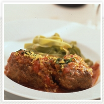

# ハンバーグのソース煮

### Hamburger Steak with Sauceハンバーグのソース煮

ミラノでは、このソースで仔牛のすね肉を2～[3時](file:///var/mobile/Applications/EE67C21D-3726-43E1-A479-9166487DCF3B/Library/Caches/www.evernote.com/eritsi/content/x-apple-data-detectors://0)間かけて煮込みます。\
ソースが煮詰まって減る事がありませんので、パスタを添えて残さずいただきます。

- 
   3人分
- 
   45分
- 
   210℃

材料

【ハンバーグ】
:   \

牛豚挽肉
:   各150g

玉ねぎ　みじん切り
:   大1/2個

パン粉
:   1/2カップ

小麦粉
:   少々

牛乳
:   70cc

塩、こしょう
:   適宜

ナツメッグ
:   適宜

卵
:   小1個

サラダオイル
:   適宜

バター
:   適宜

【付け合わせ】
:   \

パスタ
:   1人20g

塩、こしょう、バター
:   少々

【ソース】
:   \

にんにく　みじん切り
:   1/2片

玉ねぎ　みじん切り
:   大1/2個

にんじん　みじん切り
:   1/2本

セロリ みじん切り
:   小1本

赤ワイン
:   100cc

トマトの水煮
:   400g

固形のビーフブイヨン1個を湯でといたもの
:   200cc

バター
:   15g

塩、こしょう
:   少々

【仕上げ】
:   \

レモン
:   1/2個の皮をすりおろす

パセリみじん切り
:   大さじ2

主要アレルゲン表示（省令7品目）

卵
:   ○

乳
:   ○

小麦
:   ○

えび
:   －

かに
:   －

そば
:   －

落花生
:   －

大豆
:   －

監修

料理研究家　渡辺早苗

#### 作り方

1.　ハンバーグ用の玉ねぎをサラダオイルでよく妙め、軽く塩こしょうをして冷ましておく。

\

2.　ボールに(1)と挽肉、卵、牛乳に浸したパン粉、塩、こしょう、ナツメッグを入れてねばりが出るまでしっかり練り合わす。

\

3.　手にサラダオイルをつけて6個に分け、ハンバーグ状に形を作り、小麦粉少々をつけておく。

\

4.　(3)をサラダオイルとバター半々で、両面に焦げ目をつけるように焼く。

\

5.　煮込み鍋にソース用のバターでにんにくを妙め、玉ねぎ、にんじん、セロリを加え妙め(4)を入れ赤ワインを注ぎ香りをつけてトマトの水煮を握りつぶしながら加える。

\

6.　ビーフブイヨンを注ぎ、鍋の蓋またはクッキングホイルの蓋をして210度のオーブンで20～30分煮る。

\

7.　塩、こしょうをして味を整え、仕上げのレモンの皮とパセリをふり入れる。

\

8.　ゆで上げのパスタが熱いうちに、バター、塩、こしょうで味をつけ、添え物としてソースでいただく。

\

・ 冷凍のハンバーグや、輸入牛肉を軽くソテーして煮込んでも美味しい一品です。オーブンでの煮込み料理が、短時間でこんなに簡単にできるのかと驚かされます。

\
