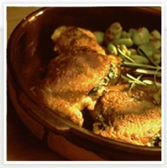

# 若鶏の香草焼き

Herb Roasted Chicken

### 若鶏の香草焼き

パリッと焼き上がった鶏の皮の香ばしさとハーブのすがすがしい香りが食卓に立ち込めます。

- 
   6人
- 
   30分
- 
   210℃

材料

鶏もも肉（骨付き）
:   6本

塩、こしょう
:   適宜

（A）

パセリみじん切り
:   1/2カップ

バジル
:   1/2カップ

バター
:   30g

マスタード
:   大さじ2～3

塩、こしょう
:   適宜

小麦粉
:   適宜

サラダオイル
:   適宜

バター
:   適宜

（飾り用）ローズマリーまたはクレソン

主要アレルゲン表示（省令7品目）

卵
:   －

乳
:   ○

小麦
:   ○

えび
:   －

かに
:   －

そば
:   －

落花生
:   －

大豆
:   －

監修

料理研究家　渡辺早苗

#### 作り方

1.　鶏肉は関節から包丁を入れて二つに切りはなす。\
\
2.　(A) のバターをやわらかくポマード状に練ってすべての材料と合わせる。\
\
3.　(1)のもも肉の部分のみを使用する。皮と肉を袋状にして、塩、こしょうをし、間に(2)を入れ全体にうすく小麦粉をつける。\
\
4.　フライパンにバターとサラダオイル半々を熱して（3）を皮目からソテーする。\
\
5.　色がついたらオイルプレートに移してコンベクションオーブンで皮を上にして210℃で15～20分焼く。

##### 

・ マスタードバターを鶏の皮と身の間につけて、鶏肉の臭みをとりながら焼きます。\
\
・ 鶏の足首はここではつかいません。カレー等の別のお料理に使いましょう。\
\
・ 皮の表面をパリッと香ばしく焼くため、オーブンはコンベクションが最適です。\
\
・ 余分な脂を落とすため、付属のオイルプレートを使用してください。\
\
・ ここでは付け合わせに、空豆を添えています。
