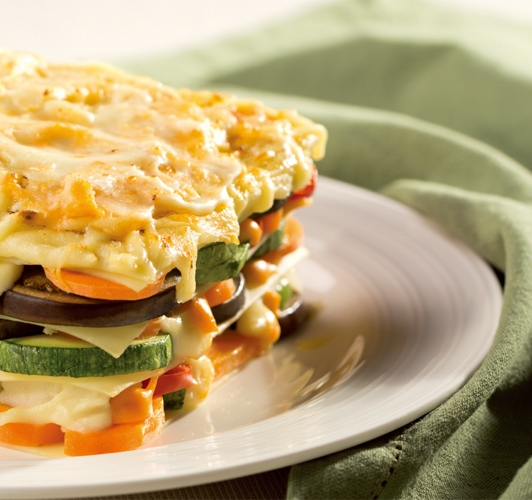
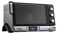

# 野菜ラザニア@デロンギ

## 野菜ラザニア レシピ

20Lの庫内容量があるから、6人分のラザニアが作れます。

野菜の旨味が凝縮されたラザニアです。

### 使用モデル

 

コンベクションオーブン EOB2071J

### 材料 (6人分)

|  |  |
| --- | --- |
| ラザニア | 250g |
| A： |  |
| にんじん（スライス） | 3本 |
| グリーンピース | 100g |
| パプリカ（スライス） | 2個 |
| なす（スライス） | 1本 |
| ズッキーニ（スライス） | 2本 |

|  |  |
| --- | --- |
| トマトピューレ | 400g |
| 玉ねぎ（みじん切り） | 1/2個 |
| ホワイトソース | 1L |
| パルメザンチーズ | 適量 |
| バター | 50g |

### 野菜ラザニア 作り方

1. フライパンに油をひき、玉ねぎを炒める。
2. 1 に【A】をすべて加え、5 ～ 10 分さらに炒める。
3. トマトピューレを加え、なじんだら火を止め、あら熱をとる。
4. 耐熱容器の底にバターをぬり、大さじ2 〜 3 のホワイトソースをぬる。
5. 野菜、ホワイトソース、おろしたパルメザンチーズ、ラザニアの順で耐熱容器に敷き詰める。
6. 5 を3 〜 4 回繰り返し、最後にホワイトソース、バター、パルメザンチーズをのせる。
7. ワイヤーラックをセットし（ワイヤーラック位置②）、耐熱容器をワイヤーラックにのせる。
8. 調理ダイヤルで「オーブン」を選び、200℃で35 分焼き色が付くまで焼く。
