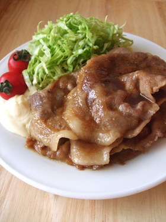

# しょうが焼き

# モテる！定食屋さんの生姜焼き

\

つくれぽを１５００件以上頂きました。ありがとうございます。これからもよろしくお願い致します^^

 [BECCI](http://cookpad.com/kitchen/392751)

### 材料 （ ２人分 ）

豚薄切り肉

200g

A.酒

大さじ2/3

醤油

大さじ1/2

生姜の絞り汁

大さじ1/2

B.砂糖

大さじ1/2

酒

大さじ１

醤油

大さじ２

みりん

大さじ２

生姜のすりおろし

小さじ１

サラダ油

大さじ１

キャベツの千切り

適量

ミニトマト、マヨネーズ

お好みで

[カロリー・塩分を計算](http://cookpad.com/user/confirm_premium_navi?pslink_place=nutrition_recipe_show&type=nutrition)

### 1
:   Ａを混ぜ合わせたボウルに豚肉を10分以上つける。別のボウルにＢを混ぜ合わせておく。

### 2
:   フライパンにサラダ油を熱し、豚肉を一枚ずつ広げて両面をしっかりと焼く。

### 3
:   Ｂを加えて煮絡める。キャベツの千切りを乗せた皿に盛り付け、お好みでミニトマトとマヨネーズを添える。

### コツ・ポイント

こってり派は肩ロース、あっさり派はロース、コマ切れもおすすめです。生姜の絞り汁は皮ごとすりおろした生姜をキッチンペーパーに包んで絞ると◎タレは煮詰めると味が濃くなり過ぎてしまうので、お肉と煮絡めるくらいで火からおろしてください^^

### このレシピの生い立ち

試行を重ねてこの味に落ち着きました☆

\
