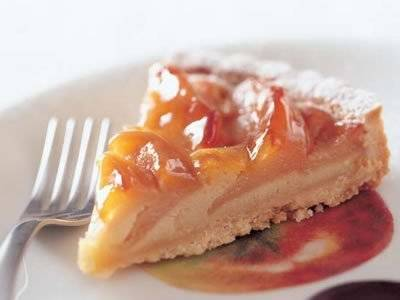

# りんごのタルト

## りんごのタルト

りんごの甘酸っぱさとアーモンドクリームのやさしい甘さが調和した上品な味。しっとり落ち着いた翌日もまたおいしい。

\

放送日:
:   2001/11/28(水)

撮影: 野口 健志

- [マイレシピ登録](http://www.kyounoryouri.jp/index.php?flow=myrecipe_add_del_ajax&rid=731&iframe=1&back_url=http://www.kyounoryouri.jp/recipe/731_%25E3%2582%258A%25E3%2582%2593%25E3%2581%2594%25E3%2581%25AE%25E3%2582%25BF%25E3%2583%25AB%25E3%2583%2588.html "マイレシピ登録")530人

講師:
:   [小菅 陽子](http://www.kyounoryouri.jp/teacher/%E3%81%8A%E8%8F%93%E5%AD%90%EF%BD%A5%E3%83%87%E3%82%B6%E3%83%BC%E3%83%88/81_%E5%B0%8F%E8%8F%85+%E9%99%BD%E5%AD%90.html)

エネルギー
:   2830kcal

調理時間
:   90分

- [お菓子](http://www.kyounoryouri.jp/recipe/tag_id/116_%E3%81%8A%E8%8F%93%E5%AD%90/1/)
 - [りんご](http://www.kyounoryouri.jp/recipe/tag_id/118_%E3%82%8A%E3%82%93%E3%81%94/1/)
 - [りんごのタルト](http://www.kyounoryouri.jp/recipe/tag_id/785_%E3%82%8A%E3%82%93%E3%81%94%E3%81%AE%E3%82%BF%E3%83%AB%E3%83%88/1/)
 - [ケーキ](http://www.kyounoryouri.jp/recipe/tag_id/119_%E3%82%B1%E3%83%BC%E3%82%AD/1/)
 - [スイーツ](http://www.kyounoryouri.jp/recipe/tag_id/480_%E3%82%B9%E3%82%A4%E3%83%BC%E3%83%84/1/)
 - [タルト](http://www.kyounoryouri.jp/recipe/tag_id/1042_%E3%82%BF%E3%83%AB%E3%83%88/1/)
 - [デザート](http://www.kyounoryouri.jp/recipe/tag_id/632_%E3%83%87%E3%82%B6%E3%83%BC%E3%83%88/1/)
 - [リンゴ](http://www.kyounoryouri.jp/recipe/tag_id/117_%E3%83%AA%E3%83%B3%E3%82%B4/1/)
 - [焼き菓子](http://www.kyounoryouri.jp/recipe/tag_id/176_%E7%84%BC%E3%81%8D%E8%8F%93%E5%AD%90/1/)
 - [洋菓子](http://www.kyounoryouri.jp/recipe/tag_id/544_%E6%B4%8B%E8%8F%93%E5%AD%90/1/)

### 材料

(直径20cmのタルト型1台分)

【タルト生地】＊タルト生地の砂糖、バター、薄力粉の基本配合は、砂糖50g：バター100g：薄力粉150g＝1：2：3と覚えておくとよい（薄力粉は、生地のまとまり具合によっては10g増やしてもよい）

・バター100g
:   ＊食塩不使用

・砂糖50g

・卵黄1コ分

・薄力粉150～160g

【キャラメルりんご】＊キャラメルりんごの材料の分量は、グラニュー糖はりんごの正味重量の約6～10%、バターはグラニュー糖の半分くらいを目安にし、あとは好みで加減するとよい。レモン汁の分量は、りんごの酸味によって調節する

・りんご3コ（正味500～650g）

・バター15～25g
:   ＊食塩不使用

・グラニュー糖30～50g

・レモン汁大さじ1～2

【アーモンドクリーム】

・バター35g
:   ＊食塩不使用

・砂糖25g

・卵黄1コ分

・ラム酒大さじ1/2

・アーモンド （粉末）35g

・牛乳大さじ2

・バニラオイル少々
:   ＊またはバニラエッセンス

・薄力粉大さじ1

・粉砂糖適宜

・あんずジャム約30g

タルト生地を冷蔵庫で休ませる時間、荒熱を取る時間、キャラメルりんごを冷ます時間は除く

＊エネルギーは全量

### 下ごしらえ・準備

1
:   【タルト生地】と【アーモンドクリーム】のバターを室温に戻しておく。\
    オーブンを180℃に温めておく。

### つくり方

【タルト生地】をつくる

1
:   バターをボウルに入れ、泡立て器でクリーム状に練り、砂糖を加えて、白っぽくなるまでよくすり混ぜる。

    バターが堅いようなら、最初に手で柔らかく練ってから、泡立て器に替えるとよい。

2
:   卵黄を加え、よく混ぜ合わせる。さらに薄力粉150gをふるい入れ、カードまたは木べらで切るようにサックリと混ぜる。

3
:   粉っぽさがなくなったら、手でギュッと押さえるようにして生地を一つにまとめる。ラップフィルムを敷いて生地をのせ、手のひらで押しながら丸く平らにしてラップフィルムをもう1枚かぶせる。冷蔵庫に入れて15～30分間休ませ、生地を落ち着かせる。

    生地が柔らかくてまとまらないようなら、薄力粉10gを加えてまとめるとよい。

4
:   のし台の上に休ませた生地をラップフィルムごとのせ、めん棒で生地を押すように広げ、型より一回り大きい円形　(直径25cmくらい)で厚さ3mmくらいに均等にのばす。ラップフィルムの上からめん棒を転がすので、打ち粉は使わなくてもよい。

    のばす途中で生地が柔らかくなって扱いにくくなったら、冷蔵庫で冷やしてから作業を続けるとよい。

5
:   上のラップフィルムをはがし、その面が下になるように生地を型にのせる。もう1枚のラップフィルムの上から指で押さえつけながら生地を敷き込み、ラップフィルムをはがして型の上でめん棒を転がし、型からはみ出した余分な生地を切り落とす。再びラップフィルムをかけ、型ごと冷蔵庫に入れ、20～30分間冷やす。

    余分な生地はクッキーにする。

6
:   幅をタルトの高さに合わせて切ったアルミ箔を5の生地の側面にはりつけ、焼き縮みにより生地が下に沈むのを防ぐ。

7
:   フォークで生地の底全体に穴をあける　(これをピケという)。穴をあけることで空気が抜け、焼くときに生地が浮き上がりにくくなる。

8
:   180℃に温めたオーブンに入れ、10分間焼いて取り出し、アルミ箔をはずす。170℃に下げたオーブンに再び入れ、2～3分間焼いて取り出し、荒熱を取る。

【キャラメルりんご】をつくる

9
:   りんごは縦6～8等分にし、皮をむいて芯を取り除く。フライパンまたはなべにバター、グラニュー糖を入れて弱火にかける。

10
:   かき混ぜずにそのまま煮詰め、キャラメル状になったら、りんごを加えてサッと混ぜる。ふたをし、りんごに竹ぐしを刺して、スーッと通るくらいの柔らかさになるまで煮る。

    りんごの種類や大きさによって、煮る時間はかなり変わってくる。

11
:   ふたを取り、混ぜながら水分をとばし、水分が少なくなってきたらレモン汁を加えて、からませる。完全に水分がとぶまでりんごを混ぜてキャラメル色に仕上げ、冷まして荒熱を取る。

【アーモンドクリーム】をつくる

12
:   バターをボウルに入れ、泡立て器でクリーム状に練り、砂糖を加えて、白っぽくなるまでよくすり混ぜる。

13
:   卵黄を加えて混ぜ、続いてラム酒、アーモンド、牛乳、バニラオイル、薄力粉の順に加え、なめらかになるまで混ぜる。

仕上げる

14
:   8の【タルト生地】に13の【アーモンドクリーム】を流し入れ、カードやゴムべらで表面を平らにならす。

15
:   14に11の【キャラメルりんご】を放射状に並べ、170℃に温めたオーブンに入れて約30分間焼く。

16
:   15を冷まして荒熱を取り、型からはずしてタルトの縁に粉砂糖をふる。あんずジャムを耐熱性の皿に入れ、ラップフィルムをかけて電子レンジで軽く温め、タルトの表面にぬる。

    タルトをココット型など高さのある器の上にのせると、簡単に型がはずれる。また、タルト型の底を、焼いた面の上にのせてから粉砂糖をふると、縁だけにきれいにふれる。

### 全体備考

タルトに使うりんごは酸味の強い紅玉が特に向いているが、ジョナゴールド、ふじなど別の品種を使ってもおいしくできる。

- [マイレシピ登録](http://www.kyounoryouri.jp/index.php?flow=myrecipe_add_del_ajax&rid=731&iframe=1&back_url=http://www.kyounoryouri.jp/recipe/731_%25E3%2582%258A%25E3%2582%2593%25E3%2581%2594%25E3%2581%25AE%25E3%2582%25BF%25E3%2583%25AB%25E3%2583%2588.html "お気に入りのレシピ集に簡単保存！")530人

\
