# エビワンタンスープ

６／１（木）放送　**～エビワンタンスープ～**\
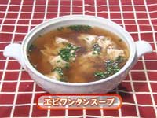
\
今日の先生：峨嵋山（ガビサン）店主　江崎輝彦さん\
\
\
≪レシピ≫
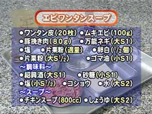
～材料～\
ワンタン皮20枚、ムキエビ１００ｇ、\
豚ひき肉８０ｇ、万能ネギ大S1、塩、\
片栗粉　適量、卵白1/2個、片栗粉大S１/２、\
ゴマ油小S1\
\
～調味料～\
紹興酒大S1、砂糖小Ｓ１、塩小S１/２、\
コショウ少々、水大S2\
\
～スープ～\
チキンスープ８００ｃｃ、しょうゆ大S2\
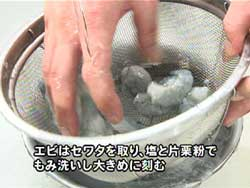
　１）　エビはセワタをとり、塩と片栗粉でもみ洗いし大きめに刻む。\
万能ネギは小口切り。\
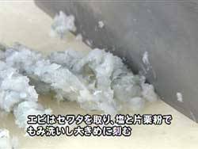
　
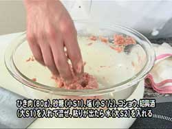
　２）　ボールにひき肉８０ｇ、調味料（砂糖小Ｓ１、塩小S１/２，コショウ少々、紹興酒大S1）を入れて混ぜ、粘りが出たら水大S2を入れる\
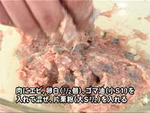
　３）　肉のなかにエビ、卵白1/2個、ゴマ油を加えて粘りが出るまで混ぜ合わせ、片栗粉大S1/2を入れる
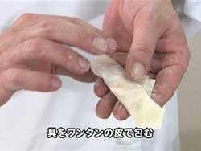
　４）　具をワンタンの皮に包む。\
ワンタンを茹でる。（湯が沸騰したら型崩れを防ぐため火を弱くする）
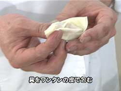
　５）　カスタードが冷めたら春巻きの皮の手前にのせ、イチゴ、キウイ入れて包み、薄力粉の糊でとめる
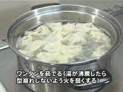
　\
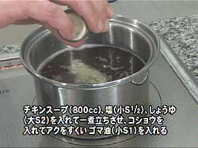
　６）　鍋にチキンスープ８００ｃｃ、塩、しょうゆ大S2を入れて一煮たちさせ、こしょうを入れアクをすくってからゴマ油小S1を入れる
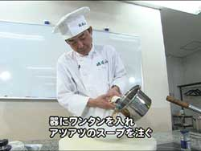
　７）　ワンタンをいれあつあつのスープを注ぎネギを入れる
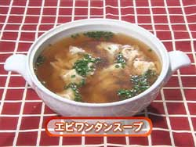
　～エビワンタンスープ～\
