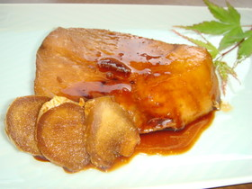
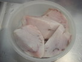
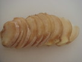
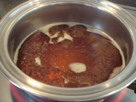
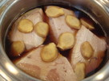
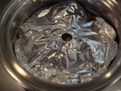
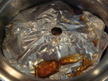
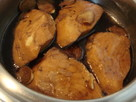
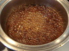
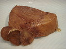

# カジキマグロの煮付け

# カジキマグロの煮付け

\

小料理屋さんの味♪\
自慢の煮付け

 [あんちゃみん](http://cookpad.com/kitchen/3835283)

### 材料 （４人分）

カジキマグロ

４切れ

[生姜](http://cookpad.com/dict/%E3%81%97%E3%82%87%E3%81%86%E3%81%8C "しょうがのコツと使い方")

３０ｇ

■ Ａ

しょう油

大さじ３

酒

大さじ３

みりん

大さじ３

砂糖

大さじ３

水

１００ｃｃ

[カロリー・塩分を計算](http://cookpad.com/user/confirm_premium_navi?pslink_place=psm_nutrition_loading-all-in-one_optin-nutrition_empty_empty&type=nutrition)

### 1
:   

    カジキマグロに熱湯をかける。

### 2
:   

    生姜は皮を付けたまま、薄切りにする。

### 3
:   

    Ａの調味料を鍋に入れ、ひと煮立ちさせる。

### 4
:   

    カジキマグロ、生姜を③の鍋に入れる。

### 5
:   

    落とし蓋をして中火で10分煮て、そのまま冷ます。

### 6
:   

    再び、中火で10分煮て冷ます。

### 7
:   

    落とし蓋を取り、食べる直前にもう一度火を入れ、温める。

### 8
:   

    カジキマグロ、生姜を鍋から取り出し、煮汁にとろみが付くまで煮る。

### 9
:   

    皿にカジキマグロ、生姜を盛り付け、⑦の煮汁をかける。

### コツ・ポイント

★カジキマグロに熱湯をかけるのは「煮崩れ」を防ぐためと「臭み」を消すためです。\
★カジキマグロに味がしみ込むよう、２度火を入れます。

### このレシピの生い立ち

我が家の自慢の煮付けをレシピにしました。

\
