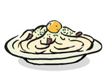

# カルボナーラ

|  |  |  |  |  |  |  |  |  |  |  |  |  |  |  |  |  |  |  |
| --- | --- | --- | --- | --- | --- | --- | --- | --- | --- | --- | --- | --- | --- | --- | --- | --- | --- | --- |
| |  | | --- | | カルボナーラ | |     |  |  | | --- | --- | | 一人分/乾麺100g用(大盛り150g用) | | | ・牛乳 | 60cc(80) | | ・生クリーム (乳脂肪分20～30％） | 60cc(80) | | ・粉状パルメザンチーズ もしくはペコリーノロマノチーズ | 10g(15) | | ・1cm幅に切ったベーコン | 30g(40) | | ・卵黄 | 1個 | | ・塩 ・あらびき黒胡椒 ・パセリ | 適量 |   ベーコンをバター15gで、中火で揚げるように焼く。 ↓  牛乳と生クリームをいれて、弱火で2/3ほどになるまで弱火で3分ほど煮込む。 ↓  ↓  パルメザンチーズをいれ、加熱しながらソースをよく混ぜる。 べたべたになってしまわないように注意。塩で調味する。 ↓ ゆでたスパゲッティをよくからめて、皿にもる。 ↓ 全体に黒胡椒とパセリをちらし、卵黄を中央にのせる。 ↓  卵とまぜまぜして食す。   |  | | --- | | ※本場のカルボナーラは、ベーコンのかわりにパンチェッタ（塩味の強い生ベーコン）を使います。 | | ※もりつける前に卵を混ぜておきたい場合は、余熱で固まってしまわないように気をつけながら、 もる直前に手際よくからめるようにしましょう。不安な人は、暖めたボールの中で混ぜれば確実です。 | | |
| |  | | --- | | 関連パスタ | | |  |  | | --- | --- | | ズワイガニのカルボナーラ | | | カルボナーラに入る食材としてお薦めしたいのがカニの身。ずわいがにのカニ缶をベーコンをいためた後に加えて軽くいためる。 | | |
