# ガトー・オ・ショコラ

|  |
| --- |
| **ガトー・オ・ショコラ** |
|  |
|  |
|  |

|  |  |  |  |  |  |  |  |  |  |  |  |  |  |  |  |  |  |  |  |  |  |  |  |  |  |  |  |  |  |  |  |  |  |  |  |  |  |  |  |  |  |  |  |  |  |  |  |  |  |  |  |  |  |  |  |  |  |  |  |  |  |  |  |  |  |  |  |  |  |  |  |  |  |  |  |  |  |  |  |  |  |  |  |  |  |  |  |  |  |  |  |  |  |  |  |  |  |  |  |  |  |  |  |  |  |  |  |  |  |  |  |  |  |  |  |  |  |  |  |  |  |  |  |  |  |  |  |  |  |  |  |  |  |  |  |  |  |  |  |  |  |  |  |  |  |  |  |  |  |  |  |  |  |  |  |  |  |  |  |  |  |  |  |  |  |  |  |  |  |  |  |  |  |  |  |  |  |  |  |  |  |  |  |  |  |  |  |  |  |  |  |  |  |  |  |  |  |  |  |  |  |  |  |  |  |  |  |  |  |  |  |  |  |  |  |  |  |  |
| --- | --- | --- | --- | --- | --- | --- | --- | --- | --- | --- | --- | --- | --- | --- | --- | --- | --- | --- | --- | --- | --- | --- | --- | --- | --- | --- | --- | --- | --- | --- | --- | --- | --- | --- | --- | --- | --- | --- | --- | --- | --- | --- | --- | --- | --- | --- | --- | --- | --- | --- | --- | --- | --- | --- | --- | --- | --- | --- | --- | --- | --- | --- | --- | --- | --- | --- | --- | --- | --- | --- | --- | --- | --- | --- | --- | --- | --- | --- | --- | --- | --- | --- | --- | --- | --- | --- | --- | --- | --- | --- | --- | --- | --- | --- | --- | --- | --- | --- | --- | --- | --- | --- | --- | --- | --- | --- | --- | --- | --- | --- | --- | --- | --- | --- | --- | --- | --- | --- | --- | --- | --- | --- | --- | --- | --- | --- | --- | --- | --- | --- | --- | --- | --- | --- | --- | --- | --- | --- | --- | --- | --- | --- | --- | --- | --- | --- | --- | --- | --- | --- | --- | --- | --- | --- | --- | --- | --- | --- | --- | --- | --- | --- | --- | --- | --- | --- | --- | --- | --- | --- | --- | --- | --- | --- | --- | --- | --- | --- | --- | --- | --- | --- | --- | --- | --- | --- | --- | --- | --- | --- | --- | --- | --- | --- | --- | --- | --- | --- | --- | --- | --- | --- | --- | --- | --- | --- | --- | --- | --- | --- | --- | --- | --- | --- | --- | --- | --- | --- |
|  | |  |  |  |  |  |  |  |  |  |  |  |  |  |  |  |  |  |  |  |  |  |  |  |  |  |  |  |  |  |  |  |  |  |  |  |  |  |  |  |  |  |  |  |  |  |  |  |  |  |  |  |  |  |  |  |  |  |  |  |  |  |  |  |  |  |  |  |  |  |  |  |  |  |  |  |  |  |  |  |  |  |  |  |  |  |  |  |  |  |  |  |  |  |  |  |  |  |  |  |  |  |  |  |  |  |  |  |  |  |  |  |  |  |  |  |  |  |  |  |  |  |  |  |  |  |  |  |  |  |  |  |  |  |  |  |  |  |  |  |  |  |  |  |  |  |  |  |  |  |  |  |  |  |  |  |  |  |  |  |  |  |  |  |  |  |  |  |  |  |  |  |  |  |  |  |  |  |  |  |  |  |  |  |  |  |  |  |  |  |  |  |  |  |  |  |  |  |  |  |  |  |  |  |  |  |  |  |  |  |  |  |  |  |  |  |  | | --- | --- | --- | --- | --- | --- | --- | --- | --- | --- | --- | --- | --- | --- | --- | --- | --- | --- | --- | --- | --- | --- | --- | --- | --- | --- | --- | --- | --- | --- | --- | --- | --- | --- | --- | --- | --- | --- | --- | --- | --- | --- | --- | --- | --- | --- | --- | --- | --- | --- | --- | --- | --- | --- | --- | --- | --- | --- | --- | --- | --- | --- | --- | --- | --- | --- | --- | --- | --- | --- | --- | --- | --- | --- | --- | --- | --- | --- | --- | --- | --- | --- | --- | --- | --- | --- | --- | --- | --- | --- | --- | --- | --- | --- | --- | --- | --- | --- | --- | --- | --- | --- | --- | --- | --- | --- | --- | --- | --- | --- | --- | --- | --- | --- | --- | --- | --- | --- | --- | --- | --- | --- | --- | --- | --- | --- | --- | --- | --- | --- | --- | --- | --- | --- | --- | --- | --- | --- | --- | --- | --- | --- | --- | --- | --- | --- | --- | --- | --- | --- | --- | --- | --- | --- | --- | --- | --- | --- | --- | --- | --- | --- | --- | --- | --- | --- | --- | --- | --- | --- | --- | --- | --- | --- | --- | --- | --- | --- | --- | --- | --- | --- | --- | --- | --- | --- | --- | --- | --- | --- | --- | --- | --- | --- | --- | --- | --- | --- | --- | --- | --- | --- | --- | --- | --- | --- | --- | --- | --- | --- | --- | --- | --- | --- | --- | --- | | 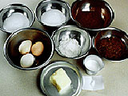 |  | |  |  |  |  |  | | --- | --- | --- | --- | --- | |  | | | | | |  |  | |  |  |  | | --- | --- | --- | |  | | | |  | | | |  | | | | 生地 |  |  | |  | | | | |  |  |  | | --- | --- | --- | |  |  | スイートチョコレート | |  | 60g | |  | | | | |  |  |  | | --- | --- | --- | |  |  | （湯煎で溶かす） | |  |  | |  | | | | |  |  |  | | --- | --- | --- | |  |  | 溶かしバター | |  | 50g | |  | | | | |  |  |  | | --- | --- | --- | |  |  | 卵黄 | |  | 2個 | |  | | | | |  |  |  | | --- | --- | --- | |  |  | グラニュー糖 | |  | 50g | |  | | | | |  |  |  | | --- | --- | --- | |  |  | 生クリーム | |  | 15ml | |  | | | | |  |  |  | | --- | --- | --- | |  |  | （湯煎で人肌に温める） | |  |  | |  | | | | |  |  |  | | --- | --- | --- | |  |  | ココアパウダー | |  | 35g | |  | | | | |  |  |  | | --- | --- | --- | |  |  | 薄力粉 | |  | 15g | |  | | | | |  |  |  | | --- | --- | --- | |  |  | 卵白 | |  | 2個分 | |  | | | | |  |  |  | | --- | --- | --- | |  |  | グラニュー糖 | |  | 50g | |  | | | | 仕上げ |  |  | |  | | | | |  |  |  | | --- | --- | --- | |  |  | 粉砂糖 | |  | 適量 | |  | | | | |  |  |  | | --- | --- | --- | |  |  | 生クリーム | |  | 適量 | |  | | | |  | | | |  |  | |  | | | | |     |  |  |  |  |  | | --- | --- | --- | --- | --- | |  | | | | | |  |  | |  |  |  | | --- | --- | --- | |  | | | | オーブン |  |  | |  | | | | ボウル（直径24cm） |  | 2 | |  | | | | 泡立て器 |  | 2 | |  | | | | 木ベラかゴムベラ |  | 1 | |  | | | | 直径15cmの型 |  | 1 | |  | | | | 茶こし |  | 1 | |  | | | |  | | | |  |  | |  | | | | | | |  |

\

|  |
| --- |
|  |
|  |
|  |

|  |  |  |  |  |  |  |  |  |  |  |  |  |  |  |  |  |  |  |  |  |  |  |  |  |  |  |  |  |  |  |  |  |  |  |  |  |  |  |  |  |  |  |  |  |  |  |  |  |  |  |  |  |  |  |  |  |  |  |  |  |  |  |  |  |  |  |  |  |  |  |  |  |  |  |
| --- | --- | --- | --- | --- | --- | --- | --- | --- | --- | --- | --- | --- | --- | --- | --- | --- | --- | --- | --- | --- | --- | --- | --- | --- | --- | --- | --- | --- | --- | --- | --- | --- | --- | --- | --- | --- | --- | --- | --- | --- | --- | --- | --- | --- | --- | --- | --- | --- | --- | --- | --- | --- | --- | --- | --- | --- | --- | --- | --- | --- | --- | --- | --- | --- | --- | --- | --- | --- | --- | --- | --- | --- | --- | --- |
|  | |  |  |  | | --- | --- | --- | | **準備** | | |  |  |  |  |  |  |  |  | | --- | --- | --- | --- | --- | --- | --- | | 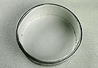 |  | |  |  | | --- | --- | | 1. | 型に紙を敷く。オーブンは160℃に温めておく。 | |  |   型の高さ、円周に合う紙を用意する。 | |  |  |  |  |  |  | | --- | --- | --- | --- | --- | | 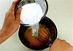 |  | |  |  | | --- | --- | | 2. | 卵黄をボウルに入れ、グラニュー糖50gを加えてすり混ぜる。 | |  |  |  |  |  |  | | --- | --- | --- | --- | --- | | 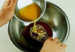 |  | |  |  | | --- | --- | | 3. | 別のボウルに溶かしたチョコレートを入れ、溶かしバターを加えて混ぜる。 | |  |  |  |  |  |  | | --- | --- | --- | --- | --- | | 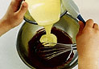 |  | |  |  | | --- | --- | | 4. | チョコレートの中に、２の卵黄を加え混ぜる。 | |  |  |  |  |  |  | | --- | --- | --- | --- | --- | | 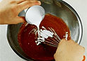 |  | |  |  | | --- | --- | | 5. | 人肌に温めておいた生クリームを加え混ぜる。 | |  |  |  |  |  |  | | --- | --- | --- | --- | --- | | 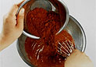 |  | |  |  | | --- | --- | | 6. | ココアパウダーを加え混ぜる。 | |  |  |  |  |  |  | | --- | --- | --- | --- | --- | | 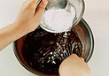 |  | |  |  | | --- | --- | | 7. | さらにに薄力粉を加え混ぜる。 | |  |  |  |  |  |  |  |  | | --- | --- | --- | --- | --- | --- | --- | | 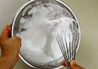 |  | |  |  | | --- | --- | | 8. | 別のボウルに卵白を入れ、グラニュー糖50ｇを３回位に分けて加えながら泡立て、メレンゲを作る。 | |  |   泡立て器を持ち上げたとき、角の先が軽く曲がるくらいに泡立てる。 | |  |  |  |  |  |  | | --- | --- | --- | --- | --- | | 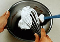 |  | |  |  | | --- | --- | | 9. | 7の中に、泡立てたメレンゲの1/4を加え混ぜ合わせる。 | |  |  |  |  |  |  | | --- | --- | --- | --- | --- | | 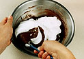 |  | |  |  | | --- | --- | | 10. | 混ざりきったらさらに残りのメレンゲを加え、メレンゲが見えなくなるまで合わせる。 | |  |  |  |  |  |  | | --- | --- | --- | --- | --- | | 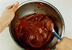 |  | |  |  | | --- | --- | | 11. | 混ぜ終わった状態。 | |  |  |  |  |  |  | | --- | --- | --- | --- | --- | | 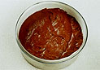 |  | |  |  | | --- | --- | | 12. | 準備しておいた型に入れ、160度のオーブンで約20～30分で焼き上げる。 | |  |  |  |  |  |  | | --- | --- | --- | --- | --- | | 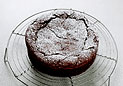 |  | |  |  | | --- | --- | | 13. | 焼き上がったら型からはずし、冷めたら全体に軽く粉砂糖を振る。 | | |  |
