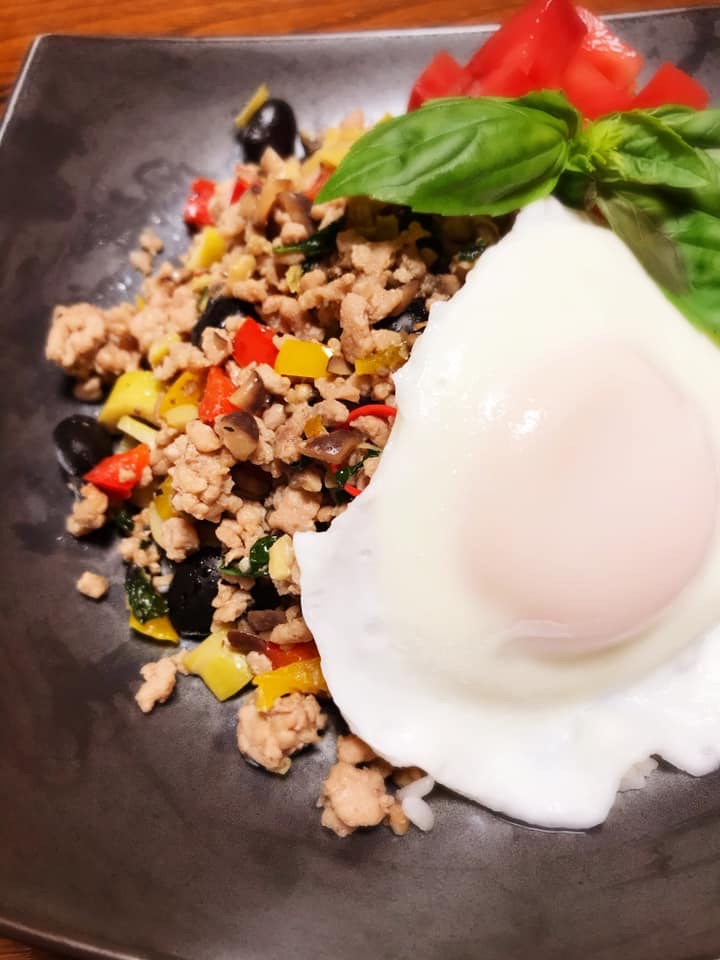

# ガパオライス(薬膳 陳皮)

\

（２人前）

\

材料：

\

豚ひき肉　200グラム

\

バジル　10枚

\

玉ねぎ　2分の1個

\

パプリカ　2分の1個

\

蒸し黒豆（市販品）　30グラム

\

タケノコの水煮　50グラム

\

にんにくのみじん切り　1かけら　（チューブにんにくでもOKです。）

\

卵2個

\

★ナンプラー　大さじ１★醤油　　　小さじ１★オイスターソース★砂糖　小さじ2分の1

\

胡椒

\

胡麻油　大さじ1

\

みかんフレーク　ひとつまみ

\

※本格的なピリッとした辛さがお好みの方は豆板醤小さじ2分の1を足してください。

\

『作り方』

\

１：タケノコと玉ねぎはみじん切りにする。パプリカは1センチぐらいの粗みじん切りにする。

\

2：フライパンにごま油を入れてにんにくを炒める。（お好みで豆板醤を追加する場合はここで）

\

3:にんにくの香りがたってきたら玉ねぎを軽くいため、次にひき肉とタケノコを炒め合わせる。

\

4：火がまわったらパプリカを入れる。

\

5：調味料を加えてざっくり混ぜてからバジル、黒豆を加えて軽く火を通す。最後にみかんフレークをふりかけてお皿にもったご飯の上に乗せる。フライパンを軽くふき、油を少し入れてから目玉焼きをつくり盛り付ける。

\

お好みで飾り付けてできあがり！

\

\

<https://kanpokitchen.com/news/20200520/>

\
