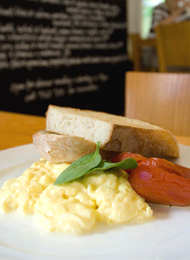

# スクランブルエッグ

スクランブルエッグ

材料(1人分)

卵…2個／生クリーム…70cc／塩…適量／バター…10g

作り方

ボウルに卵、生クリーム、塩を入れてしっかりと混ぜる。熱したテフロン加工のフライパンでバターを溶かす。バターは焦がさないように注意！

フライパンに1を流し込み、20秒ほどそのままにしたら、木ベラで優しく外側から中心に寄せるようにかき回す。スクランブルするというよりは、折りたたむような感覚で。これを約20秒間繰り返す

半熟の状態で、器にトースト・葉野菜（ともに分量外）と一緒に盛ってできあがり

卵は、かき混ぜすぎないように注意して。クリームを入れているので、オムレツを作るみたいに大体の形をつくるだけでフワフワになりますよ

\
