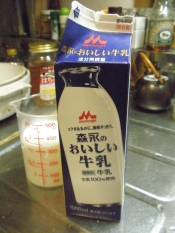
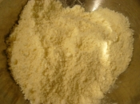
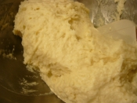
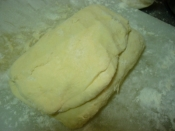
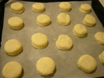
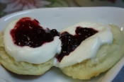

# スコーン

# ふんわりしっとり　本場のスコーン

- **約30分**
 - **－**

## 材 料

（2～4 人分）

|  |  |
| --- | --- |
| [<直径5、6ｃｍの丸型又は菊型10個分>](http://recipe.rakuten.co.jp/search/%3C%E7%9B%B4%E5%BE%845%E3%80%816%EF%BD%83%EF%BD%8D%E3%81%AE%E4%B8%B8%E5%9E%8B%E5%8F%88%E3%81%AF%E8%8F%8A%E5%9E%8B10%E5%80%8B%E5%88%86%3E/?t=1) | --- |
| [薄力粉](http://recipe.rakuten.co.jp/search/%E8%96%84%E5%8A%9B%E7%B2%89/?t=1) | 200ｇ |
| [無塩バター](http://recipe.rakuten.co.jp/search/%E7%84%A1%E5%A1%A9%E3%83%90%E3%82%BF%E3%83%BC/?t=1) | 50g |
| [グラニュー糖](http://recipe.rakuten.co.jp/search/%E3%82%B0%E3%83%A9%E3%83%8B%E3%83%A5%E3%83%BC%E7%B3%96/?t=1) | 大さじ1 |
| [塩](http://recipe.rakuten.co.jp/search/%E5%A1%A9/?t=1) | 小さじ1/2 |
| [ベーキングパウダー](http://recipe.rakuten.co.jp/search/%E3%83%99%E3%83%BC%E3%82%AD%E3%83%B3%E3%82%B0%E3%83%91%E3%82%A6%E3%83%80%E3%83%BC/?t=1) | 大さじ1と小さじ1 |
| [牛乳](http://recipe.rakuten.co.jp/search/%E7%89%9B%E4%B9%B3/?t=1) | 150ｃｃ |
| [レモン汁又は酢](http://recipe.rakuten.co.jp/search/%E3%83%AC%E3%83%A2%E3%83%B3%E6%B1%81%E5%8F%88%E3%81%AF%E9%85%A2/?t=1) | 小さじ1 |
| [強力粉（打ち粉用。無ければ薄力粉）](http://recipe.rakuten.co.jp/search/%E5%BC%B7%E5%8A%9B%E7%B2%89/?t=1) | 適量 |

伝統的なスコットランドのスコーン。独特の割れと膨らみ、中はしっとりふんわりしています。このレシピになってから他の作り方でスコーンを焼こうとは思えません。

 [Nico0803](http://recipe.rakuten.co.jp/mypage/1070001672/)

- ### 1

  

  牛乳にレモン汁又は酢を加え、そのまま10分ほど置いておく。\
  ボールに薄力粉、グラニュー糖、塩、ベーキングパウダーを合わせてふるい入れる。\
  オーブンは220度に予熱する。
- ### 2

  

  粉類の入ったボールに、刻んだバターを加え、粉をまぶしながらフォーク等で刻む。ある程度バターが小さくなったら、指先や手のひらでこすりあわせるように粉とバターをよく合わせる。
- ### 3

  

  1の牛乳を2に加え、ナイフ又はゴムベラで切るように混ぜる。絶対に練らないこと。生地は少しゆるめです。
- ### 4

  

  打ち粉（強力粉）をしっかり振った台の上に生地をのせ、生地にも打ち粉をしながら平らに伸ばし3つ折りにする。90度回転させて伸ばし再び3つ折りにする。

- ### 5

  

  2～3ｃｍ厚に伸ばし、打ち粉をした直径5ｃｍの型で抜きクッキングシートを敷いた天板に隙間を空けて並べる。伸ばす時は厚めに伸ばすのがコツです。2,3ｃｍは思っているよりも分厚いです。
- ### 6

  

  予熱したオーブンで10分ほど焼いてできあがり。焼きあがったら温かいうちに二つに割って、クロテッドクリームとジャムを載せ、紅茶とともに頂きます。

おいしくなるコツ
:   高温で焼くので小型の電気オーブンで焼く場合、表面のみ焦げて中に火が通りにくい場合があります。その時は、温度を190度～200度まで下げて時間を長めに焼いて下さい。
