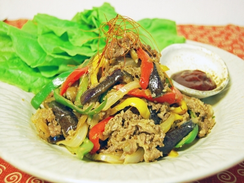
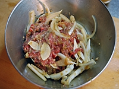
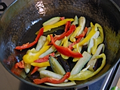
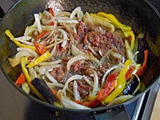

# プルコギ

所要時間：60分以上

カテゴリー：[メインのおかず](http://allabout.co.jp/recipe/search/dish/4/)、[炒め物](http://allabout.co.jp/recipe/search/dish/446/)

### フライパンで作る、夏野菜たっぷりプルコギ

韓国で広く親しまれている「プルコギ」は、プルは“火”、コギは“肉”を意味する焼き肉料理。甘く味つけした醤油ベースのたれに牛肉などを漬けこみ、中央が帽子のように盛り上がった鍋にのせて焼きます。\
\
今回は、そのプルコギをフライパンで手軽に作れるようにアレンジしました。夏野菜をたっぷり合わせて、栄養バランスをアップ！\
\

### 夏野菜たっぷりプルコギの材料（4人分）

| フライパンで作る、夏野菜たっぷりプルコギ | |
| --- | --- |
| [牛肉](http://allabout.co.jp/recipe/search/material/10/) | 薄切り肉：200g |
| [なす](http://allabout.co.jp/recipe/search/material/58/) | 1個 |
| [パプリカ](http://allabout.co.jp/recipe/search/material/122/) | 赤・黄各1/4個 |
| [ピーマン](http://allabout.co.jp/recipe/search/material/87/) | 1個 |
| [たまねぎ](http://allabout.co.jp/recipe/search/material/90/) | 1個 |
| [ごま油](http://allabout.co.jp/recipe/search/material/387/) | 大さじ1 |
| [塩](http://allabout.co.jp/recipe/search/material/338/) | 少々 |

| 牛肉の下味 | |
| --- | --- |
| [たまねぎ](http://allabout.co.jp/recipe/search/material/90/) | 1/4個分(すりおろし) |
| [ニンニク](http://allabout.co.jp/recipe/search/material/134/) | 1片(すりおろし) |
| [生姜](http://allabout.co.jp/recipe/search/material/65/) | 5g(すりおろし) |
| [梨](http://allabout.co.jp/recipe/search/material/191/) | 1/8個(すりおろし)→りんごでも可 |
| [醤油](http://allabout.co.jp/recipe/search/material/356/) | 大さじ3 |
| [酒](http://allabout.co.jp/recipe/search/material/341/) | 大さじ2 |
| [きび砂糖](http://allabout.co.jp/recipe/search/material/853/) | 大さじ3/4 |
| [ごま油](http://allabout.co.jp/recipe/search/material/387/) | 大さじ1 |
| [すり白ごま](http://allabout.co.jp/recipe/search/material/734/) | 大さじ1(半ずり状態がよい) |
| [ブラックペッパー](http://allabout.co.jp/recipe/search/material/648/) | 少々 |
|  |  |
| --- | --- |
|  | |

\

### 夏野菜たっぷりプルコギの作り方・手順

#### フライパンで作る、夏野菜たっぷりプルコギ

1：

ボウルに牛肉、スライスした玉ねぎを入れ、牛肉の下味の材料をすべて加える。手でよくもみ、できれば1時間ほど冷蔵庫に置く。\
なす、パプリカ、ピーマンは食べやすい大きさに切る。\
急ぐ場合は、5分ほどでも結構です。

2：

フライパンにごま油を入れて熱し、なす、塩を入れて炒める。焼き色がついたらパプリカを加え、しんなりするまで炒める。

3：

フライパンの中央をあけ、1の牛肉と玉ねぎを加える。ゆっくり炒めていき、牛肉の色が変わったらピーマンを加えて火を強め、汁気がなくなるまで炒める。器に盛り、サンチュ、コチュジャン、粉唐辛子などを添える。\

\

### ガイドのワンポイントアドバイス

食べるときはサンチュにのせ、コチュジャンや粉唐辛子、白髪ねぎ、にんにくスライスなどをのせてお召し上がりください。

\
