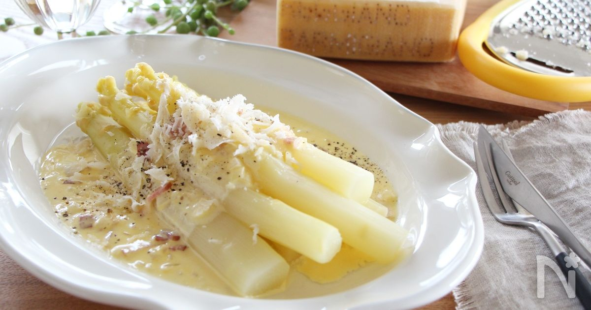
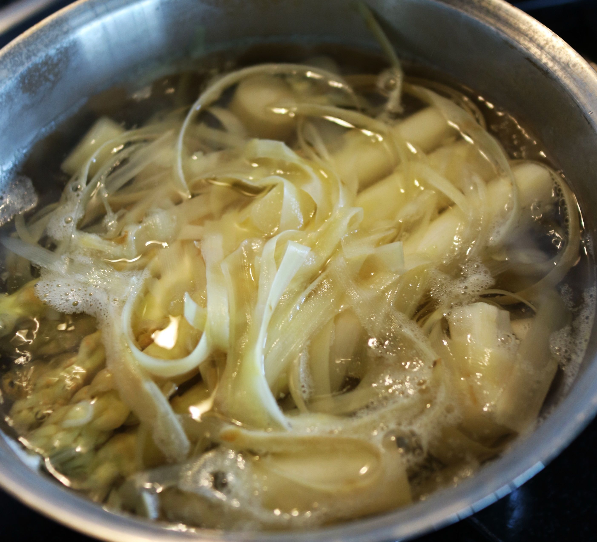

# ホワイトアスパラガスのチーズクリームソース

旬のホワイトアスパラガスをカルボナーラ風のパルミジャーノ・レッジャーノたっぷりのチーズクリームソースで戴きます。チーズはソースの中にもまた上にさらにトッピングしてたっぷりかけるのがおススメです！

**分量**: 2人分 / **合計**: 15分 / **調理**: 15分

## 材料

- パルミジャーノ・レッジャーノ 5g
- ホワイトアスパラガス 6本
- にんにく 1/2片
- たまねぎ 1/4個
- ベーコン 18g
- 生クリーム 100ml
- オリーブオイル 大さじ1/2
- 卵 1個
- 塩 少々
- 黒胡椒 適宜

## 作り方

1. ホワイトアスパラガスは、皮をむきしたの固い部分をきり除き、塩を入れたたっぷりのお湯にむいた皮レモン汁少々（分量外あれば）といっしょに入れて、3～5分ほど柔らかくなるまでゆでる。
2. にんにくは皮をむき包丁の背でつぶし、たまねぎは薄切りにし、ベーコンは、5ミリ幅に切り、パルミジャーノ・レッジャーノはすりおろしておく。
3. フライパンにオリーブオイルと、つぶしたにんにくを入れて、中火で香りが出るまで炒めたら、たまねぎ、ベーコンを加えしんなりするまで炒める。
4. 生クリームを加え、すりおろしたパルミジャーノ・レッジャーノと塩を加え味を調えたら、火を止めて、溶いた卵を加え、<a href="/wordlist/余熱">余熱</a>で卵を温めながらさっと混ぜる。
5. １のゆでたアスパラガスの上に４のソースをかけ、荒めにすりおろしたパルミジャーノ・レッジャーノ（分量外）と黒胡椒をかける。

