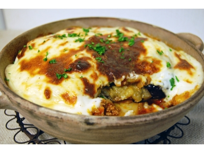
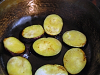
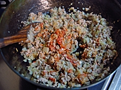
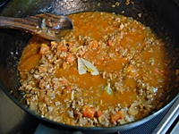
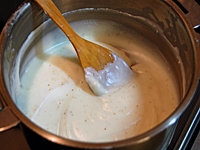
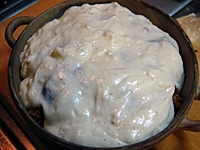

# ムサカ

所要時間：60分

カテゴリー：[メインのおかず](http://allabout.co.jp/recipe/search/dish/4/)、[オーブン焼き](http://allabout.co.jp/recipe/search/dish/20/)

### ギリシャ料理：ムサカ(野菜のラザニア)

「ムサカ」はギリシャ、中近東、バルカン半島などの国々で広く親しまれている料理。地域によってスタイルはさまざまですが、ギリシャのムサカは、ナス、じゃがいも、ミートソース、ベシャメルソースを層にし、オーブンで焼きあげるもの。イタリアのラザニアとよく似ています。\
ムサカというと、日本ではギリシャのムサカが最も知られていますよね。ちなみに、トルコのムサカはこのような↓感じ。\
\
[■トルコのナスのムサカのレシピ](http://allabout.co.jp/gm/gc/432742/)\
\
ギリシャにはパスタを加えたムサカもありますが、野菜だけで仕上げるのは定番。今回は、ナスとじゃがいもを使ったギリシャ風野菜のラザニアをご紹介します。野菜がたっぷりだから、見ためよりもあっさりとした味わいですよ。\
\
\

### ギリシャ料理：ムサカの材料（2～3人分）

| ギリシャ：ムサカ　(ギリシャ風野菜のラザニア) | |
| --- | --- |
| [なす](http://allabout.co.jp/recipe/search/material/58/) | 3本　(7～8mm厚さの斜め切り) |
| [じゃがいも](http://allabout.co.jp/recipe/search/material/67/) | 2個　(皮をむいた後7～8mm厚さの輪切り) |
| [合いびき肉](http://allabout.co.jp/recipe/search/material/32/) | 200g |
| [トマト](http://allabout.co.jp/recipe/search/material/64/) | 1個　(皮をむいた後1cm角切り) |
| [ニンニク](http://allabout.co.jp/recipe/search/material/134/) | 1/2片　(みじん切り) |
| [ローリエ](http://allabout.co.jp/recipe/search/material/901/) | 1枚　(半分にちぎる) |
| [トマトペースト](http://allabout.co.jp/recipe/search/material/1118/) | 大さじ2強 |
| [水](http://allabout.co.jp/recipe/search/material/836/) | 100cc |
| [塩](http://allabout.co.jp/recipe/search/material/338/) | 少々 |
| [こしょう](http://allabout.co.jp/recipe/search/material/466/) | 少々 |
| [オリーブオイル](http://allabout.co.jp/recipe/search/material/332/) | 適量 |
| [イタリアンパセリ](http://allabout.co.jp/recipe/search/material/462/) | 適量　(みじん切り) |

| ベシャメルソースの材料 | |
| --- | --- |
| [バター](http://allabout.co.jp/recipe/search/material/307/) | 30g |
| [薄力粉](http://allabout.co.jp/recipe/search/material/752/) | 30g |
| [牛乳](http://allabout.co.jp/recipe/search/material/305/) | 330ｃｃ |
| [ナツメグ](http://allabout.co.jp/recipe/search/material/460/) | ひとつまみ |
| [塩](http://allabout.co.jp/recipe/search/material/338/) | 少々 |
| [こしょう](http://allabout.co.jp/recipe/search/material/466/) | 少々 |
|  |  |
| --- | --- |
|  | |

\

### ギリシャ料理：ムサカの作り方・手順

#### ギリシャ料理：ムサカ　(ギリシャ風野菜のラザニア)

1：

なすは塩水に15分ほど漬け、水気をしっかり切る。じゃがいもは蒸すか電子レンジで火を通しておく。\
フライパンに多めのオリーブオイルを入れ、じゃがいもを両面こんがり焼く。じゃがいもを取り出し、なすも同じように焼く。\

2：

1のフライパンにニンニクを入れて熱し、香りが出たら玉ねぎを炒める。しんなりしたらひき肉を加え、火が通り水分がなくなるまでしっかり炒める。トマトペーストを加えてさらに炒める。

3：

トマト、ローリエを入れてトマトがとろりとするまで炒め、水、塩、こしょうを加え、弱火で水気がなくなるまで煮込む。味が足りないようなら塩、こしょうで味を調える。

4：

ベシャメルソースを作る。\
熱した鍋にバターを入れ、焦がさないように溶かす。薄力粉をふるって入れ、しっかり炒める。温めた牛乳を少しずつ入れてよくかき混ぜる。ソースにとろみがつくまで火にかけ、すりおろしたナツメグ、塩、こしょうで味を調える。牛乳を加えるときは、火からおろしてかき混ぜるとだまになりにくい。

5：

耐熱容器になすの半量、じゃがいも、3のソースを重ね、さらに残りのなすを重ねる。4のベシャメルソースをかけ、220℃のオーブンで20分ほど焼く。仕上げにイタリアンパセリをふる。

\

### ガイドのワンポイントアドバイス

ベシャメルソースに卵黄、エメンタールチーズを加えるとより濃厚なソースになりますので、お好みでどうぞ。なすとじゃがいもは、揚げるとより食べ応えのある味わいに。

\
