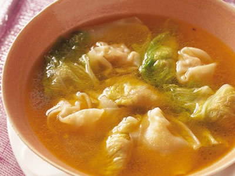

# 白菜のワンタン

## 白菜のワンタン

白菜がたっぷり入った肉ダネをワンタンの皮だけでなく、白菜の葉でも巻いてみました。食感の違いが楽しい一品です。

### [材料・作り方](http://www.kyounoryouri.jp/index.php?flow=recipe_detail&rid=1360)

### [このレシピを登録しているユーザー（172人）](http://www.kyounoryouri.jp/index.php?flow=recipe_detail&rid=1360&tab=comment)

撮影：今清水 隆宏

- 講師：[脇屋　友詞](http://www.kyounoryouri.jp/teacher/%E4%B8%AD%E5%9B%BD%E6%96%99%E7%90%86/245_%E8%84%87%E5%B1%8B%E3%80%80%E5%8F%8B%E8%A9%9E.html)
- 放送日：2003年02月10日（月）

|  |  |
| --- | --- |
| 230kcal | 30分 |

#### 

- [ひき肉](http://www.kyounoryouri.jp/recipe/tag_id/263_%E3%81%B2%E3%81%8D%E8%82%89/1/)
 - [スープ](http://www.kyounoryouri.jp/recipe/tag_id/261_%E3%82%B9%E3%83%BC%E3%83%97/1/)
 - [ワンタン](http://www.kyounoryouri.jp/recipe/tag_id/1541_%E3%83%AF%E3%83%B3%E3%82%BF%E3%83%B3/1/)
 - [ワンタンスープ](http://www.kyounoryouri.jp/recipe/tag_id/1387_%E3%83%AF%E3%83%B3%E3%82%BF%E3%83%B3%E3%82%B9%E3%83%BC%E3%83%97/1/)
 - [中華](http://www.kyounoryouri.jp/recipe/tag_id/53_%E4%B8%AD%E8%8F%AF/1/)
 - [豚ひき肉](http://www.kyounoryouri.jp/recipe/tag_id/484_%E8%B1%9A%E3%81%B2%E3%81%8D%E8%82%89/1/)
 - [白菜](http://www.kyounoryouri.jp/recipe/tag_id/586_%E7%99%BD%E8%8F%9C/1/)
 - [白菜のワンタン](http://www.kyounoryouri.jp/recipe/tag_id/34706_%E7%99%BD%E8%8F%9C%E3%81%AE%E3%83%AF%E3%83%B3%E3%82%BF%E3%83%B3/1/)
 - [白菜ワンタン](http://www.kyounoryouri.jp/recipe/tag_id/37970_%E7%99%BD%E8%8F%9C%E3%83%AF%E3%83%B3%E3%82%BF%E3%83%B3/1/)
 - [脇屋シェフ](http://www.kyounoryouri.jp/recipe/tag_id/28358_%E8%84%87%E5%B1%8B%E3%82%B7%E3%82%A7%E3%83%95/1/)

[次のレシピ](http://www.kyounoryouri.jp/recipe/7880_%E7%99%BD%E8%8F%9C%E3%81%A8%E3%81%9F%E3%81%93%E3%81%AE%E3%81%82%E3%81%88%E7%89%A9.html?from=recipe-next#pankuzu)

#### 

(4人分) \
白菜 400g（外葉の部分約8枚）＊\
豚ひき肉＊＊ 200g\
----------\
【A】\
・紹興酒（または酒）大さじ1\
・ねぎ油＊＊＊ 大さじ1\
・ごま油 大さじ1\
・オイスターソース 小さじ1\
・溶き卵 大さじ1\
・塩・こしょう 各少々\
・かたくり粉 小さじ1\
----------\
ワンタンの皮（市販）8枚\
紹興酒（または酒）大さじ1\
スープ＊＊＊＊ カップ4\
（塩・サラダ油・かたくり粉\
　　　　　・しょうゆ・こしょう）\
\
＊「[白菜と豚肉の元気なべ](http://www.kyounoryouri.jp/recipe/1359_%E7%99%BD%E8%8F%9C%E3%81%A8%E8%B1%9A%E8%82%89%E3%81%AE%E5%85%83%E6%B0%97%E3%81%AA%E3%81%B9.html?cmp=n221)」で使わなかった外葉を利用できます。\
＊＊できれば脂身の多いものを使ったほうがしっとりおいしく仕上がる。\
＊＊＊なければ、ごま油（白）で代用してもよい。\
＊＊＊＊固形または顆粒のスープの素を表示どおりに水で溶いたものでもよい。\
\
※肉ダネを冷蔵庫で冷やす時間は除く。

#### 

《ねぎ油の材料と作り方》\
（つくりやすい分量）\
1　ねぎ（青い部分）100gは10cm長さのブツ切りにする。たまねぎ50gは厚めのザク切りにする。にんにく15g、しょうが30gは包丁の腹などでつぶす。\
\
2　なべにサラダ油カップ1、ラードカップ1/2、(1)を入れて火にかけ、温度が150～160℃になったら弱火にし、加えた具材がきつね色になるまで揚げる。こして冷ます。\
※密閉できる保存瓶などに移し、冷蔵庫で1ヶ月間保存可能。香味油としていろんな中国料理に利用できる。

#### 

1.　熱湯2リットルに塩小さじ1、サラダ油大さじ1を加え、白菜を入れて1分間ほどゆで、氷水にとって冷ます。白菜が冷めたら水けをきり、ふきんまたは紙タオルで包んで、さらに水分を絞る。\
\
2.　1を白い芯の部分と黄色い葉の部分の境目で切り分け、黄色い葉の部分はさらに水けを絞る。白い芯の部分はみじん切りにし、さらに水けをよく絞る。\
\
3.　肉ダネをつくる。大きめのボウルに豚ひき肉を入れ、【A】の材料を加えてよく練り合わせ、2のみじん切りにした白菜の白い芯の部分を加え、混ぜ合わせる。\
\
4.　3をバットに移し、ラップフィルムをかけて冷蔵庫に入れてしばらく冷やし、落ち着かせる。肉ダネを冷蔵庫に入れるのは、ワンタンの皮や白菜の葉でくるみやすくするため。\
\
5.　肉ダネの半量を8等分してワンタンの皮にのせ、縁に水をつけてとじる。同様に計8コつくる。2の白菜の黄色い葉の部分を1枚ずつ広げてかたくり粉適宜をまぶし、残りの肉ダネを8等分してのせ、包む。同様に計8コつくる。\
〈★メモ〉白菜の葉に肉ダネをのせて包み、煮くずれないようにきっちりととじる。\
\
6.　なべにたっぷりの湯を沸かし、中火にして軽く沸騰するくらいの温度を保ちながら5を入れ、2～3分間くらいゆでる。湯の表面に浮き上がってきたら、ゆで上がり。\
\
7.　別のなべに紹興酒、スープ、しょうゆ小さじ1、塩小さじ2、こしょう少々を入れて火にかけ、煮立たせて器に注ぎ、6の水けをきって静かに加える。

[\](http://ad.jp.doubleclick.net/click;h=v8/3c89/0/0/%2a/g;44306;0-0;0;32281700;29930-620/270;0/0/0;;~sscs=%3f)
