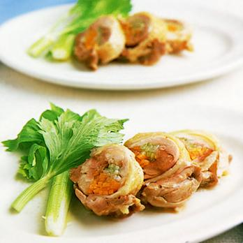

# 豚肉ロール

\
豚もも肉　薄切り

にんじん2本

さやいんげん　120g

えのきだけ

たれ　しょうゆ大2 1/2

みりん　大２

砂糖　大1/2

野菜はゆでて下味（みりん大1/2としょうゆ大１）をつける（にんじん5分＋さやいんげん1分）

肉2枚で巻いて巻き終わりを下にして焼き付けてからまわりを焼く

酒大２をふって、ふたをして2分蒸し焼きにし、肉に火を通してからたれを加える
