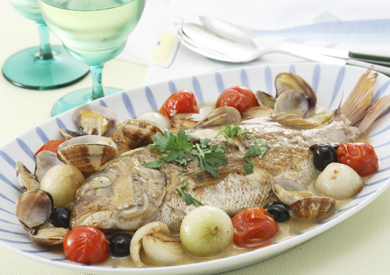
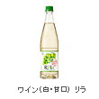
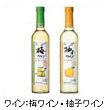

# 鯛のアクアパッツァ

## 鯛のアクアパッツァ

豪華に見えてとっても簡単な「アクアパッツア」。魚貝類の下ごしらえさえしておけば、あとはフライパンと時間がおいしさを引き出してくれます。

- :   30分
- :   アンチョビの塩気が魚や野菜にも染み込むので、味付けは最初の塩・コショウを魚にしっかりしていれば、手間要らずのアクアパッツァが楽しめる。

- 
- 

:   魚貝の旨みをシンプルに味わうこのおつまみには、よく冷えた白ワインがおすすめです。自然な甘さが爽やかな梅ワインや柚子ワインに合わせてもおいしいです。

:   1.鯛に塩・コショウをし、オリーブオイルを熱したフライパンで両面をこんがり焼く。
:   2.Aを加えさらによく炒め、白ワインを加え魚に火を通す。
:   3.汁気が足りなければ水を足し、あさりを加え蒸す。
:   4.仕上げにイタリアンパセリをふる。

- （4人分）
- 鯛
  :   1匹
- 塩
  :   適量
- コショウ
  :   適量
- A
- ・小タマネギ
  :   6個
- ・プチトマト
  :   6個
- ・ブラックオリーブ
  :   12粒
- ・ニンニク
  :   2かけ(つぶしたもの）
- ・アンチョビ
  :   2枚
- ・赤唐辛子
  :   1本
- 白ワイン
  :   1カップ
- あさり
  :   1カップ
- イタリアンパセリ
  :   適量
- オリーブオイル
  :   大さじ4

\
