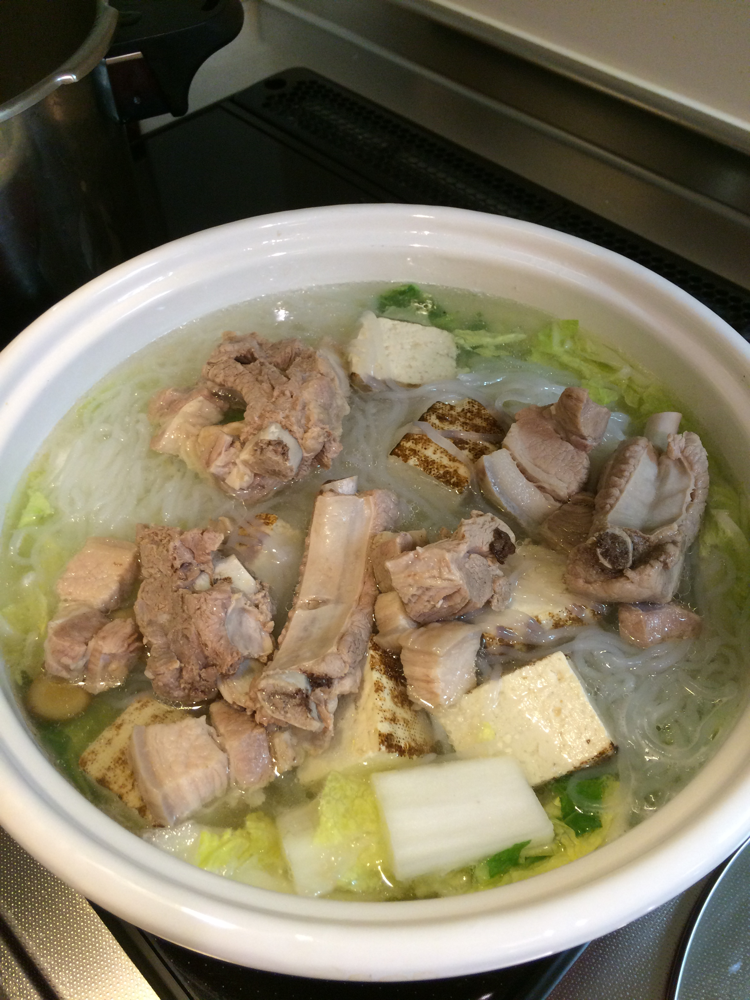
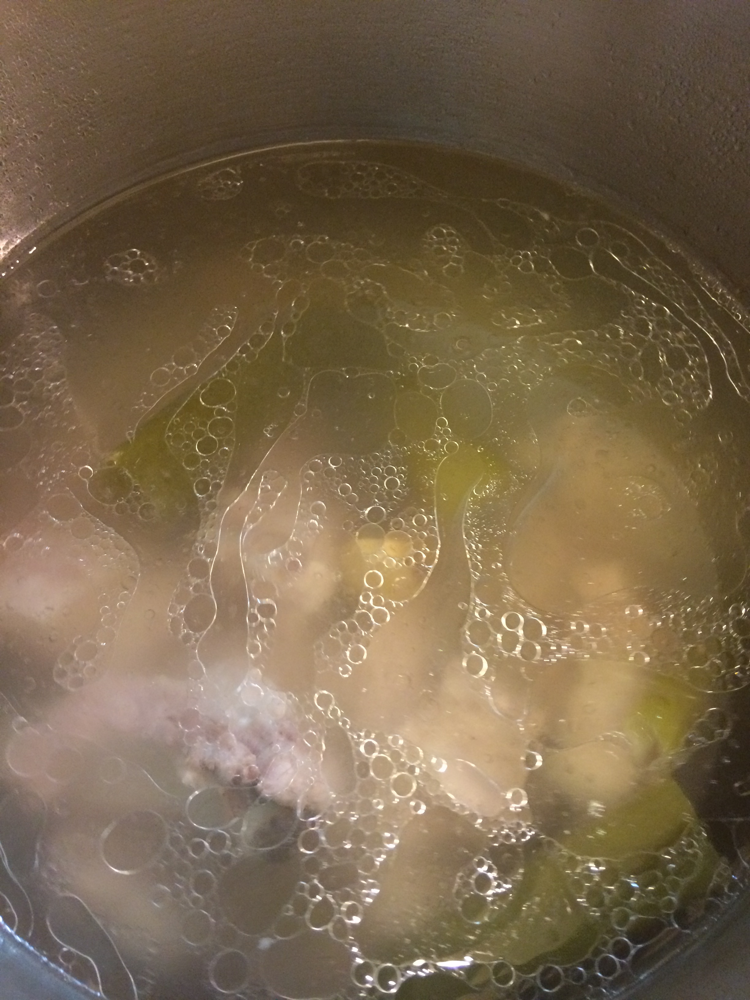
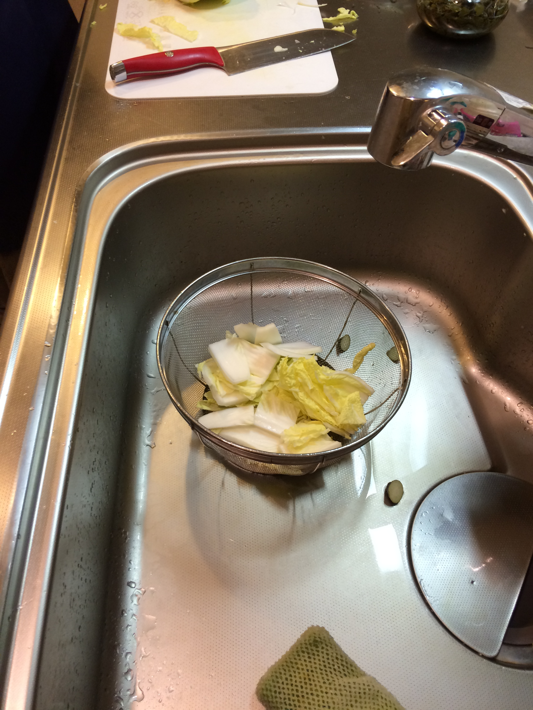
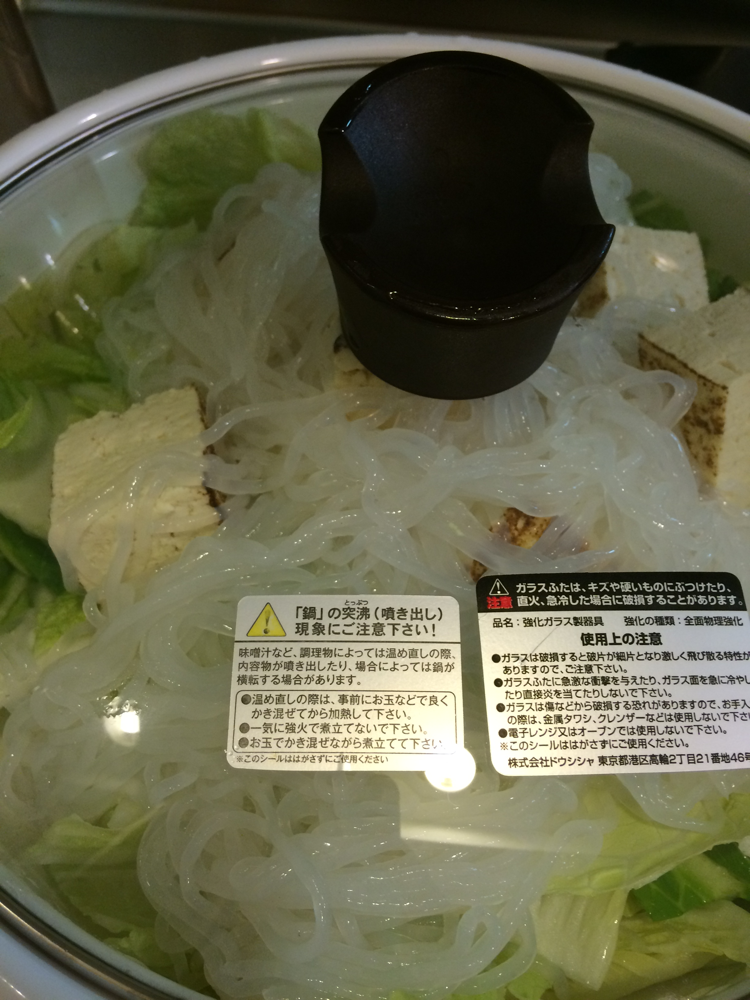
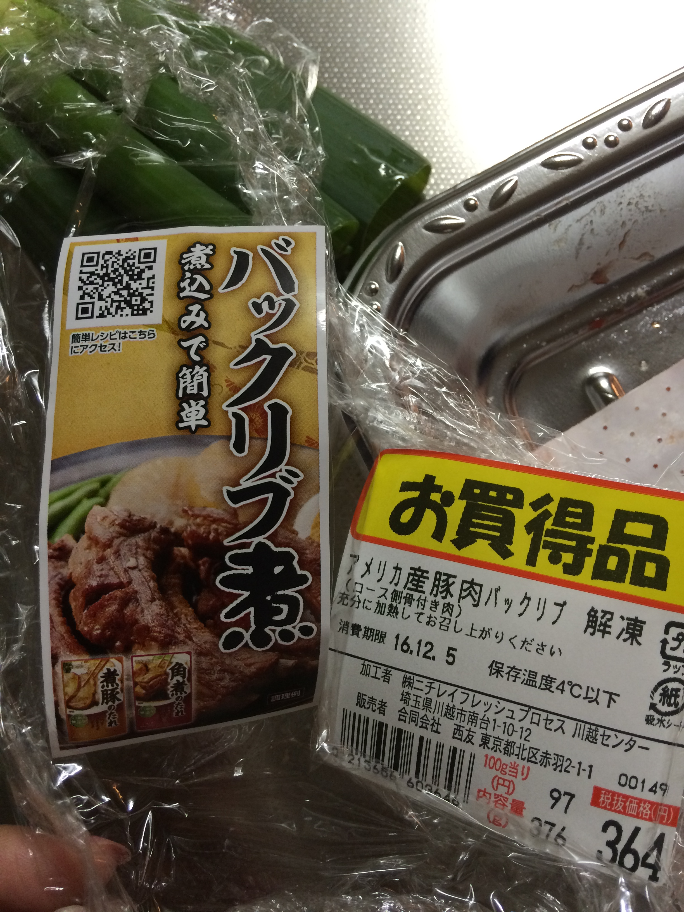

# 中華スープ

------------------

沸騰手前のお湯に、スペアリブと皮付き豚角煮用(豚バラ肉200g)の肉をいれ、五分強くらい茹でる

\

圧力鍋でぬるま湯から、茹でた肉を入れなおしネギ青いところ全部、しょうが皮付きスライスと一緒に蓋する

\

圧力鍋は6分

\

圧力かかっている状態でしばし放置

圧力を少しずつ抜く

40分〜1時間後

白菜1/4を 大きめざく切り

鍋に白菜いれ、しらたき、豆腐をのせる

ネギの小口みじん切り、軽く一本分

スペアリブの煮込み汁を半分ほど加えて、塩を5杯くらいばっさりいれて、煮る

その後しょうがとネギを残して全て鍋に移す

塩を5杯追加で、味の素少しいれて終了

\

\
