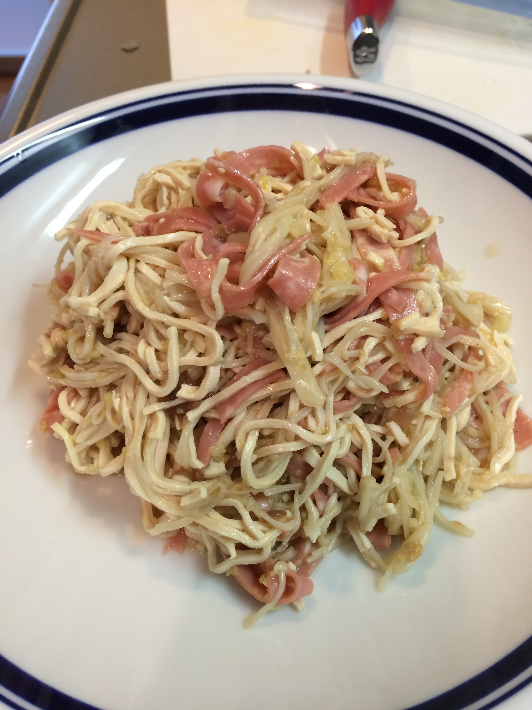
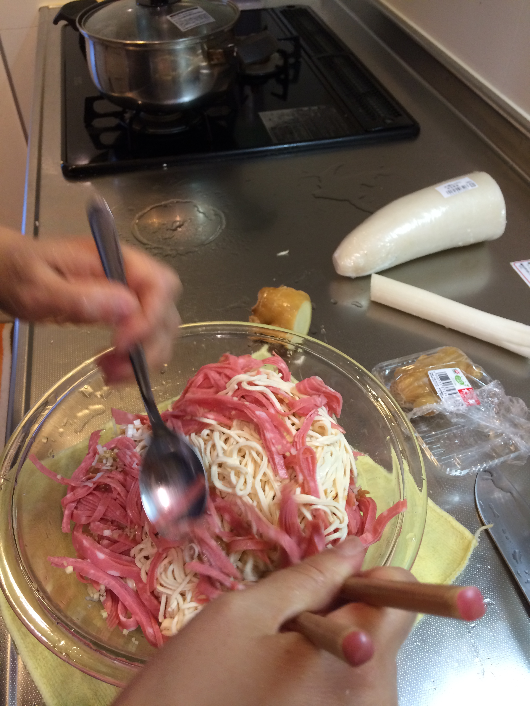
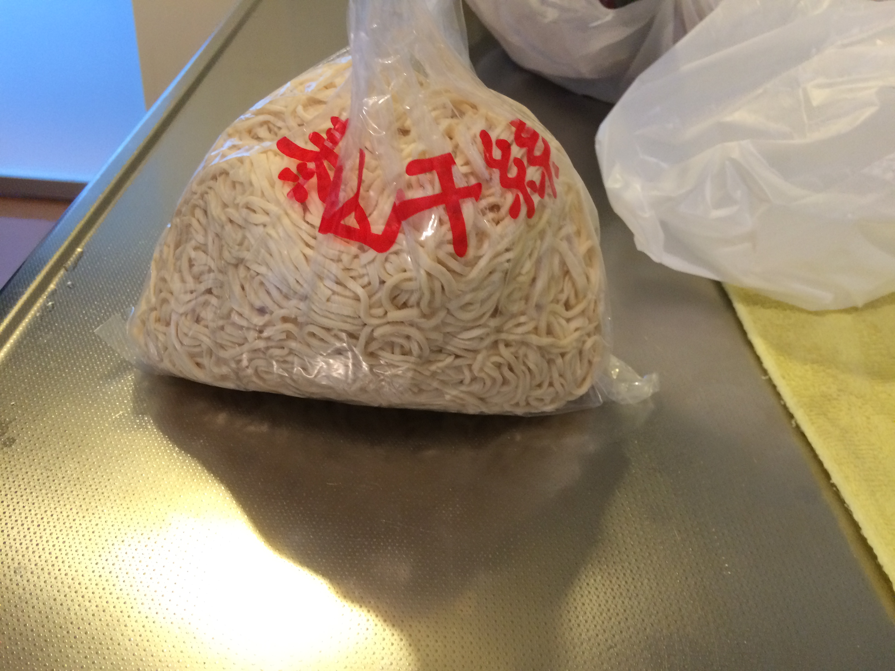
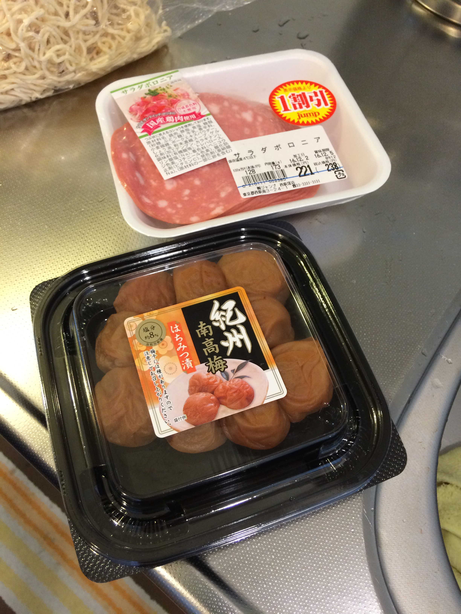

# 干し豆腐

干し豆腐

\

茹で時間 五分、氷で締めてからハムと混ぜる

えのきだけをさっと茹で、氷で冷やす

梅干し二粒、みじん切り たたく

ネギの白いとこ半分、みじん切り

しょうが 皮付きみじん切り 大さじ3くらい

醤油小おたま半

オイスター小おたま半

砂糖小さじ3

酢は、梅干しが入ってない時はいれる

オリーブオイル小おたま半

ごま油小おたま半

ごま油の方が多め、オイスターの方が多め

塩

こしょう

味の素ちょっと

(梅の代わりに、しそみじん切りでも良い)

\

干し豆腐

その他

\
