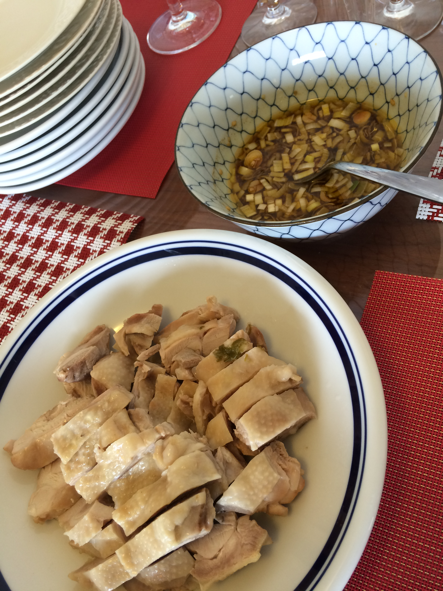
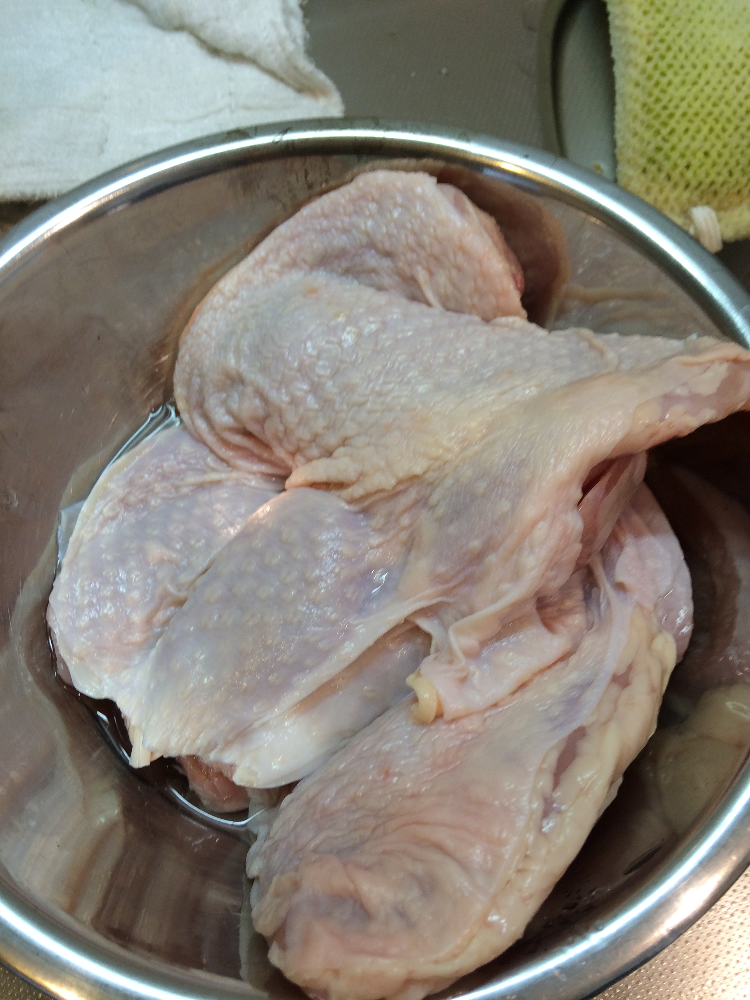

# 蒸し鶏

\

\

骨つき鳥肉に1/2ほど水をかぶせ、火にかける

軽く煮えたら上下返す

直ぐにぬるま湯で流しながら洗う感じ

\

昨日のスペアリブのスープに鶏をいれ、しょうが3mm厚二枚いれ15分ほど煮る

\

鶏はスープから上げて、涼しいところに置いておく

\

このスープをワンタンに使う。

\

鶏を切ってタレ作る

\

しょうゆ30cc

オイスターソース大さじ1

お酢小さじ1

りんご酢小さじ1

しょうが細かいみじん切りたっぷり

ネギ一つかみ

砂糖大さじ1

こしょう一振り

ゴマ油、オリーブオイル合わせて20cc

味の素 かくし味程度

\

\
