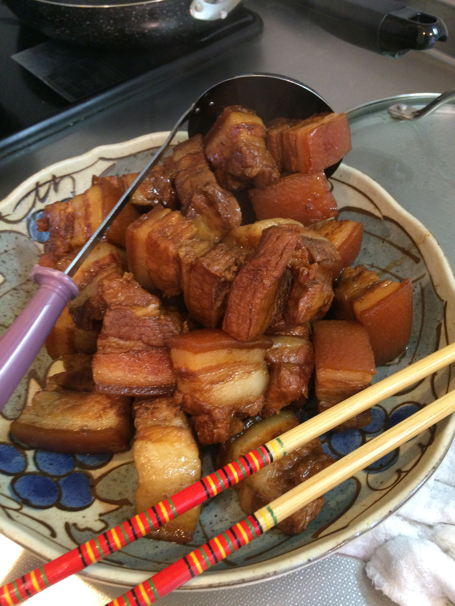
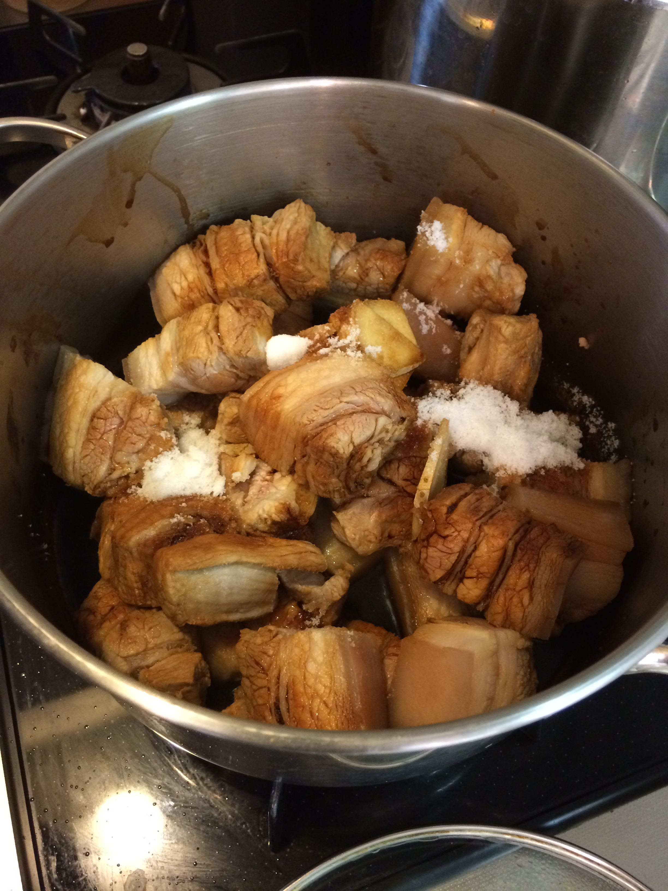
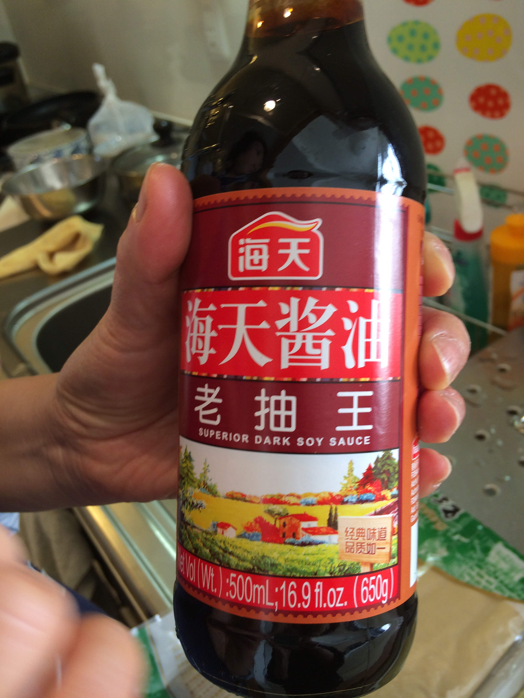
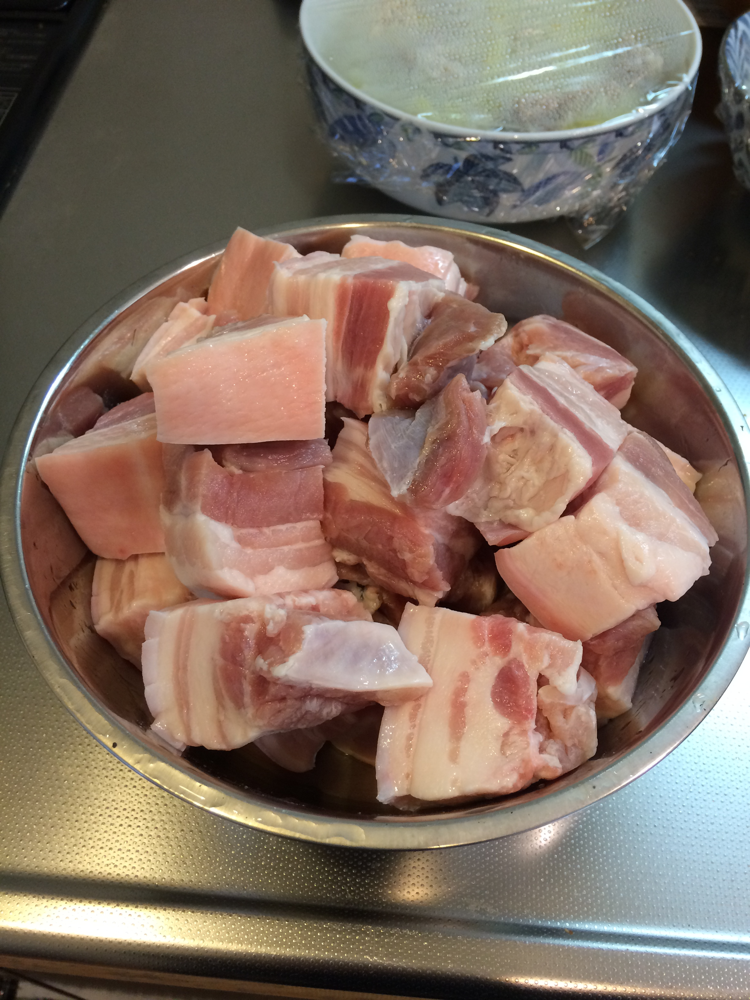

# 豚角煮

\

角煮をさっと茹で、流水で洗い流す感じ。

鍋に入れて、水40ccほど入れて蓋をして弱火。

料理酒をこの場で同量

しょうが3mm厚 3枚

しょうゆ と老抽醤を半々、肉の表面に回しかける感じ

砂糖(氷砂糖や黒糖だとなお良し)を小さじ4杯くらい

八角、唐辛子やシナモン(バニラビーンズのような形で売ってるらしい)をいれる。一つ二つでよい。

ひたひた2/3くらいまで水で調整して、肉を回しながら全部で1時間〜1時間半

\

\

強火でグラグラ煮はじめ、

味がタレとしてちょうどよかったと思うところで

唐辛子は適宜抜いて、老抽醬、塩、しょうゆ追加し、辛いくらいの味付けにして弱火に戻し、まず30分

途中グラグラ煮て

弱火に戻し、紹興酒を回しいれる。

\

干し豆腐を結んで、水洗いしておく

豚角煮を皿にあげ、鍋に干し豆腐を入れて煮る。水足して調整。

お肉を上に置いて、上から味を染ませる。

\

干し豆腐や厚揚げ(肉と同じサイズに切るイメージ)でラスト15分味を染ませると大根よりうまい。

2時間ほど置いて火にかけ直す。グラグラ煮る。

\

紹興酒を少し入れて仕上げ

\

